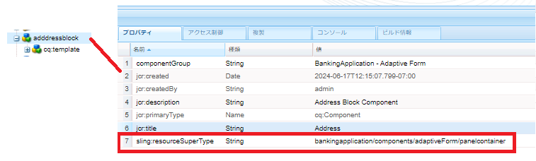
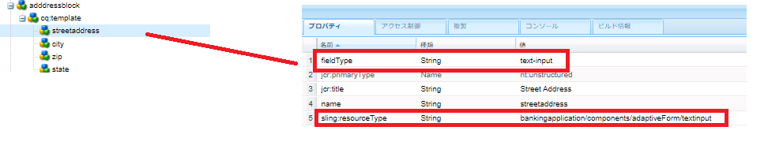
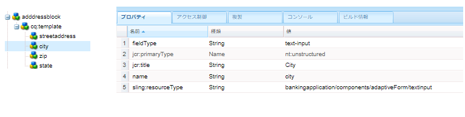
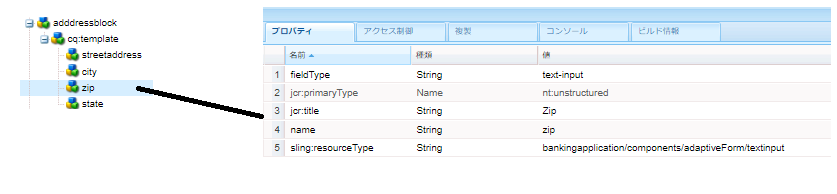

# 住所コンポーネントの作成

ローカルのAEM Forms Cloud Ready インスタンスの CRXDE にログインします。

のコピーを作成 ``/apps/bankingapplication/components/adaptiveForm/button`` ノードを追加して、名前を addressblock に変更します。 addressblock ノードを選択し、次に示すようにプロパティを設定します。

>[!NOTE]
>
> ``bankingapplication`` は、Maven プロジェクトの作成時に指定された appId です。 この appId は、お使いの環境で異なる可能性があります。 任意のコンポーネントのコピーを作成できます。たまたまボタンコンポーネントのコピーを作成しました

## cq-template ノードのプロパティ

「」を選択します ``cq-template`` の下のノード ``addressblock`` をノードし、次に示すようにプロパティを設定します。 fieldType が panel に設定されています。

## cq-template の下のノードの追加

タイプの次のノードを追加します ``nt:unstructured`` 未満 ``cq-template``

* streetaddress
* 市区町村
* zip
* ステート

これらのノードは、アドレスブロックコンポーネントのフィールドを表します。 streetaddress、city および zip フィールドは、テキスト入力フィールドになり、state フィールドは、ドロップダウンフィールドになります。

## streetaddress ノードのプロパティの設定

>[!NOTE]
>
> この **_bankingapplication_** のパスでは、Maven プロジェクトの appId を参照します。 これは、環境によって異なる場合があります

「」を選択します ``streetaddress`` をノードし、次に示すようにプロパティを設定します。

## 都市ノードのプロパティを設定します。

「」を選択します ``city`` をノードし、次に示すようにプロパティを設定します。

## zip ノードのプロパティの設定

「」を選択します ``zip`` をノードし、次に示すようにプロパティを設定します。

## 状態ノードのプロパティの設定

「」を選択します ``state`` をノードし、次に示すようにプロパティを設定します。 状態の fieldType に注意してください。ドロップダウンに設定されています

最終的な addressblock コンポーネントは次のようになります

## 次の手順

[プロジェクトのデプロイ](./deploy-your-project.md)

