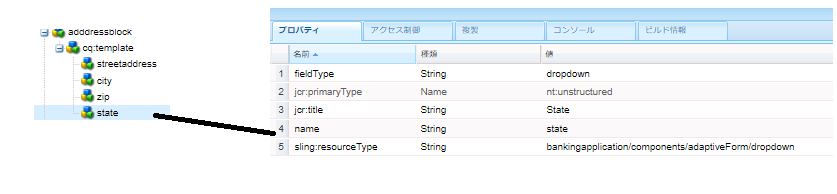

# 住所コンポーネントの作成

AEM Forms のローカルクラウド対応インスタンスの CRXDE にログインします。

``/apps/bankingapplication/components/adaptiveForm/button`` ノードのコピーを作成し、名前を addressblock に変更します。addressblock ノードを選択し、次に示すようにプロパティを設定します。

>[!NOTE]
>
> ``bankingapplication`` は、Maven プロジェクトの作成時に提供された appId です。この appId は、環境によって異なる可能性があります。任意のコンポーネントのコピーを作成できます。例として、ボタンコンポーネントのコピーを作成しました。

## cq-template ノードのプロパティ

``addressblock`` ノードの下にある ``cq-template`` ノードを選択し、次に示すようにプロパティを設定します。fieldType が panel に設定されます。

## cq-template の下へのノードの追加

``cq-template`` の下に ``nt:unstructured`` タイプの次のノードを追加します。

* streetaddress
* city
* zip
* state

これらのノードは、住所ブロックコンポーネントのフィールドを表します。streetaddress、city、zip のフィールドはテキスト入力フィールドになり、state フィールドはドロップダウンフィールドになります。

## streetaddress ノードのプロパティの設定

>[!NOTE]
>
> パス内の **_bankingapplication_** は、Maven プロジェクトの appId を参照します。これは、環境によって異なる可能性があります。

``streetaddress`` ノードを選択し、次に示すようにプロパティを設定します。

## city ノードのプロパティの設定

``city`` ノードを選択し、次に示すようにプロパティを設定します。

## zip ノードのプロパティの設定

``zip`` ノードを選択し、次に示すようにプロパティを設定します。

## state ノードのプロパティの設定

``state`` ノードを選択し、次に示すようにプロパティを設定します。state の fieldType がドロップダウンに設定されます。

## state フィールドのデフォルト値の設定

``state`` ノードを選択して、次のプロパティを追加します。

| 名前 | タイプ | 値 |
|----------|----------|---------------------|
| enum | 文字列[] | CA、NY |
| enumNames | 文字列[] | California、New York |

最終的な addressblock コンポーネントは次のようになります。

## 次の手順

[プロジェクトのデプロイ](./deploy-your-project.md)
