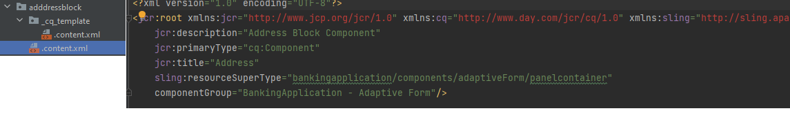

# プロジェクトのデプロイ

AEM Formsas a Cloud Serviceへのプロジェクトのデプロイを開始する前に、ローカルのAEM Forms cloud ready インスタンスにプロジェクトをデプロイすることをお勧めします。

## 変更内容を AEM プロジェクトに同期する

以下に示すように、IntelliJ を起動し、``ui.apps`` フォルダーの下の adaptiveForm フォルダーに移動します

``adaptiveForm`` ノードを右クリックして、新規 | パッケージを選択します
必ず名前 **addressblock** をパッケージに追加します

新しく作成されたパッケージ ``addressblock`` を右クリックし、以下に示すように ``repo | Get Command`` 選択します

これにより、ロジェクトがローカルのクラウド対応 AEM Forms インスタンスと同期されます。.content.xml ファイルを検証して、プロパティを確認できます

## ローカルインスタンスにプロジェクトをデプロイ

新しいコマンドプロンプトウィンドウを起動し、プロジェクトのルートフォルダーに移動して、以下に示すコマンドを使用してプロジェクトを作成します

プロジェクトが正常にデプロイされると、
アダプティブフォームでアドレスコンポーネントを使用できるようになります

## 開発環境にプロジェクトをデプロイ

ローカル開発環境で問題がなければ、次の手順で Cloud Manager を使用して [クラウドインスタンスにデプロイします。](https://experienceleague.adobe.com/ja/docs/experience-manager-learn/cloud-service/forms/developing-for-cloud-service/push-project-to-cloud-manager-git)
