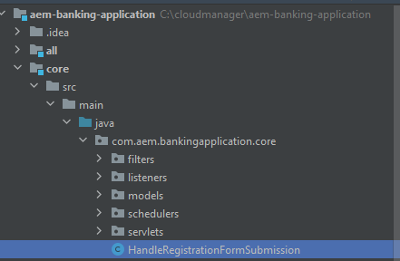
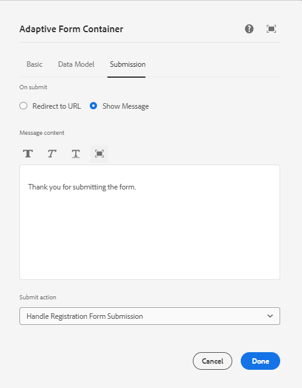

# カスタム送信の作成

AEM Forms には、ほとんどのユースケースに対応できる、多数の送信オプションが標準で用意されています。これらの事前定義済み送信アクションに加えて、AEM Forms では、必要に応じてフォーム送信を処理する独自のカスタム送信ハンドラーを作成できます。

カスタム送信サービスを書き込むには、次の手順に従います

## AEM プロジェクトを作成

既存の AEM Forms as a Cloud Service プロジェクトがある場合は、[カスタム送信サービスの書き込みに進む](#Write-the-custom-submit-service)ことができます

* C ドライブ上に cloudmanager というフォルダーを作成します。
* この新しく作成したフォルダーに移動します
* [このテキストファイル](./assets/creating-maven-project.txt)の内容をコマンドプロンプトウィンドウにコピー＆ペーストします。[最新バージョン](https://github.com/adobe/aem-project-archetype/releases)に応じて、DarchetypeVersion=41 の変更が必要な場合があります。この記事の作成時点での最新バージョンは 41 でした。
* Enter キーを押してコマンドを実行します。すべてが正しく行われた場合は、ビルド成功のメッセージが表示されます。

## カスタム送信サービスの書き込み{#Write-the-custom-submit-service}

IntelliJ を起動し、AEM プロジェクトを開きます。以下のスクリーンショットに示すように、**HandleRegistrationFormSubmission** という名前の新しい Java クラスを作成します


このサービスを実装するには、次のコードを書き込みます。

```java
package com.aem.bankingapplication.core;
import java.util.HashMap;
import java.util.Map;
import com.google.gson.Gson;
import org.osgi.service.component.annotations.Component;
import com.adobe.aemds.guide.model.FormSubmitInfo;
import com.adobe.aemds.guide.service.FormSubmitActionService;
import com.adobe.aemds.guide.utils.GuideConstants;
import com.google.gson.JsonObject;
import org.slf4j.*;

@Component(
        service=FormSubmitActionService.class,
        immediate = true
)
public class HandleRegistrationFormSubmission implements FormSubmitActionService {
    private static final String serviceName = "Core Custom AF Submit";
    private static Logger logger = LoggerFactory.getLogger(HandleRegistrationFormSubmission.class);


    @Override
    public String getServiceName() {
        return serviceName;
    }

    @Override
    public Map<String, Object> submit(FormSubmitInfo formSubmitInfo) {
        logger.error("in my custom submit service");
        Map<String, Object> result = new HashMap<>();
        logger.error("in my custom submit service");
        String data = formSubmitInfo.getData();
        JsonObject formData = new Gson().fromJson(data,JsonObject.class);
        logger.error("The form data is "+formData);
        JsonObject jsonObject = new JsonObject();
        jsonObject.addProperty("firstName",formData.get("firstName").getAsString());
        jsonObject.addProperty("lastName",formData.get("lastName").getAsString());
        result.put(GuideConstants.FORM_SUBMISSION_COMPLETE, Boolean.TRUE);
        result.put("json",jsonObject.toString());
        return result;
    }

}
```

## apps の下での crx ノードの作成

ui.apps ノードを展開し、以下のスクリーンショットに示すように、apps ノードの下に **HandleRegistrationFormSubmission** という新しいパッケージを作成します

**HandleRegistrationFormSubmission** の下に .content.xml というファイルを作成します。次のコードを .content.xml にコピー＆ペーストします。

```xml
<?xml version="1.0" encoding="UTF-8"?>
<jcr:root xmlns:jcr="http://www.jcp.org/jcr/1.0" xmlns:sling="http://sling.apache.org/jcr/sling/1.0"
    jcr:description="Handle Registration Form Submission"
    jcr:primaryType="sling:Folder"
    guideComponentType="fd/af/components/guidesubmittype"
    guideDataModel="xfa,xsd,basic"
    submitService="Core Custom AF Submit"/>
```

**submitService** 要素の値は、FormSubmitActionService 実装の **serviceName = &quot;Core Custom AF Submit&quot;** と一致する必要があります。

## ローカル AEM Forms インスタンスにコードをデプロイ

変更を Cloud Manager リポジトリにプッシュする前に、ローカルのクラウド対応オーサーインスタンスにコードをデプロイしてテストすることをお勧めします。オーサーインスタンスが実行中であることを確認します。
クラウド対応オーサーインスタンスにコードをデプロイするには、AEM プロジェクトのルートフォルダーに移動し、次のコマンドを実行します

```
mvn clean install -PautoInstallSinglePackage
```

これにより、コードが 1 つの単一パッケージとしてオーサーインスタンスにデプロイされます

## Cloud Manager へのコードのプッシュと、コードのデプロイ

ローカルインスタンス上のコードを確認したら、コードをクラウドインスタンスにプッシュします。
変更をローカル Git リポジトリにプッシュしてから、Cloud Manager リポジトリにプッシュします。[Git の設定](https://experienceleague.adobe.com/docs/experience-manager-learn/cloud-service/forms/developing-for-cloud-service/setup-git.html?lang=ja)、[Cloud Manager リポジトリへの AEM プロジェクトのプッシュ](https://experienceleague.adobe.com/docs/experience-manager-learn/cloud-service/forms/developing-for-cloud-service/push-project-to-cloud-manager-git.html?lang=ja)、[開発環境へのデプロイ](https://experienceleague.adobe.com/docs/experience-manager-learn/cloud-service/forms/developing-for-cloud-service/deploy-to-dev-environment.html?lang=ja)の記事を参照してください。

パイプラインが正常に実行されると、以下のスクリーンショットに示すように、フォームの送信アクションをカスタム送信ハンドラーに関連付けられるようになります


## 次の手順

[React アプリでカスタム応答を表示](./handle-response-react-app.md)
