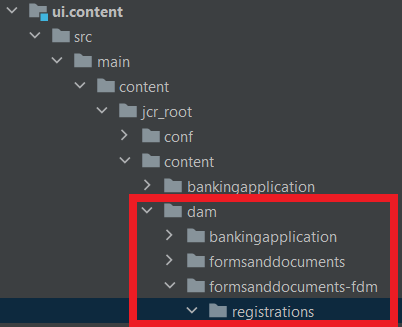

# プロジェクトにクラウドサービス設定を含める

クラウドサービス設定を保持する「FormTutorial」という設定コンテナを作成する
Azure ストレージのクラウドサービス設定を作成し、Azure ストレージアカウントの詳細と Azure アクセスキーを指定して、「FormsTutorial」コンテナ内に「FormsCSAndAzureBlob」という名前を付けます。

IntelliJ で AEM プロジェクトを開きます。 ui.content プロジェクトで、以下に示すように、FormTutorial フォルダーを必ず追加してください。


ui.content プロジェクトの filter.xml に次のエントリを必ず追加してください

```xml
<filter root="/conf/FormTutorial" mode="replace"/>
```


## プロジェクトにフォームデータモデルを含める

前の手順で作成したクラウドサービス設定に基づいて、フォームデータモデルを作成します。 フォームデータモデルをプロジェクトに含めるには、AEM の intelliJ プロジェクトに適切なフォルダー構造を作成します。 例えば、フォームデータモデルが、登録という名前のフォルダーにあるとします


ui.content プロジェクトの filter.xml に適切なエントリを含める

```xml
<filter root="/content/dam/formsanddocuments-fdm/registrations" mode="replace"/>
```


>[!NOTE]
>
>Cloud Manager を使用してプロジェクトをビルドおよびデプロイする際に、クラウドサービス設定で Azure アクセスキーを再入力する必要があります。 アクセス キーを再入力しないために、[次の記事](./context-aware-fdm.md)で説明されているように、環境変数を使用してコンテキスト対応の構成を作成することをお勧めします。

## 次の手順

[コンテキスト対応設定の作成](./context-aware-fdm.md)
