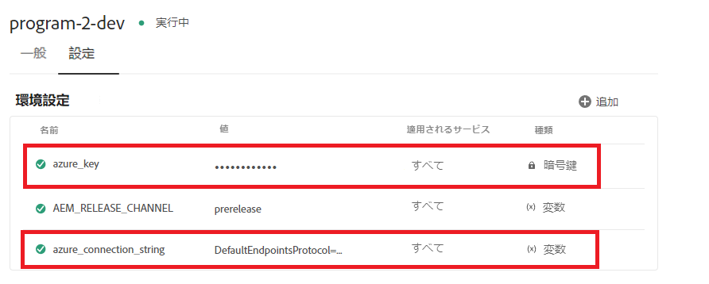

# コンテキスト対応のクラウド設定

ローカル環境でクラウド設定を作成し、テストが成功した場合、アップストリーム環境で同じクラウド設定を使用しても、エンドポイント、秘密鍵／パスワード、ユーザー名を変更する必要はありません。このユースケースを実現するために、Cloud Service 上の AEM Forms にコンテキスト対応のクラウド設定を定義する機能を導入しました。
例えば、Azure ストレージアカウントのクラウド設定は、異なる接続文字列とキーを使用することで、開発環境、ステージング環境、実稼動環境で再利用できます。

コンテキスト対応のクラウド設定を作成するのに必要な手順を次に示します。

## 環境変数の作成

標準環境変数は、Cloud Manager を介して設定および管理できます。これらは実行時環境に提供され、OSGi 設定で使用できます。[環境変数には、環境固有の値または環境シークレットを変更内容に応じて指定できます。](https://experienceleague.adobe.com/docs/experience-manager-cloud-service/content/implementing/using-cloud-manager/environment-variables.html?lang=ja)


次のスクリーンショットは、定義した azure_key と azure_connection_string の環境変数を示しています


これらの環境変数は、適切な環境で使用する設定ファイルで指定できます
例えば、すべてのオーサーインスタンスでこれらの環境変数を使用する場合は、次に指定するように config.author フォルダーで設定ファイルを定義します

## 設定ファイルを作成

IntelliJ で プロジェクトを開きます。config.author に移動し、ファイルを作成します。

```java
org.apache.sling.caconfig.impl.override.OsgiConfigurationOverrideProvider-integrationTest.cfg.json
```


前の手順で作成したファイルに、次のテキストをコピーします。 このファイルのコードは、accountName プロパティと accountKey プロパティの値を環境変数 **azure_connection_string** と **azure_key** で上書きしています。

```json
{
  "enabled":true,
  "description":"dermisITOverrideConfig",
  "overrides":[
   "cloudconfigs/azurestorage/FormsCSAndAzureBlob/accountName=\"$[env:azure_connection_string]\"",
   "cloudconfigs/azurestorage/FormsCSAndAzureBlob/accountKey=\"$[secret:azure_key]\""

  ]
}
```

>[!NOTE]
>
>この設定は、クラウドサービスインスタンス内のすべてのオーサー環境に適用されます。設定をパブリッシュ環境に適用するには、同じ設定ファイルを IntelliJ プロジェクトの config.publish フォルダーに配置する必要があります
>[!NOTE]
> 上書きされるプロパティがクラウド設定の有効なプロパティであることを確認してください。クラウド設定に移動して、次に示すように、上書きするプロパティを見つけます。


基本認証を使用する REST ベースのクラウド設定の場合は、通常、serviceEndPoint、userName および password のプロパティの環境変数を作成する必要があります。

## 次の手順

[AEM プロジェクトを Cloud Manager にプッシュ](./push-project-to-cloud-manager-git.md)
