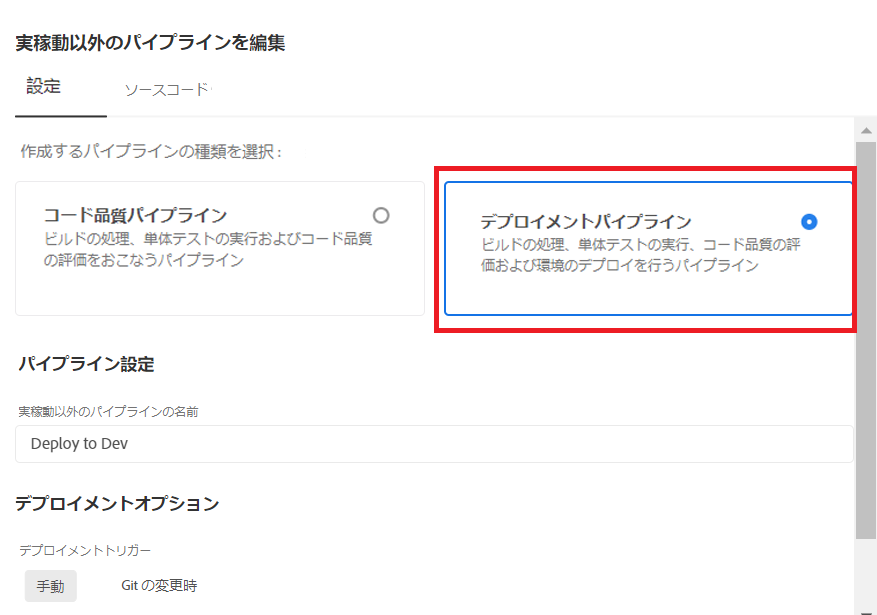
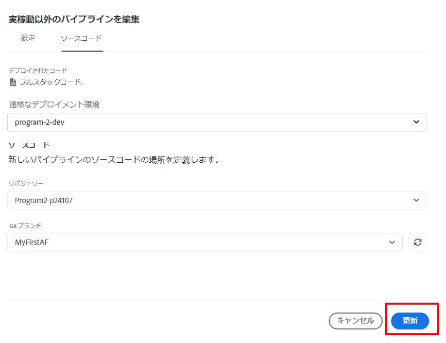
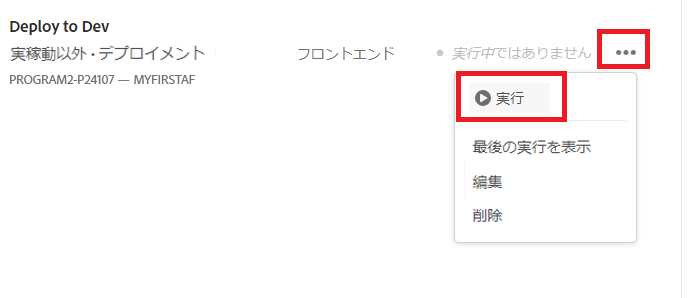

# ローカル開発環境へのデプロイ

前の手順では、ローカル Git リポジトリから Cloud Manager リポジトリの MyFirstAF ブランチにメインブランチをプッシュしました。

次の手順では、コードを開発環境にデプロイします。
Cloud Manager にログインし、プログラムを選択します。

「開発環境にデプロイ」を選択します（下図を参照）。

「デプロイメントパイプライン」を選択します（下図を参照）。

ソースコードと適切な Git ブランチを選択します。

必ず変更内容を更新してください。

パイプラインを実行します。

コードをデプロイすると、AEM Forms の Cloud Service インスタンスに変更内容が表示されます。

## 次の手順

[Maven アーキタイププロジェクトの更新](./updating-project-archetype.md)
