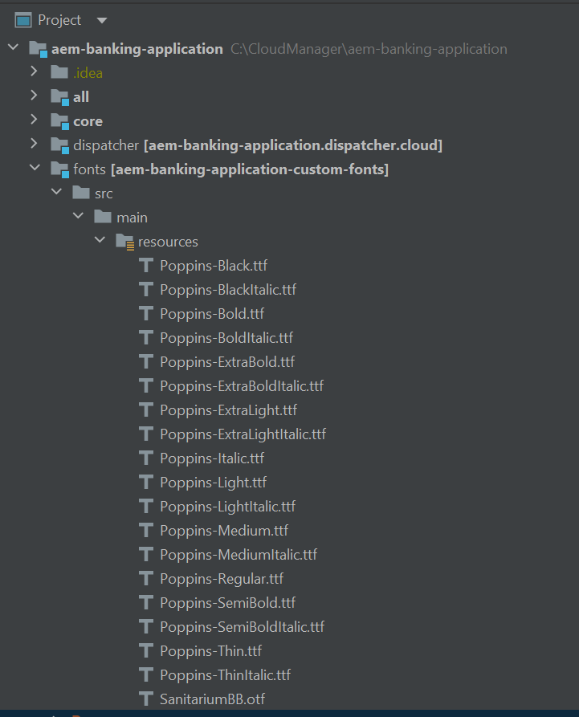
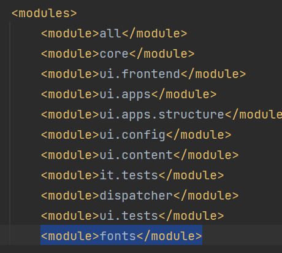

# IntelliJ のインストール

 [IntelliJ コミュニティエディション](https://www.jetbrains.com/idea/download/#section=windows)をインストールします。インストール時に推奨された場合、デフォルトの設定をそのまま使用することができます。

## AEM プロジェクトの読み込み

* IntelliJ の起動
* 前の手順で作成した AEM プロジェクトを読み込みます。 プロジェクトが読み込まれると、画面の表示はこの  のようになります。通常は、core,ui.apps,ui.config および ui.content サブプロジェクトを使用します。
* Maven ウィンドウと Terminal ウィンドウが表示されない場合は、View／Tools Window に移動し、「Maven and Terminal」を選択してください

## フォントモジュールの追加

PDF ファイルでカスタムフォントを使用する場合は、カスタムフォントを AEM Forms CS インスタンスにプッシュする必要があります。 次の手順に従ってください。

* C:\CloudManager\aem-banking-application に **fonts** という名前のフォルダーを作成します。
* 新しく作成した fonts フォルダーに [font.zip](assets/fonts.zip) の内容を抽出します。
* フォントモジュールには、いくつかのカスタムフォントが含まれています。組織のカスタムフォントはフォントモジュールの C:\CloudManager\aem-banking-application\fonts\src\main\resources フォルダーに追加できます。
* C:\CloudManager\aem-banking-application\pom.xml ファイルを開きます。
* pom.xml の modules セクションに、```<module>fonts</module>``` という行を追加します。
* pom.xml を保存します。
* IntelliJ で aem-banking-application プロジェクトを更新します。

fonts モジュールを含んだプロジェクト構造


プロジェクト POM に含まれている fonts モジュール


## 次の手順

[Git の設定](./setup-git.md)
