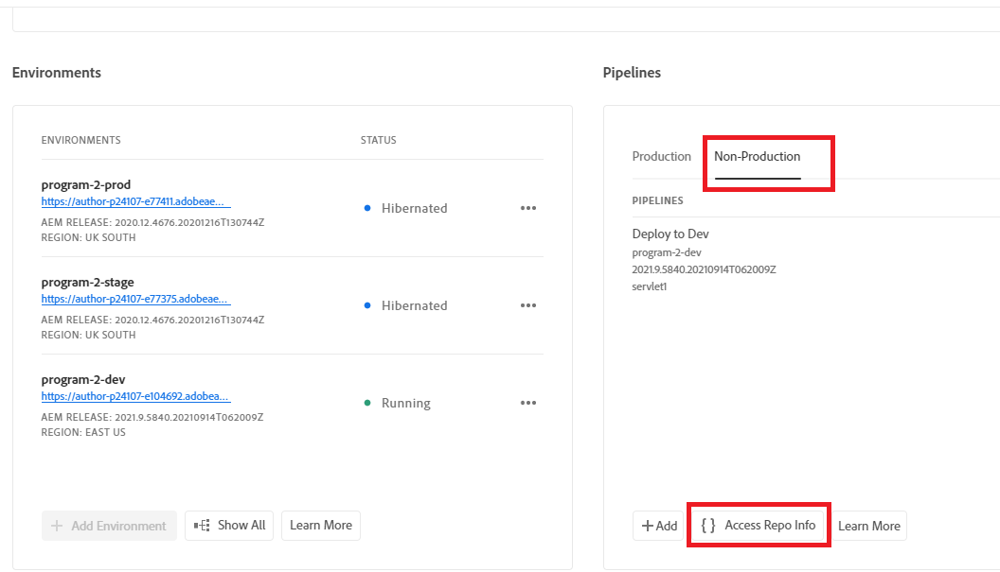

# Git のインストール


[Git のインストール](https://git-scm.com/downloads). デフォルト設定を選択して、インストールプロセスを完了できます。
コマンドプロンプトに移動c:\cloudmanager\aem-banking-app type in git —version に移動します。 システムにインストールされている GIT のバージョンが表示されます

## ローカル Git リポジトリの初期化

c:\cloudmanager\aem-banking-app folderフォルダー内にあることを確認します。

```
git init
```

上記のコマンドは、プロジェクトを Git ローカルリポジトリとして初期化します

```
git add .
```

これにより、Git リポジトリにコミットできる状態で、すべてのプロジェクトファイルが Git リポジトリに追加されます

```
git commit -m "initial commit"
```

これにより、ファイルが Git リポジトリにコミットされます


## Cloud Manager リポジトリをローカル Git リポジトリに登録する

Cloud Manager リポジトリへのアクセス

Cloud Manager のリポジトリ資格情報の取得


ユーザー名を設定ファイルに保存します。

```java
git config --global credential.username "gbedekar-adobe-com"
```

パスワードを設定ファイルに保存します。

```java
git config --global user.password "bqwxfvxq2akawtqx3oztacb5wax5a7"
```

（パスワードは Cloud Manager の Git リポジトリのパスワードです）

Cloud Manager の Git リポジトリをローカル Git リポジトリに登録します。 以下のコマンドは関連付けられます。 **adobe** リモート cloud manager git リポジトリに置き換えます。 代わりに任意の名前を使用できました。 **adobe**


```java
git remote add adobe https://git.cloudmanager.adobe.com/techmarketingdemos/Program2-p24107/
```

（リポジトリ URL を使用していることを確認してください）。

リモートリポジトリが登録されているかどうかを確認します

```java
git remote -v
```


