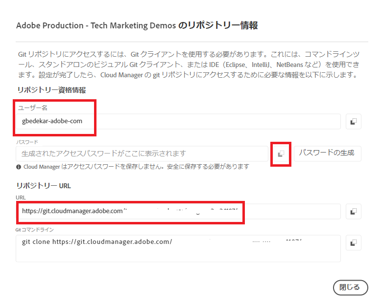

# Git のインストール


[Git をインストールします](https://git-scm.com/downloads)。デフォルトの設定を選択し、インストールプロセスを完了できます。
コマンドプロンプトに移動します。
c:\cloudmanager\aem-banking-app に移動します。
git --version と入力します。 システムにインストールされている GIT のバージョンが表示されます。

## ローカル Git リポジトリを初期化

c:\cloudmanager\aem-banking-app folder にいることを確認します。 

```
git init
```

上記のコマンドは、プロジェクトを Git ローカルリポジトリとして初期化します。

```
git add .
```

これにより、Git リポジトリにコミットする準備が整った Git リポジトリに、すべてのプロジェクトファイルが追加されます。

```
git commit -m "initial commit"
```

これにより、ファイルが Git リポジトリにコミットされます


## Cloud Manager リポジトリをローカル Git リポジトリに登録する

Cloud Manager リポジトリにアクセス

Cloud Manager のリポジトリ資格情報を取得します。


ユーザー名を設定ファイルに保存します。

```java
git config --global credential.username "gbedekar-adobe-com"
```

パスワードを設定ファイルに保存します。

```java
git config --global user.password "XXXX"
```

（パスワードは Cloud Manager の Git リポジトリのパスワードです）

Cloud Manager の Git リポジトリをローカル Git リポジトリに登録します。 以下のコマンドは、**bankingapp** をリモート Cloud Manager Git リポジトリに関連付けます。**bankingapp** の代わりに任意の名前を使用できました。


```shell
git remote add bankingapp https://git.cloudmanager.adobe.com/<cloud-manager-repo-path>
```

（リポジトリ URL を使用していることを確認）

リモートリポジトリが登録されているかどうかを確認します。

```java
git remote -v
```

## 次の手順

[IntelliJ のAEMをAEM Project と同期](./intellij-and-aem-sync.md)
