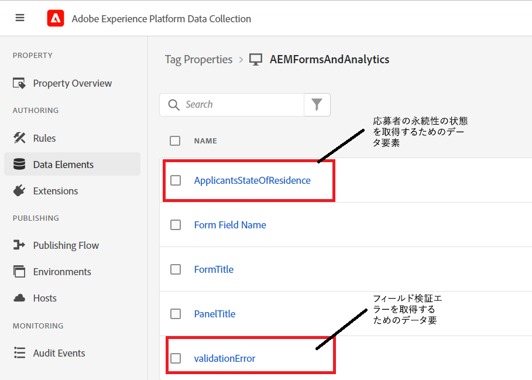

# 適切なデータ要素の作成

tags プロパティに、2 つの新しいデータ要素（ApplientsStateOfResidence および validationError）を追加しました。


## ApplicantStateOfResidence

この **ApplicantStateOfResidence** データ要素は、「 **コア** 拡張機能ドロップダウンで、 **カスタムコード** 以下のスクリーンショットに示すように、データ要素タイプの


次のカスタムコードは、 **_state_** アダプティブフォームフィールド

```javascript
// use the GuideBridge API to access adaptive form elements
//The state field's SOM expression is used to access the state field
var ApplicantsStateOfResidence = guideBridge.resolveNode("guide[0].guide1[0].guideRootPanel[0].state[0]").value;
_satellite.logger.log(" Returning  Applicants State Of Residence is "+ApplicantsStateOfResidence);
return ApplicantsStateOfResidence;
```

## validationError

この **ValidationError** データ要素は、「 **コア** 拡張機能ドロップダウンで、 **カスタムコード** 以下のスクリーンショットに示すように、データ要素タイプの


次のカスタムコードは、validationError データ要素の値を設定するために記述されました。

```javascript
var validationError = "";
// Using GuideBridge API to access adaptive forms fields using the fields SOM expression
var tel = guideBridge.resolveNode("guide[0].guide1[0].guideRootPanel[0].telephone[0]");
var email = guideBridge.resolveNode("guide[0].guide1[0].guideRootPanel[0].email[0]");
_satellite.logger.log("Got tel in Tags custom script "+tel.isValid)
_satellite.logger.log("Got email in Tags custom script "+email.isValid)
if(tel.isValid == false)
{  
  validationError = "error: telephone number";
  _satellite.logger.log("Validation error is "+ validationError);
}

if(email.isValid == false)
{  
  validationError = "error: invalid email";
  _satellite.logger.log("Validation error is "+ validationError);
}

return validationError;
```
