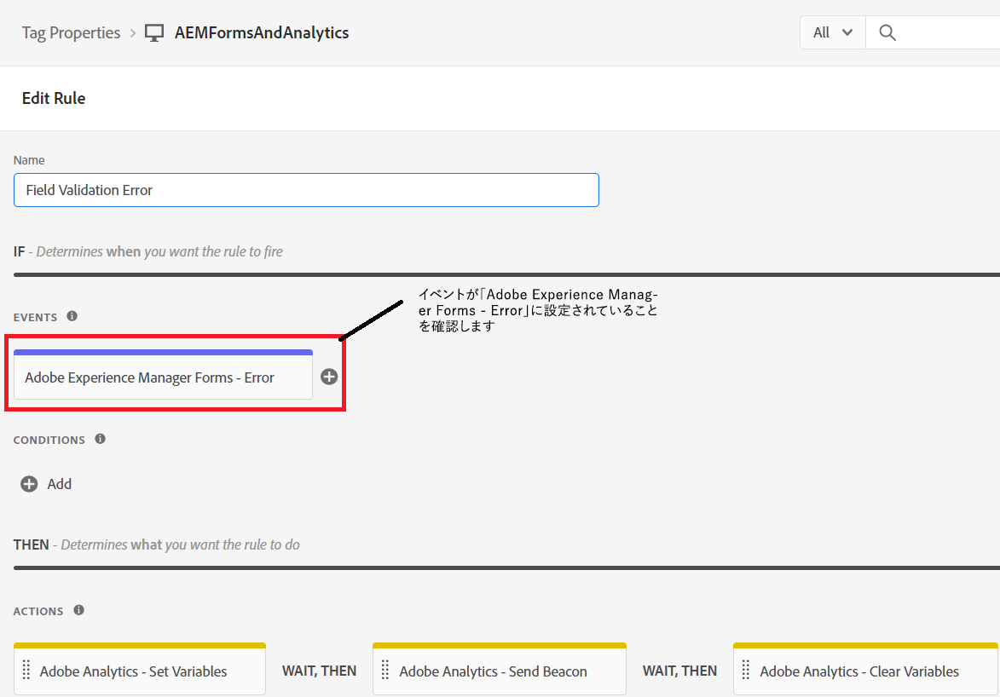

# ルールを定義

Tags プロパティで、2 つの新しい [ルール](https://experienceleague.adobe.com/docs/platform-learn/implement-in-websites/configure-tags/add-data-elements-rules.html)(**フィールド検証エラーとフォーム送信**) をクリックします。

## フィールド検証エラー

この **フィールド検証エラー** ルールは、アダプティブフォームフィールドに検証エラーが発生するたびにトリガーされます。 例えば、電話番号や E メールが想定される形式ではない場合、検証エラーメッセージが表示されます。
フィールド認証エラールールは、イベントを _**Adobe Experience Manager Forms-Error**_ スクリーンショットに示すように

「 Adobe Analytics - Set Variables 」は、次のように設定します

## フォーム送信ルール

フォーム送信ルールは、アダプティブフォームが正常に送信されるたびにトリガーされます。
フォーム送信ルールは、 _**Adobe Experience Manager Forms — 送信**_ イベント

フォーム送信ルールで、データ要素の値 _**ApplicatorsStateOfResidence**_ は prop5 にマッピングされ、データ要素 FormTitle の値は prop8 にマッピングされます。

Adobe Analytics - Set 変数は、次のように設定します。

タグコードをテストする準備が整ったら、[タグに加えた変更を公開する](https://experienceleague.adobe.com/docs/experience-platform/tags/publish/publishing-flow.html) 公開フローを使用します。
