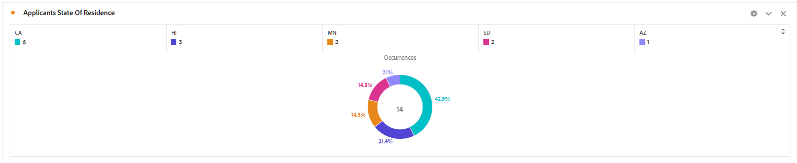
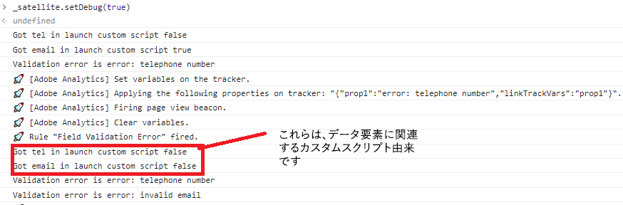

# ソリューションのテスト

フォーム値のいくつかの組み合わせを使用して、フォームをプレビューし送信します。Adobe Analytics レポートでデータが表示されるまで、数分～30 分かかります。prop に設定されたデータは、eVar に設定されたデータよりも早くレポートに表示されます。

## レポートスイート

Adobe Analytics でキャプチャされたフォームデータはドーナツ形式で表示されます。

**状態別の送信**



フィールド検証エラー


## デバッグ

アダプティブフォームが、Adobe Launch 設定を含んだ設定コンテナと同じものを使用していることを確認してください。

フォームが Adobe Analytics にデータを送信していることを確認するには、以下を行います。

* ブラウザーで開発者ツールを開きます。
* コンソールパネルで次のテキストを入力します。

```javascript
_satellite.setDebug(true)
```

コンソールウィンドウを開いたまま、フォームを操作します。例えば、次のように表示されます。



## Adobe Experience Platform Debugger の使用

[AEP デバッガー拡張機能](https://experienceleague.adobe.com/docs/experience-platform/debugger/home.html?lang=ja)をブラウザーに追加すると（ログインする必要があります）、より詳細なデバッグ情報を取得できます。


## これで完了です

AEM Forms as a Cloud Service と Adobe Analytics を正常に統合して、フォームデータフィールドに関するレポートを作成しました。