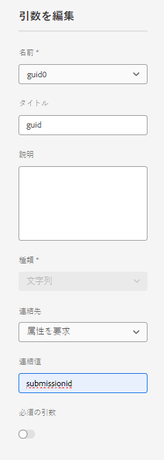
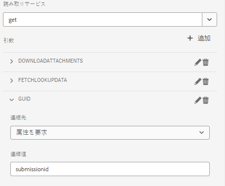
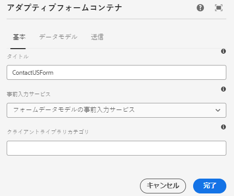

# アダプティブフォームへの SharePoint リストデータの事前入力

AEM Forms の以前のバージョン（6.5）では、request 属性を使用して、フォームデータモデルベースのアダプティブフォームに事前に入力するためのカスタムコードを記述する必要がありました。 AEM Forms as a Cloud Service では、カスタムコードを記述する必要がなくなりました。

この記事では、フォームデータモデルの事前入力サービスを使用して、SharePoint リストから取得したデータをアダプティブフォームに事前入力する手順について説明します。

この記事は、[SharePoint リストにデータを送信するようにアダプティブフォームが正常に設定されている](https://experienceleague.adobe.com/docs/experience-manager-cloud-service/content/forms/adaptive-forms-authoring/authoring-adaptive-forms-core-components/create-an-adaptive-form-on-forms-cs/configure-submit-actions-core-components.html?lang=ja#connect-af-sharepoint-list)ことを前提としています。

次に、SharePoint リストのデータを示します。


特定の GUID に関連付けられたデータをアダプティブフォームに事前入力するには、次の手順を実行する必要があります

## GET サービスの設定

* guid 属性を使用して、フォームデータモデルの最上位オブジェクトの GET サービスを作成する
  

このスクリーンショットでは、guid 列は、`submissionid` という名前のリクエスト属性を使用して連結されています。

GET サービスが完全に設定されると、次のようになります



## フォームデータモデルの事前入力サービスを使用するようにアダプティブフォームを設定する

* SharePoint リストフォームのデータモデルに基づいたアダプティブフォームを開きます。フォームデータモデルの事前入力サービスの関連付け
  

## フォームのテスト

以下に示すように、URL に `submissionid` を含めてフォームをプレビューします。

```html
http://localhost:4502/content/dam/formsanddocuments/contactusform/jcr:content?wcmmode=disabled&submissionid=57e12249-751a-4a38-a81f-0a4422b24412
```
