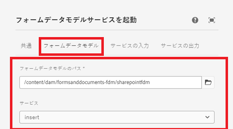

# FDM 呼び出しワークフローステップを使用して SharePoint リストにデータを挿入


この記事では、AEM ワークフローの FDM 呼び出しステップを使用して SharePoint リストにデータを挿入するために必要なステップについて説明します。

この記事は、[SharePoint リストにデータを送信するようにアダプティブフォームが正常に設定されている](https://experienceleague.adobe.com/docs/experience-manager-cloud-service/content/forms/adaptive-forms-authoring/authoring-adaptive-forms-core-components/create-an-adaptive-form-on-forms-cs/configure-submit-actions-core-components.html?lang=ja#connect-af-sharepoint-list)ことを前提としています。


## SharePoint リストデータソースに基づいてフォームデータモデルを作成

* SharePoint リストデータソースに基づいて新しいフォームデータモデルを作成します。
* 適切なモデルと、フォームデータモデルの get サービスを追加します。
* トップレベルのモデルオブジェクトを挿入する挿入サービスを設定します。
* 挿入サービスをテストします。


## ワークフローの作成

* FDM 呼び出しステップを使用して単純なワークフローを作成します。
* 前のステップで作成したフォームデータモデルを使用する FDM 呼び出しステップを設定します。
* 

## コアコンポーネントに基づくアダプティブフォーム

次の形式でデータが送信されます。スクリーンショットに示すように、フォームデータモデルサービスを呼び出しワークフローステップでドット表記を使用して ContactUS オブジェクトを抽出する必要があります。

```json
{
  "ContactUS": {
    "Title": "Mr",
    "Products": "Photoshop",
    "HighNetWorth": "1",
    "SubmitterName": "John Does"
  }
}
```


* 


## 基盤コンポーネントに基づくアダプティブフォーム

次の形式でデータが送信されます。フォームデータモデルサービスを呼び出しワークフローステップでドット表記を使用して ContactUS JSON オブジェクトを抽出します。

```json
{
    "afData": {
        "afUnboundData": {
            "data": {}
        },
        "afBoundData": {
            "data": {
                "ContactUS": {
                    "Title": "Lord",
                    "HighNetWorth": "true",
                    "SubmitterName": "John Doe",
                    "Products": "Forms"
                }
            }
        },
        "afSubmissionInfo": {
            "lastFocusItem": "guide[0].guide1[0].guideRootPanel[0].afJsonSchemaRoot[0]",
            "stateOverrides": {},
            "signers": {},
            "afPath": "/content/dam/formsanddocuments/foundationform",
            "afSubmissionTime": "20240517100126"
        }
    }
}
```


## AEM ワークフローをトリガーするアダプティブフォームの設定

* 前のステップで作成したフォームデータモデルを使用してアダプティブフォームを作成します。
* データソースからフォームに一部のフィールドをドラッグ＆ドロップします。
* 次に示すように、フォームの送信アクションを設定します
* 


## フォームのテスト

前のステップで作成したフォームをプレビューします。フォームに入力して送信します。フォームのデータが SharePoint リストに挿入されます。
