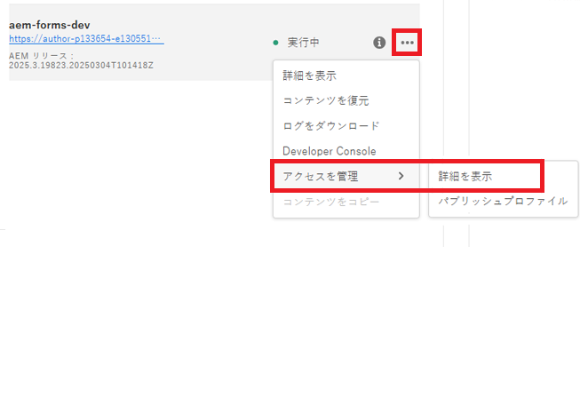
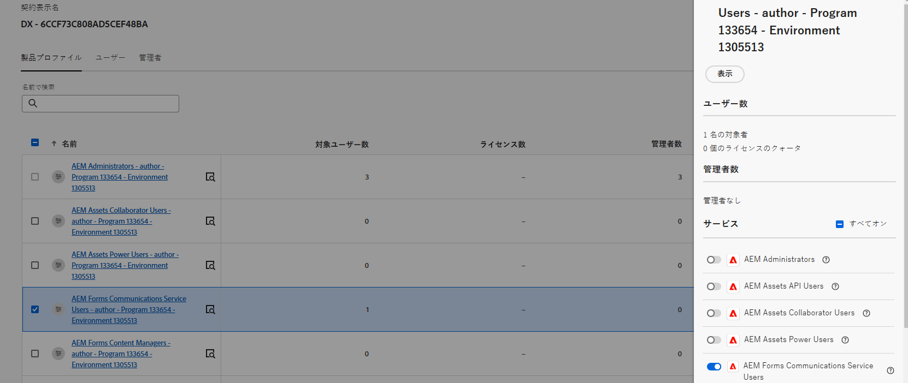
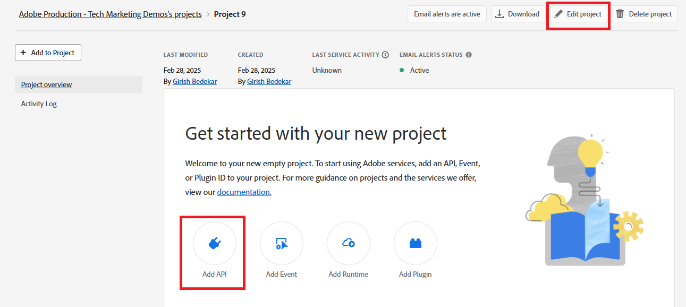
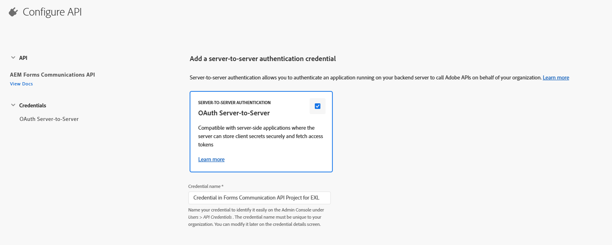
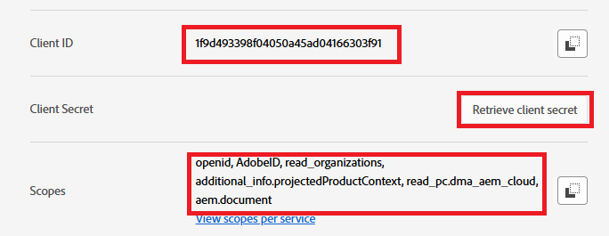

# AEM Forms as a Cloud Service での AEM Forms Communication API の設定

## 前提条件

* AEM Forms as a Cloud Service の最新のインスタンス。
* 必要なすべての[製品プロファイルが環境に追加](https://experienceleague.adobe.com/ja/docs/experience-manager-learn/cloud-service/aem-apis/invoke-openapi-based-aem-apis)されます。

* 以下に示すように、製品プロファイルへの AEM API アクセスを有効にします
  
  

## Adobe Developer Console プロジェクトの作成

Adobe ID を使用して [Adobe Developer Console](https://developer.adobe.com/console/) にログインします。適切なアイコンをクリックして、新しいプロジェクトを作成します

プロジェクトに意味のある名前を付け、「API を追加」アイコンをクリックします

Experience Cloud を選択します

AEM Forms Communications API を選択して、「次へ」をクリックします

サーバー間認証を選択していることを確認し、「次へ」をクリックします

プロファイルを選択し、「設定済み API を保存」ボタンをクリックして設定を保存します

OAuth サーバー間をクリックします

クライアント ID、クライアント秘密鍵およびスコープをコピーします

## ADC プロジェクト通信を有効にする AEM インスタンスの設定

AEM Forms プロジェクトが既にある場合は、[こちらの手順](https://experienceleague.adobe.com/ja/docs/experience-manager-learn/cloud-service/aem-apis/invoke-openapi-based-aem-apis)に従って、Adobe Developer Console プロジェクトの OAuth サーバー間資格情報のクライアント IDを有効にして AEM インスタンスと通信できるようにします

AEM Forms プロジェクトがない場合は、[このドキュメントに従って AEM Forms プロジェクトを作成してください。](https://experienceleague.adobe.com/ja/docs/experience-manager-learn/cloud-service/forms/developing-for-cloud-service/getting-started)次に、Adobe Developer Console プロジェクトの OAuth サーバー間資格情報のクライアント ID を有効にして、[こちらのドキュメントを使用](https://experienceleague.adobe.com/ja/docs/experience-manager-learn/cloud-service/aem-apis/invoke-openapi-based-aem-apis)して AEM インスタンスと通信できるようにします。

## 次の手順

[アクセストークンの生成](./generate-access-token.md)
