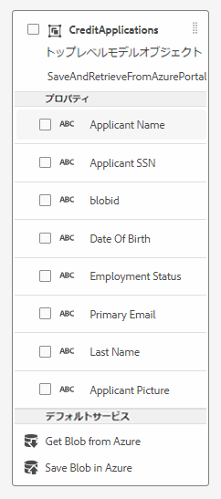

# Azure ストレージとの統合の作成

次に、フォームデータモデルを使用して AEM Forms CS と Azure ストレージの統合を作成します。
次のビデオでは、統合の作成に必要な手順を説明しています。

>[!VIDEO](https://video.tv.adobe.com/v/335385?quality=12&learn=on)

このチュートリアルでは、SaveAndRetrieveFromAzurePortal というフォームデータモデルを CreditApplications というエンティティで作成しました。

## 次の手順

[アダプティブフォームの作成](./create-af.md)
