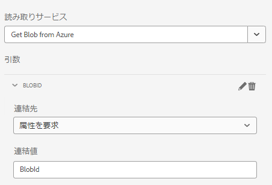

# ページコンポーネント

ページコンポーネントは、ページのレンダリングを担う通常のコンポーネントです。新しいページコンポーネントを作成し、このページコンポーネントを新しいアダプティブフォームテンプレートに関連付けます。これにより、アダプティブフォームがこの特定のテンプレートに基づいている場合にのみ、コードが実行されるようになります。

## ページコンポーネントの作成

ローカルクラウド対応の AEM Forms インスタンスにログインします。apps フォルダーの下に次の構造を作成します。


1. ページフォルダーを右クリックし、cq:Component タイプの storeandfetch というノードを作成します。
1. 変更内容を保存します。
1. 次のプロパティを `storeandfetch` ノードに追加して保存します。

| **プロパティ名** | **プロパティタイプ** | **プロパティ値** |
|-------------------------|-------------------|----------------------------------------|
| componentGroup | 文字列 | hidden |
| jcr:description | 文字列 | アダプティブフォームテンプレートページのタイプ |
| jcr:title | 文字列 | アダプティブフォームテンプレートページ |
| sling:resourceSuperType | 文字列 | `fd/af/components/page2/aftemplatedpage` |

`/libs/fd/af/components/page2/aftemplatedpage/aftemplatedpage.jsp` をコピーし、`storeandfetch` ノードの下にペーストします。`aftemplatedpage.jsp` の名前を `storeandfetch.jsp` に変更します。

`storeandfetch.jsp` を開いて、次の行を追加します。

```jsp
<cq:include script="azureportal.jsp"/>
```

次の行の下に、上の行を追加します。

```jsp
<cq:include script="fallbackLibrary.jsp"/>
```

最終的なコードは以下のようになります。

```jsp
<cq:include script="fallbackLibrary.jsp"/>
<cq:include script="azureportal.jsp"/>
```

storeandfetch ノードの下に azureportal.jsp というファイルを作成し、
次のコードを azureportal.jsp にコピーして、変更内容を保存します。

```jsp
<%@page session="false" %>
<%@include file="/libs/fd/af/components/guidesglobal.jsp" %>
<%@ page import="org.apache.commons.logging.Log" %>
<%@ page import="org.apache.commons.logging.LogFactory" %>
<%
    if(request.getParameter("guid")!=null) {
            logger.debug( "Got Guid in the request" );
            String BlobId = request.getParameter("guid");
            java.util.Map paraMap = new java.util.HashMap();
            paraMap.put("BlobId",BlobId);
            slingRequest.setAttribute("paramMap",paraMap);
    } else {
            logger.debug( "There is no Guid in the request " );
    }            
%>
```

このコードでは、リクエストパラメーター **guid** の値を取得し、BlobId という変数に保存しています。この BlobId は、paramMap 属性を使用して Sling リクエストに渡されます。このコードが機能するには、Azure Storage でサポートされているフォームデータモデルに基づくフォームがあり、フォームデータモデルの読み取りサービスが BlobId というリクエスト属性にバインドされている（以下のスクリーンショットを参照）ことを前提としています。



### 次の手順

[ページコンポーネントとテンプレートの関連付け](./associate-page-component.md)
