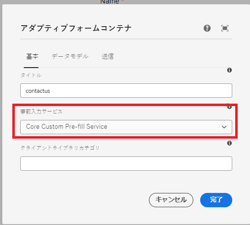

# ソリューションのテスト

コードをデプロイしたら、コアコンポーネントに基づいてアダプティブフォームを作成します。以下のスクリーンショットに示すように、アダプティブフォームを事前入力サービスに関連付けます。


フォームがレンダリングされるたびに、関連する事前入力サービスが実行され、事前入力サービスが返すデータがフォームに入力されます。

例えば、GUID に関連付けられたデータをフォームに事前入力する&#x200B;**d815a2b3-5f4c-4422-8197-d0b73479bf0e**の場合、次の URL が使用されます。
事前入力サービスのコードは、GUID パラメーターの値を抽出し、その GUID に関連付けられたデータをデータソースから取得します。

```html
http://localhost:4502/content/dam/formsanddocuments/contactus/jcr:content?wcmmode=disabled&guid=d815a2b3-5f4c-4422-8197-d0b73479bf0e
```
