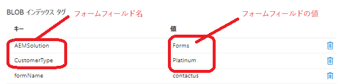

# Blob インデックスタグを追加

データセットが大きくなると、データの海で特定のオブジェクトを見つけるのが難しくなる場合があります。Blob インデックスタグは、キーと値のインデックスタグ属性を使用して、データの管理と検出の機能を提供するものです。単一のコンテナ内、またはストレージアカウント内のすべてのコンテナ間で、オブジェクトを分類して検索できます。例えば、Blob インデックスタグが _**CustomerType=Platinum**_ の場合、「Platinum」は CustomerType フィールドの値です。


次のコードは、送信されたデータから対応する値を持つ Blob インデックスデータタグ文字列を作成します。

```java
@Override
    public String getMetaDataTags(String submittedFormName,String formPath,Session session,String formData) {

        JsonObject jsonObject = JsonParser.parseString(formData).getAsJsonObject();
        List<String>metaDataTags = new ArrayList<String>();
        metaDataTags.add("formName="+submittedFormName);
        Map< String, String > map = new HashMap< String, String >();
        map.put("path", formPath);
        map.put("1_property", "Searchable");
        map.put("1_property.value","true");
        Query query = queryBuilder.createQuery(PredicateGroup.create(map),session);
        query.setStart(0);
        query.setHitsPerPage(20);
        SearchResult result = query.getResult();
        logger.debug("Get result hits " + result.getHits().size());
        for (Hit hit: result.getHits()) {
            try {
                    logger.debug(hit.getPath());
                    String jsonElementName = (String) hit.getProperties().get("name");
                    String fieldName = hit.getProperties().get("name").toString();
                    if(jsonObject.get(jsonElementName).isJsonArray())
                    {
                        
                        JsonArray arrayOfValues = jsonObject.get(jsonElementName).getAsJsonArray();
                        StringBuilder valuesString = new StringBuilder();
                        for(int j=0;j<arrayOfValues.size();j++)
                        {
                            valuesString.append(arrayOfValues.get(j).getAsString());
                            if(j < arrayOfValues.size() -1)
                            {
                                valuesString.append(" and ");
                            }
                        }

                        
                        metaDataTags.add(fieldName + "=" + valuesString.toString());

                    }
                    else
                    {
                        logger.debug("The searchable field name is " + fieldName + "the json element name is " + jsonElementName);
                        metaDataTags.add(fieldName + "=" + jsonObject.get(jsonElementName).getAsString());
                    }

            } catch (RepositoryException e) {
                throw new RuntimeException(e);
            }
        }
        return String.join("&",metaDataTags);
    }
```

## 次の手順

[カスタム送信ハンドラーを作成](./create-custom-submit.md)
