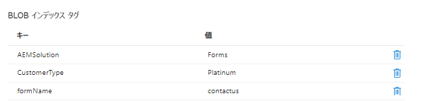

# はじめに

このチュートリアルでは、Blob インデックスタグを使用して Azure ストレージにフォーム送信を保存する、簡単なユースケースの実装方法を学びます。Blob インデックスタグは、キーと値のインデックスタグ属性を使用して、データの管理と検出の機能を提供するものです。単一のコンテナ内、またはストレージアカウント内のすべてのコンテナに対して、オブジェクトを分類して検索できます。

## 前提条件

* AEM Forms CS でのエクスペリエンス。
* Cloud Manager を使用してコードをデプロイした経験。
* AEM Forms CS のクラウド対応インスタンスへのアクセス権限。

上記のユースケースを AEM Forms CS で実装するには、以下が必要です。

* [AEM Forms CS のクラウド対応インスタンス](https://experienceleague.adobe.com/docs/experience-manager-learn/cloud-service/forms/developing-for-cloud-service/intellij-and-aem-sync.html?lang=ja#set-up-aem-author-instance)
* [Azure ポータルアカウント](https://portal.azure.com/)

### 次の手順

[extend-choice-group-components](./extend-choice-group-components.md)
