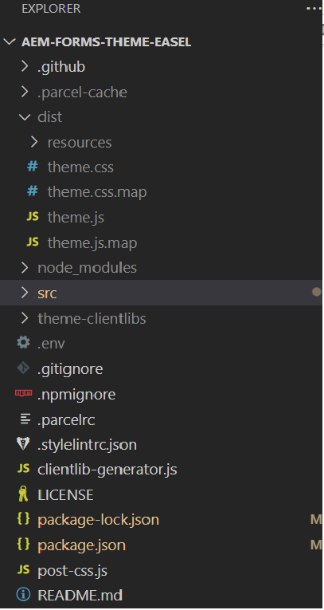

# ボタンコンポーネントのバリエーションの作成

テーマのクローンが作成されたら、visual studio code を使用してプロジェクトを開きます。 同様のビューが表示されます
visual studio code 内


src->components->button->_button.scss ファイルを開きます。 このファイルでカスタムバリエーションを定義します。

## 企業のバリエーション

```css
.cmp-adaptiveform-button-corporate {
  @include container;
  .cmp-adaptiveform-button {
    &__widget {
      @include primary-button;
      background: $brand-red;
      text-transform: uppercase;
      border-radius: 0px;
      color: yellow;
    }
  }
}
```

## 説明

* **cmp-adaptiveform-button—corporate**：これは、「cmp-adaptiveform-button—corporate」コンポーネントのメインラッパーまたはコンテナクラスです。
このブロック内のすべてのスタイルまたはミックスインは、このクラス内の要素に適用されます。
* **@include container**：これは、_mixins.scss で定義されている container という Mixin を使用します。 Mixin コンテナは、通常、余白、パディング、その他の構造スタイルの設定など、レイアウト関連のスタイルを適用して、コンテナの動作が一貫するようにします。
* **.cmp-adaptiveform-button**: corporate-style-button ブロック内では、クラス .cmp-adaptiveform-button を使用して子要素をターゲティングしています。
* **&amp;__widget**:&amp;記号は親セレクター（この場合は.cmp-adaptiveform-button）を参照します。
つまり、ターゲットになる最後のクラスは、.cmp-adaptiveform-button__widget であり、.cmp-adaptiveform-button ブロック内のサブコンポーネント（__widget 要素）を表す BEM スタイルのクラス（ブロック要素修飾子）です。
* **@include primary-button**：プライマリボタン mixin が含まれます。この mixin は_mixin.scss で定義され、ボタンに関連するスタイル（パディング、色、ホバー効果など）を追加します。 mixin プライマリボタンで定義されているプロパティ background、text-transform、border-radius、color がオーバーライドされます。

_mixins.scss ファイルは、次のスクリーンショットに示すように、src->site の下で定義されます。


## マーケティングバリエーション

```css
.cmp-adaptiveform-button--marketing {
  
  @include container;
  .cmp-adaptiveform-button {
  &__widget {
    @include primary-button;
    background-color: #3498db;
    color: white;
    font-weight: bold;
    border: none;
    border-radius: 50px;
    box-shadow: 0 4px 6px rgba(0, 0, 0, 0.1);
    cursor: pointer;
    transition: all 0.3s ease;
    outline: none;
    text-transform: uppercase;
    letter-spacing: 0.05em;
    &:hover:not([disabled]) {
      position: relative;
      scale: 102%;
      transition: box-shadow 0.1s ease-out, transform 0.1s ease-out;
      background-color: #2980b9;
      box-shadow: 0 8px 15px rgba(0, 0, 0, 0.2);
      transform: translateY(-3px);
    }
  }
}
  
}
```

## 次の手順

[バリエーションのテスト](./build.md)


