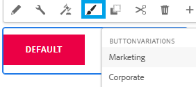

# はじめに

Adobe Experience Manager（AEM）のスタイルシステムを使用すると、コンポーネントの複数の視覚的バリエーションを作成し、フォームのオーサリングで使用するスタイルを選択できます。これにより、スタイルごとにカスタムコンポーネントを作成する必要がなくなるので、コンポーネントをより柔軟に再利用できるようになります。

この記事では、Cloud Manager を使用して変更内容をクラウドインスタンスにプッシュする前に、ボタンコンポーネントのバリエーションを作成し、ローカルのクラウド対応環境でバリエーションをテストする際に役立ちます。

スクリーンショットは、フォーム作成者が使用できるボタンコンポーネントの 2 つのスタイルバリエーションを示しています。

## 前提条件

* コアコンポーネントを含む AEM Forms クラウド対応インスタンス。
* テーマのクローン作成：テーマのクローン作成に精通している必要があります。このチュートリアル用に、[easel テーマ](https://github.com/adobe/aem-forms-theme-easel)のクローンを作成しました。必要に応じて、使用可能なテーマのクローンを作成できます。

* Apache Maven の最新リリースのインストール。Apache Maven は、主に Java™ プロジェクトで使用されるビルド自動化ツールです。最新のリリースをインストールすると、テーマのカスタマイズに必要な依存関係が確保されます。
* プレーンテキストエディターをインストールします。例えば Microsoft® Visual Studio Code などです。Microsoft® Visual Studio Code などのプレーンテキストエディターを使用すると、テーマファイルの編集と変更を行う際に使いやすい環境を利用できます。

## 次の手順

[スタイルポリシーの作成](./style-policy.md)
