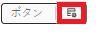
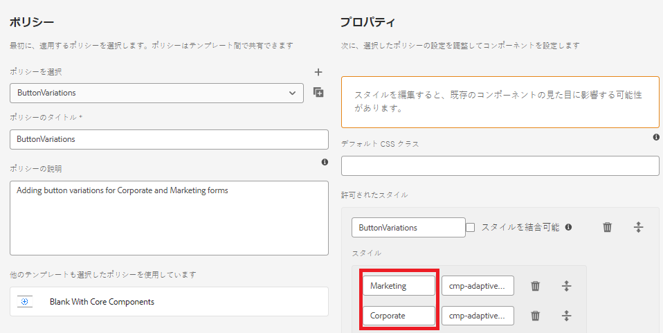

# コンポーネントのポリシーでスタイルを定義する

* ローカルクラウド対応 AEM インスタンスにログインし、ツール／一般／テンプレート／プロジェクト名の順に移動します。

* **コアコンポーネントを含む空白**&#x200B;テンプレートを選択し、編集モードで開きます。
* ボタンコンポーネントの「ポリシー」アイコンをクリックして、ポリシーエディターを開きます。

* 

次に示すように、ポリシーを定義します

Marketing と Corporate という 2 つのスタイル／バリエーションを定義しました。これらのバリエーションは、対応する CSS クラスに関連付けられています。**CSS クラス名の前後にスペースが入らないようにしてください**。
変更を保存します。

| スタイル | CSS クラス |
|-----------|------------------------------------|
| マーケティング | cmp-adaptiveform-button--marketing |
| Corporate | cmp-adaptiveform-button--corporate |

これらの CSS クラスは、コンポーネントの scss ファイル（_button.scss）で定義されます。

## 次の手順

[デフォルト CSS クラス](./create-variations.md)
