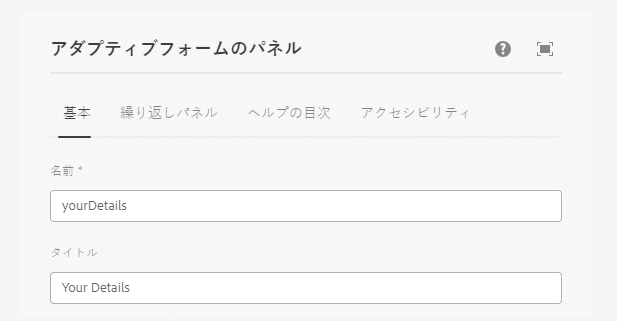

# アダプティブフォームの作成

コアコンポーネントベースのアダプティブフォームを作成し、フォームに垂直タブコンポーネントを挿入します。

## 垂直コンポーネントを設定

垂直タブコンポーネントをクリックして、設定プロパティシートを開きます。 次のタブを設定します

1. 基本 – 次に示すように、垂直タブコンポーネントに意味のある名前とタイトルを指定します
   
1. 項目 – 「項目」タブを使用すると、垂直タブコンポーネントに項目を追加できます。 通常は、パネルを項目として追加してから、フォーム要素をパネルに追加します。 垂直方向のタブにはデフォルトで 2 つの項目があり、以下に示すように、要件に応じて項目に名前を付けることができます
   

## 個々のパネルの設定

1. 詳細 – **情報** ノードの下の項目 1 を選択して、設定プロパティシートを開きます。 以下に示すように、意味のある名前とタイトルを指定します
   

次のフィールドを図のように詳細パネルに追加します

1. 住所 – **情報** ノードの下の項目 2 を選択して、設定プロパティシートを開きます。 以下に示すように、意味のある名前とタイトルを指定します
   

次の 2 つのテキストフィールドを以下に示すようにアドレスパネルに追加します

