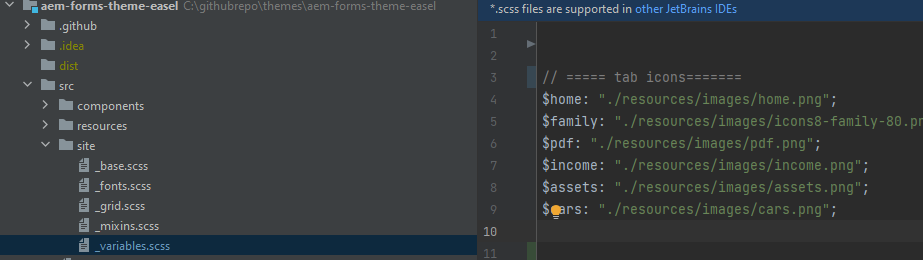
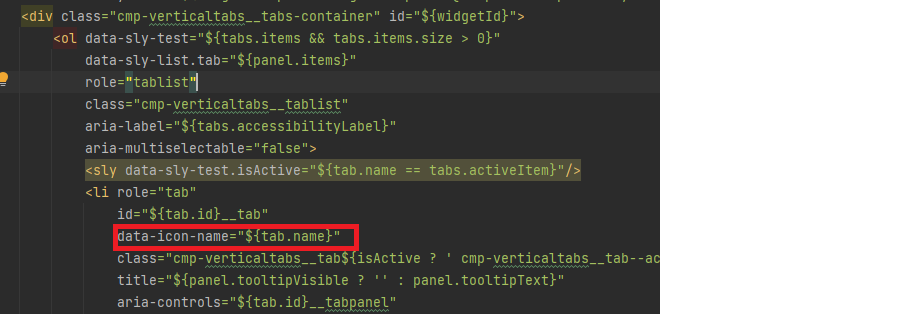
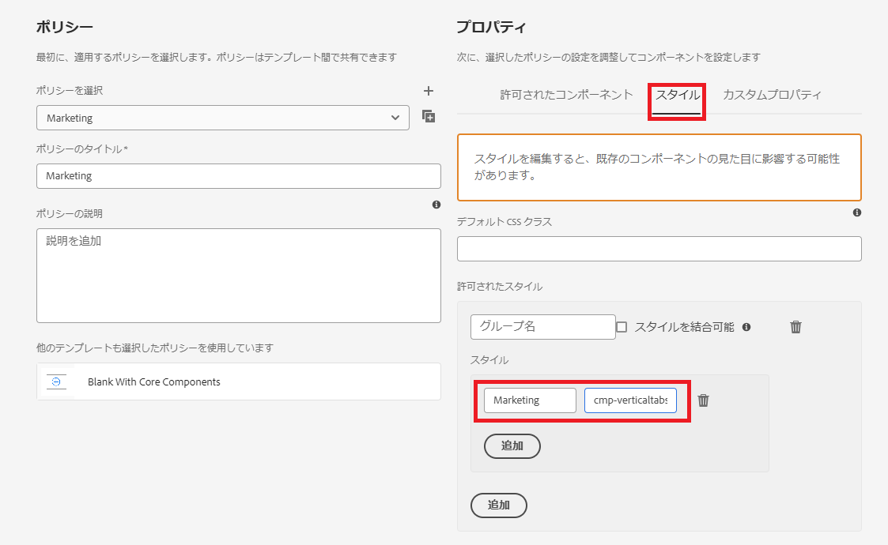
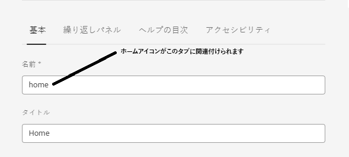

# カスタムアイコンの追加

タブにカスタムアイコンを追加すると、ユーザーエクスペリエンスと視覚的な魅力がいくつかの点で向上します。

* ユーザビリティの向上：アイコンを使用して各タブの目的をすばやく伝えることができ、ユーザーが探しているものを一目で見つけやすくなります。 アイコンなどの視覚的なキューは、ユーザーがより直感的に移動するのに役立ちます。

* 視覚的な階層とフォーカス：アイコンを使用すると、タブ間の明確な分離が作成され、視覚的な階層が向上します。 これにより、重要なタブを目立たせ、ユーザーの注意をより効果的に導くことができます。
この記事に従うと、次に示すようにアイコンを配置できます


## 前提条件

この記事に従うには、Git、Cloud Manager を使用したAEM プロジェクトの作成とデプロイ、AEM Cloud Manager でのフロントエンドパイプラインの設定、CSS について熟知している必要があります。 上記のトピックに詳しくない場合は、「テーマを使用してコアコンポーネントのスタイルを設定する [ の記事に従っ ](https://experienceleague.adobe.com/en/docs/experience-manager-cloud-service/content/forms/adaptive-forms-authoring/authoring-adaptive-forms-core-components/create-an-adaptive-form-on-forms-cs/using-themes-in-core-components#rename-env-file-theme-folder) ください。

## テーマにアイコンを追加する

テーマプロジェクトを visual studio code または任意の他のエディターで開きます。
選択したアイコンを画像フォルダーに追加します。
赤でマークされたアイコンは、追加された新しいアイコンです。


## アイコンを保存する icon-map の作成

icon-map を_variable.scss ファイルに作成します。 SCSS map $icon-map はキーと値のペアのコレクションで、各キーはアイコン名（home、family など）を表し、各値はそのアイコンに関連付けられた画像ファイルへのパスです。



```css
$icon-map: (
    home: "./resources/images/home.png",
    family: "./resources/images/icons8-family-80.png",
    pdf: "./resources/images/pdf.png",
    income: "./resources/images/income.png",
    assets: "./resources/images/assets.png",
    cars: "./resources/images/cars.png"
);
```

## Mixin を追加

_mixin.scss に次のコードを追加します

```css
@mixin add-icon-to-vertical-tab($image-url) {
  display: inline-flex;
  align-self: center;
  &::before {
    content: "";
    display:inline-block;
    background: url($image-url) left center / cover no-repeat;
    margin-right: 8px; /* Space between icon and text */
    height:40px;
    width:40px;
    vertical-align:middle;
    
  }
  
}
```

add-icon-to-vertical-tab mixin は、垂直タブ上のテキストの横にカスタムアイコンを追加するように設計されています。 画像をアイコンとしてタブに簡単に含め、テキストの横に配置してスタイルを設定し、一貫性と整列を確保できます。

Mixin の分類
Mixin の各パートの機能は次のとおりです。

パラメーター:

* $image-url: タブテキストの横に表示するアイコンまたは画像の URL。 このパラメーターを渡すと、必要に応じて異なるアイコンを異なるタブに追加できるので、Mixin は用途が広くなります。

* 適用されるスタイル：

   * 表示：inline-flex：これにより、要素が Flex コンテナになり、ネストされたコンテンツ（アイコンやテキストなど）が水平方向に揃えられます。
   * align-self：中央：要素がコンテナ内で垂直方向に中央に配置されるようにします。
   * 疑似要素（::before）:
   * content: &quot;&quot;：疑似要素：:before を初期化します。この疑似要素は、アイコンを背景画像として表示するために使用されます。
   * 表示：inline-block：疑似要素を inline-block に設定し、テキストのインラインに配置されたアイコンのように動作させます。
   * background: url （$image-url） left center / cover no-repeat;: $image-url で提供された URL を使用して背景画像を追加します。 アイコンを左揃えにし、垂直方向に中央揃えにします。

## _verticaltabs.scss の更新

この記事の目的で、タブアイコンを表示する新しい css クラス（cmp-verticaltabs—marketing）を作成しました。 この新しいクラスでは、アイコンを追加してタブ要素を拡張します。 css クラスの完全なリストは次のとおりです

```css
.cmp-verticaltabs--marketing
{
  .cmp-verticaltabs
    {
      &__tab 
        {
          cursor:pointer;
            @each $name, $url in $icon-map {
            &[data-icon-name="#{$name}"]
              {
                  @include add-icon-to-vertical-tab($url);
              }
            }
        }
    }
}
```

## verticaltabs コンポーネントの変更

```/apps/core/fd/components/form/verticaltabs/v1/verticaltabs/verticaltabs.html``` から verticaltabs.html ファイルをコピーして、プロジェクトの verticaltabs コンポーネントの下に貼り付けます。 次の図に示すように、li ロールの下のコピーされたファイルに次の行 ```data-icon-name="${tab.name}"``` を追加します

タブ名の値を使用して data-icon-name というカスタムデータ属性を設定します。タブ名がアイコンマップ内の画像名と一致する場合、対応する画像がタブに関連付けられます。


## コードのテスト

更新した verticaltabs コンポーネントをクラウドインスタンスにデプロイします。
フロントエンドパイプラインを使用して、更新したテーマをデプロイします。
次のように、垂直タブコンポーネントのスタイルバリエーションを作成します

css クラス _**cmp-verticaltabs—marketing**_ に関連付けられた、「マーケティング」というスタイルバリエーションを作成しました。
垂直タブコンポーネントを使用してアダプティブフォームを作成します。 垂直タブコンポーネントをマーケティングスタイルバリエーションに関連付けます。
垂直タブにいくつかのタブを追加し、アイコン マップで定義されているイメージ（home、family など）に一致するように名前を付けます。


フォームをプレビューすると、タブに関連付けられた適切なアイコンが表示されます
