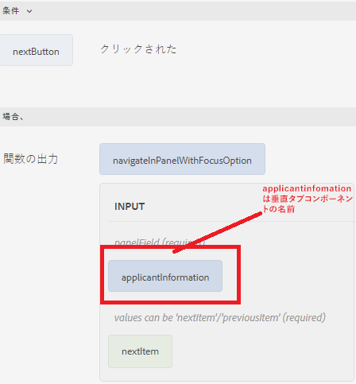
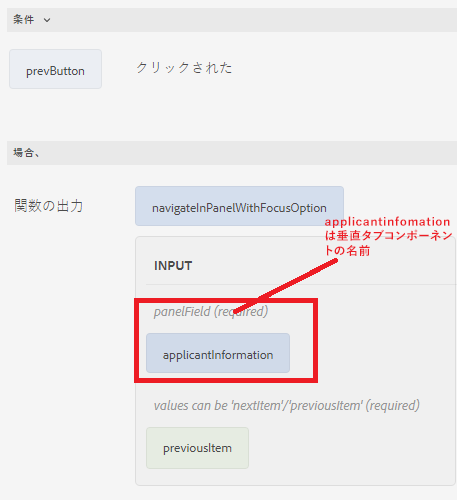

# タブ間の移動

個々のタブをクリックするか、フォームの「前へ」ボタンと「次へ」ボタンを使用して、タブ間を移動できます。
ボタンを使用して移動するには、フォームに 2 つのボタンを追加し、それらに Previous と Next という名前を付けます。 次のカスタム関数をボタンのクリックイベントに関連付けて、タブ間を移動します。

次に、タブ間を移動するためのカスタム関数を示します。


```javascript
/**
 * Navigate in panel with focusOption
 * @name navigateInPanelWithFocusOption
 * @param {object} panelField
 * @param {string} focusOption - values can be 'nextItem'/'previousItem'
 * @param {scope} globals
 */
function navigateInPanelWithFocusOption(panelField, focusOption, globals)
{
    globals.functions.setFocus(panelField, focusOption);
}
```

次に、「次へ」および「前へ」ボタンのルールエディターを示します

**次へボタン**



**前へボタン**



