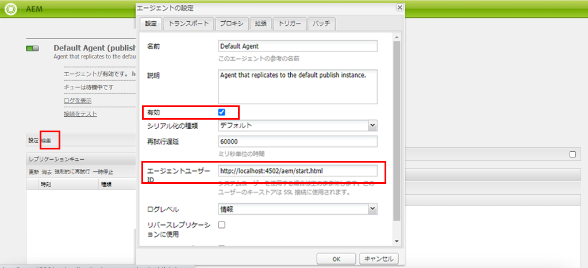
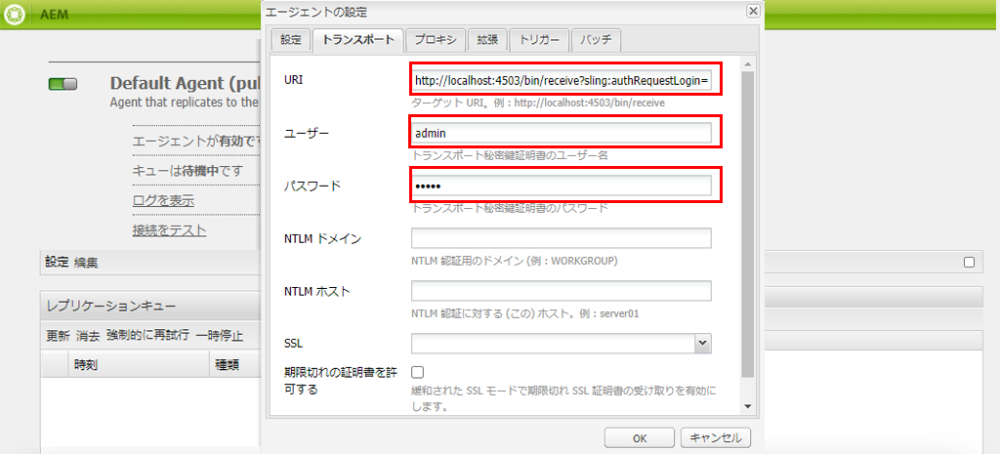
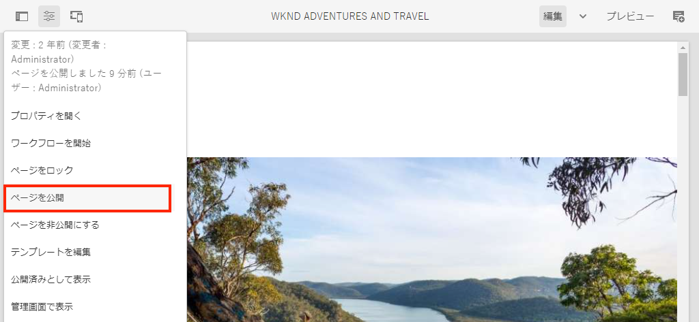

# ローカルAEM Runtimeのセットアップ

>[!CONTEXTUALHELP]
>id="aemcloud_localdev_aemruntime"
>title="ローカルAEMランタイム"
>abstract="Adobe Experience Manager(AEM)は、AEMをCloud ServiceSDKのQuickstart Jarとして使用して、ローカルで実行できます。 これにより、開発者は、カスタムコード、設定、コンテンツをソース管理にコミットする前に、カスタムコード、設定、コンテンツをデプロイしてテストし、Cloud Service環境としてAEMにデプロイできます。"
>additional-url="https://experienceleague.adobe.com/docs/experience-manager-cloud-service/implementing/developing/aem-as-a-cloud-service-sdk.html" text="AEM as a Cloud Service の SDK"
>additional-url="https://experience.adobe.com/#/downloads/content/software-distribution/en/aemcloud.html" text="Cloud ServiceSDKとしてAEMをダウンロードする"

Adobe Experience Manager(AEM)は、AEMをCloud ServiceSDKのQuickstart Jarとして使用して、ローカルで実行できます。 これにより、開発者は、カスタムコード、設定、コンテンツをソース管理にコミットする前に、カスタムコード、設定、コンテンツをデプロイしてテストし、Cloud Service環境としてAEMにデプロイできます。

`~`は、ユーザーのディレクトリの略記法として使用されます。 Windowsでは、`%HOMEPATH%`と同じです。

## Javaのインストール

Experience ManagerはJavaアプリケーションなので、開発ツールをサポートするJava SDKが必要です。

1. [最新のJava SDK 11をダウンロードしてインストールします](https://experience.adobe.com/#/downloads/content/software-distribution/en/general.html?1_group.propertyvalues.property=.%2Fjcr%3Content%2Fdc%3AsoftwareType&amp;1_group.propertyvalues.operation=equals&amp;1_group.propertyvalues.0_values=software-type%3Autoling&amp;fulltext=Oracle%7E+JDK%7E+11%E&amp;orderby=%40jcr%3Content%2Fjcr%3AlastModified&amp;orderby.sort=desc&amp;layout=リスト&amp;p.offset=0&amp;p.limit=14)
1. 次のコマンドを実行して、Java 11 SDKがインストールされていることを確認します。
   + Windows：`java -version`
   + macOS/Linux:`java --version`


## Cloud ServiceSDKとしてAEMをダウンロードする

AEMは、Cloud ServiceSDK、またはAEM SDKとして、開発のためにAEM AuthorとPublishをローカルで実行するためのQuickstart Jarと、互換性のあるバージョンのディスパッチャーツールを含みます。

1. [https://experience.adobe.com/#/downloads](https://experience.adobe.com/#/downloads)にAdobe IDとログインします
   + Adobe組織&#x200B;__は、AEMをCloud ServiceSDKとしてダウンロードするCloud ServiceとしてAEM用に__&#x200B;プロビジョニングされている必要があります。
1. 「Cloud Service __」タブで__ AEMに移動します
1. __発行日__&#x200B;で並べ替え(__降順__&#x200B;順)
1. 最新の&#x200B;__AEM SDK__&#x200B;結果行をクリックします
1. EULAを確認して同意し、「__ダウンロード__」ボタンをタップします

## AEM SDKのzipからQuickstart JARを抽出します。

1. ダウンロードした`aem-sdk-XXX.zip`ファイルを解凍します。

## ローカルAEM Authorサービス{#set-up-local-aem-author-service}のセットアップ

ローカルのAEM Authorサービスは、デジタルマーケターやコンテンツの作成者がコンテンツの作成と管理を共有する、ローカルエクスペリエンスのデベロッパーを提供します。  AEM Author Serviceは、オーサリングとプレビューの両方の環境として設計されており、これに対して機能開発のほとんどの検証を実行できるので、ローカル開発プロセスの重要な要素となります。

1. フォルダー`~/aem-sdk/author`を作成
1. __Quickstart JAR__&#x200B;ファイルを`~/aem-sdk/author`にコピーし、`aem-author-p4502.jar`に名前を変更します
1. コマンドラインから次のコマンドを実行して、ローカルのAEM Author Serviceを開始します。
   + `java -jar aem-author-p4502.jar`
      + 管理者パスワードを`admin`として指定します。 任意の管理者パスワードを使用できますが、再設定の必要性を減らすために、ローカル開発のデフォルトを使用することをお勧めします。

   *重複がクリックして](#troubleshooting-double-click)、AEMをCloud ServiceクイックスタートJAR [として開始することはできません。*
1. Webブラウザーで、[http://localhost:4502](http://localhost:4502)にあるローカルのAEM Author Serviceにアクセスします。

Windows：

```shell
$ mkdir -p c:\Users\<My User>\aem-sdk\author
$ copy aem-sdk-Quickstart-XXX.jar c:\Users\<My User>\aem-sdk\author\aem-author-p4502.jar
$ cd c:\Users\<My User>\aem-sdk\author
$ java -jar aem-author-p4502.jar
```

macOS/Linux:

```shell
$ mkdir -p ~/aem-sdk/author
$ cp aem-sdk-Quickstart-XXX.jar ~/aem-sdk/author/aem-author-p4502.jar
$ cd ~/aem-sdk/author
$ java -jar aem-author-p4502.jar
```

## ローカルAEM発行サービスのセットアップ

ローカルのAEM発行サービスは、AEM上に保存されているWebサイトの参照など、AEMのエンドユーザーが持つローカルエクスペリエンスを開発者に提供します。 ローカルのAEM発行サービスは、AEM SDKの[ディスパッチャーツール](./dispatcher-tools.md)と統合し、開発者がエンドユーザーに対する最終的なエクスペリエンスをスモークテストおよび微調整できるので、重要です。

1. フォルダー`~/aem-sdk/publish`を作成
1. __Quickstart JAR__&#x200B;ファイルを`~/aem-sdk/publish`にコピーし、`aem-publish-p4503.jar`に名前を変更します
1. コマンドラインから次のコマンドを実行して、ローカルのAEM発行サービスを開始します。
   + `java -jar aem-publish-p4503.jar`
      + 管理者パスワードを`admin`として指定します。 任意の管理者パスワードを使用できますが、再設定の必要性を減らすために、ローカル開発のデフォルトを使用することをお勧めします。

   *重複がクリックして](#troubleshooting-double-click)、AEMをCloud ServiceクイックスタートJAR [として開始することはできません。*
1. Webブラウザーの[http://localhost:4503](http://localhost:4503)にあるローカルのAEM Publish Serviceにアクセスします。

Windows：

```shell
$ mkdir -p c:\Users\<My User>\aem-sdk\publish
$ copy aem-sdk-Quickstart-XXX.jar c:\Users\<My User>\aem-sdk\publish\aem-publish-p4503.jar
$ cd c:\Users\<My User>\aem-sdk\publish
$ java -jar aem-publish-p4503.jar
```

macOS/Linux:

```shell
$ mkdir -p ~/aem-sdk/publish
$ cp aem-sdk-Quickstart-XXX.jar ~/aem-sdk/publish/aem-publish-p4503.jar
$ cd ~/aem-sdk/publish
$ java -jar aem-publish-p4503.jar
```

## コンテンツの配信をシミュレート{#content-distribution}

真のCloud Serviceの環境コンテンツは、[Sling Content Distribution](https://sling.apache.org/documentation/bundles/content-distribution.html)とAdobeパイプラインを使用して、Author ServiceからPublish Serviceに配布されます。 [Adobeパイプライン](https://experienceleague.adobe.com/docs/experience-manager-cloud-service/core-concepts/architecture.html?lang=en#content-distribution)は、クラウド環境でのみ使用可能な独立したマイクロサービスです。

開発中は、ローカルのAuthorおよびPublishサービスを使用したコンテンツの配布をシミュレートすることが望ましい場合があります。 これは、レガシー・レプリケーション・エージェントを有効にすることで実現できます。

>[!NOTE]
>
> レプリケーションエージェントは、ローカルのQuickstart JARでのみ使用でき、コンテンツ配信のシミュレーションのみを提供します。

1. **作成者**&#x200B;サービスにログインし、[http://localhost:4502/etc/replication/agents.author.html](http://localhost:4502/etc/replication/agents.author.html)に移動します。
1. [**デフォルトのエージェント（発行）**]をクリックして、デフォルトの複製エージェントを開きます。
1. 「**編集**」をクリックして、エージェントの設定を開きます。
1. 「**設定**」タブで、次のフィールドを更新します。

   + **有効**  — チェックtrue
   + **エージェントユーザーID**  — このフィールドは空のままにします。

   

1. 「**Transport**」タブで、次のフィールドを更新します。

   + **URI** - `http://localhost:4503/bin/receive?sling:authRequestLogin=1`
   + **ユーザー** - `admin`
   + **パスワード** - `admin`

   

1. **「OK**」をクリックして設定を保存し、**デフォルト**&#x200B;レプリケーションエージェントを有効にします。
1. これで、Authorサービスのコンテンツに変更を加えて、それらをPublishサービスに発行できます。



## Quickstart JAR開始アップモード

クイックスタートJARの名前`aem-<tier>_<environment>-p<port number>.jar`は、開始アップの方法を指定します。 AEMを特定の層、作成者、または発行で起動した後は、別の層に変更することはできません。 これを行うには、最初の実行時に生成された`crx-Quickstart`フォルダーを削除し、Quickstart Jarを再度実行する必要があります。 環境とポートは変更できますが、ローカルAEMインスタンスの停止/開始が必要です。

環境`dev`、`stage`、`prod`の変更は、AEMで環境固有の設定が正しく定義され、解決されることを確認する開発者にとって役立ちます。 ローカル開発は主にデフォルトの`dev`環境実行モードに対して行うことをお勧めします。

次の順に並べ替えます。

+ `aem-author-p4502.jar`
   + ポート4502でのDev実行モードでの作成者
+ `aem-author_dev-p4502.jar`
   + ポート4502上のDev実行モードの作成者（`aem-author-p4502.jar`と同じ）
+ `aem-author_stage-p4502.jar`
   + ポート4502でのステージング実行モードでの作成者
+ `aem-author_prod-p4502.jar`
   + ポート4502での実稼働実行モードの作成者
+ `aem-publish-p4503.jar`
   + ポート4503でのDev実行モードでの作成者
+ `aem-publish_dev-p4503.jar`
   + ポート4503上のDev実行モードの作成者（`aem-publish-p4503.jar`と同じ）
+ `aem-publish_stage-p4503.jar`
   + ポート4503でのステージング実行モードでの作成者
+ `aem-publish_prod-p4503.jar`
   + ポート4503での実稼働実行モードの作成者

ポート番号は、ローカル開発マシン上で使用可能な任意のポートにすることができますが、規則に従ってください。

+ ポート&#x200B;__4502__&#x200B;は、__ローカルAEM Authorサービス__&#x200B;に使用されます
+ ポート&#x200B;__4503__&#x200B;は、__ローカルAEM発行サービス__&#x200B;に使用されます

これらの変更を行うと、AEM SDK設定の調整が必要になる場合があります

## ローカルAEMランタイムの停止

ローカルAEMランタイムを停止するには、AEM Authorまたは発行サービスのいずれかを停止するには、AEMランタイムの開始に使用したコマンドラインウィンドウを開き、`Ctrl-C`をタップします。 AEMがシャットダウンするまで待ちます。 シャットダウン処理が完了すると、コマンドラインプロンプトが表示されます。

## オプションのローカルAEMランタイム設定タスク

+ __OSGi設定環境変数と秘密__ 変数は、AEM CLIを使用して管理する代わりに、ローカルランタイム用に [特別に設定されます](https://experienceleague.adobe.com/docs/experience-manager-cloud-service/implementing/deploying/configuring-osgi.html?lang=ja#local-development)。

## Quickstart Jarを更新するタイミング

AEM SDKを毎月少なくとも毎月、または毎月の最終木曜日に更新します。これは、AEMのリリースカデンスで、Cloud Service「機能リリース」として更新します。

>[!WARNING]
>
> Quickstart Jarを新しいバージョンに更新するには、ローカル開発環境全体を置き換える必要があり、その結果、ローカルのAEMリポジトリ内のすべてのコード、設定、およびコンテンツが失われます。 破棄すべきでないコード、設定またはコンテンツが、AEMパッケージとしてローカルのAEMインスタンスから安全にGitにコミットされているか、またはエクスポートされていることを確認してください。

### AEM SDKのアップグレード時にコンテンツの損失を防ぐ方法

AEM SDKをアップグレードすると、新しいリポジトリを含む新しいAEMランタイムが効果的に作成されます。つまり、以前のAEM SDKのリポジトリに対して行われた変更はすべて失われます。 以下は、AEM SDKのアップグレード間でコンテンツを継続的に保持するための実行可能な戦略で、個別に使用することも、連携して使用することもできます。

1. 開発に役立つ「サンプル」コンテンツを含む専用のコンテンツパッケージを作成し、Gitで維持します。 AEM SDKのアップグレードを通じて保持する必要のあるコンテンツはすべて、このパッケージに格納され、AEM SDKのアップグレード後に再デプロイされます。
1. [oak-upgrade](https://jackrabbit.apache.org/oak/docs/migration.html)を`includepaths`ディレクティブと共に使用して、以前のAEM SDKリポジトリから新しいAEM SDKリポジトリにコンテンツをコピーします。
1. AEM Package Managerを使用してコンテンツをバックアップし、以前のAEM SDKのコンテンツパッケージを新しいAEM SDKに再インストールします。

AEM SDKのアップグレード間でコードを維持するために上記の方法を使用すると、開発のアンチパターンを示すことに注意してください。 使い捨てでないコードは、開発IDEから派生し、デプロイメントを介してAEM SDKに流れ込む必要があります。

## トラブルシューティング

## Quickstart Jarファイルを重複がクリックすると、エラー{#troubleshooting-double-click}が発生します

Quickstart Jarを重複クリックして開始すると、エラーモーダルが表示され、AEMがローカルで起動できなくなります。


これは、AEM Quickstart JarとしてのCloud Serviceは、開始AEMに対するQuickstart Jarの重複クリックをローカルでサポートしていないためです。 代わりに、そのコマンドラインからJarファイルを実行する必要があります。

AEM Authorサービスを開始するには、`cd`をQuickstart Jarを含むディレクトリに移動し、次のコマンドを実行します。

`$ java -jar aem-author-p4502.jar`

または、AEM発行サービスに開始するには、`cd`をQuickstart Jarを含むディレクトリに移動し、次のコマンドを実行します。

`$ java -jar aem-author-p4503.jar`

## コマンドラインからQuickstart Jarを起動すると、すぐに{#troubleshooting-java-8}が中止されます。

コマンドラインからQuickstart Jarを開始すると、プロセスは直ちに中止され、AEMサービスは開始しません。次のエラーが発生します。

```shell
➜  ~/aem-sdk/author: java -jar aem-author-p4502.jar
Loading quickstart properties: default
Loading quickstart properties: instance
java.lang.Exception: Quickstart requires a Java Specification 11 VM, but your VM (Java HotSpot(TM) 64-Bit Server VM / Oracle Corporation) reports java.specification.version=1.8
  at com.adobe.granite.quickstart.base.impl.Main.checkEnvironment(Main.java:1046)
  at com.adobe.granite.quickstart.base.impl.Main.<init>(Main.java:646)
  at com.adobe.granite.quickstart.base.impl.Main.main(Main.java:981)
Quickstart: aborting
```

これは、AEMがCloud Serviceとして必要なJava SDK 11が異なるバージョンを実行している場合、おそらくJava 8が必要なためです。 この問題を解決するには、[OracleJava SDK 11](https://experience.adobe.com/#/downloads/content/software-distribution/en/general.html?1_group.propertyvalues.property=.%2Fjcr%3Content%2Fdc%3AsoftwareType&amp;1_group.propertyvalues.operation=equals&amp;1_group.propertyvalues.0_values=software-type%3Autoling&amp;fulltext=Oracle%7E+JDK%7E+11%E&amp;orderby=%40jcr%3Content%2Fjcr%3AlastModified&amp;orderby.sort=desc&amp;layout=リスト&amp;p.offset=0&amp;p.limit=14)をダウンロードしてインストールします。
Java SDK 11がインストールされたら、コマンドラインから次のコマンドを実行して、アクティブバージョンであることを確認します。

Java 11 SDKがインストールされたら、コマンドラインから次のコマンドを実行して、アクティブなバージョンであることを確認します。

+ Windows：`java -version`
+ macOS/Linux:`java --version`

## その他のリソース

+ [AEM SDKのダウンロード](https://experience.adobe.com/#/downloads)
+ [Adobeクラウドマネージャー](https://my.cloudmanager.adobe.com/)
+ [Dockerのダウンロード](https://www.docker.com/)
+ [Experience Managerディスパッチャードキュメント](https://docs.adobe.com/content/help/ja-JP/experience-manager-dispatcher/using/dispatcher.html)
