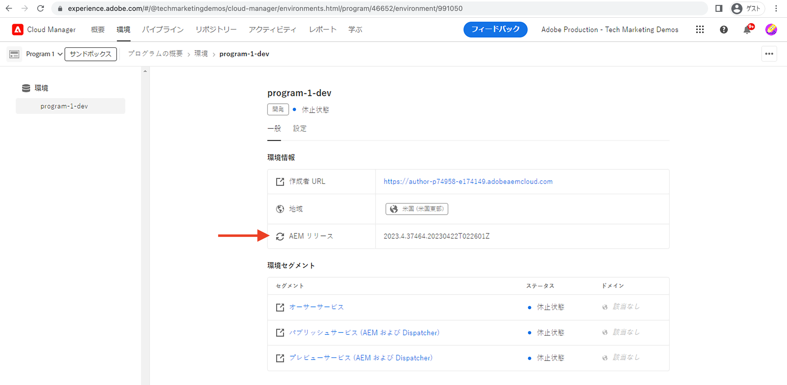

# ローカルDispatcherツールの設定

>[!CONTEXTUALHELP]
>id="aemcloud_localdev_dispatcher"
>title="ローカルDispatcherツール"
>abstract="Dispatcherは、Experience Managerアーキテクチャ全体の不可欠な要素で、ローカル開発設定の一部にする必要があります。 AEM as a Dispatcher SDKには、Dispatcherをローカルで設定、検証、シミュレーションする、推奨されるDispatcherツールバージョンが含まれています。"
>additional-url="https://experienceleague.adobe.com/docs/experience-manager-cloud-service/implementing/content-delivery/disp-overview.html" text="クラウド内の Dispatcher"
>additional-url="https://experience.adobe.com/#/downloads/content/software-distribution/ja/aemcloud.html" text="AEMをCloud ServiceSDKとしてダウンロード"

Adobe Experience Manager(AEM)のDispatcherは、CDNとAEMパブリッシュ層の間にセキュリティとパフォーマンスの層を提供するApache HTTP Webサーバーモジュールです。 Dispatcherは、Experience Managerアーキテクチャ全体の不可欠な要素で、ローカル開発設定の一部にする必要があります。

AEM as a Dispatcher SDKには、Dispatcherをローカルで設定、検証、シミュレーションする、推奨されるDispatcherツールバージョンが含まれています。 Dispatcherツールは、次の要素で構成されます。

+ `.../dispatcher-sdk-x.x.x/src`にある、Apache HTTP WebサーバーとDispatcher設定ファイルのベースラインセット
+ 設定バリデーターCLIツール(`.../dispatcher-sdk-x.x.x/bin/validate` （Dispatcher SDK 2.0.29以降）
+ `.../dispatcher-sdk-x.x.x/bin/validator`にある構成生成CLIツール
+ `.../dispatcher-sdk-x.x.x/bin/docker_run`にある構成導入CLIツール
+ Dispatcherモジュールを使用してApache HTTP Webサーバーを実行するDockerイメージ

`~`は、ユーザーのディレクトリの略記法として使用されます。 Windowsの場合、`%HOMEPATH%`と同じです。

>[!NOTE]
>
> このページのビデオはmacOSで録画されました。 Windowsユーザーは従うことはできますが、各ビデオに付属する、同等のDispatcherツールのWindowsコマンドを使用します。

## 前提条件

1. WindowsユーザーはWindows 10 Professionalを使用する必要がある
1. ローカルの開発マシンに[Experience Manager公開クイックスタートJAR](./aem-runtime.md)をインストールします。
   + 必要に応じて、最新の[AEM参照Webサイト](https://github.com/adobe/aem-guides-wknd/releases)をローカルのAEMパブリッシュサービスにインストールします。 このWebサイトは、作業中のDispatcherを視覚化するためにこのチュートリアルで使用されます。
1. ローカル開発マシンに[Docker](https://www.docker.com/)(Docker Desktop 2.2.0.5以降/Docker Engine v19.03.9+)の最新バージョンをインストールして起動します。

## Dispatcherツールのダウンロード(AEM SDKの一部として)

AEM as aCloud ServiceSDK(AEM SDK)には、開発用にApache HTTP WebサーバーをDispatcherモジュールと共にローカルで実行するためのDispatcherツールと、互換性のあるQuickStart Jarが含まれています。

AEM as aCloud ServiceSDKが既に[ローカルAEMランタイム](./aem-runtime.md)を設定するためにダウンロードされている場合は、再度ダウンロードする必要はありません。

1. Adobe IDで[experience.adobe.com/#/downloads](https://experience.adobe.com/#/downloads/content/software-distribution/en/aemcloud.html?fulltext=AEM*+SDK*&amp;1_group.propertyvalues.property=.%2Fjcr%3Acontent%2Fmetadata%2Fdc%3AsoftwareType&amp;1_group.propertyvalues.operation=equals&amp;1_group.propertyvalues.0_values=software-type%3Autoling&amp;orderby=%40jcr%3Fjcr%3Alast&amp;orderby.sort=&amp;layout=list&amp;p.offset=0&amp;p.limit=1)にログインします。
   + Adobe組織&#x200B;__は、AEMをCloud ServiceSDKとしてダウンロードするCloud ServiceとしてAEM用にプロビジョニングされている必要があります。__
1. 最新の&#x200B;__AEM SDK__&#x200B;結果行をクリックして、ダウンロードします。
   + AEM SDKのDispatcherツールv2.0.29以降がダウンロードの説明に記載されていることを確認します。

## AEM SDK zipからDispatcherツールを抽出します。

>[!TIP]
>
> Windowsユーザーは、ローカルDispatcherツールを含むフォルダーへのパスにスペースや特殊文字を含めることはできません。 パスにスペースが存在する場合、`docker_run.cmd`は失敗します。

Dispatcherツールのバージョンは、AEM SDKのバージョンとは異なります。 AEM SDKバージョンを使用して、AEM as a Dispatcherツールのバージョンが提供されていることを確認します。

1. ダウンロードした`aem-sdk-xxx.zip`ファイルを解凍します。
1. Dispatcherツールを`~/aem-sdk/dispatcher`に解凍します。
   + Windowsの場合：`aem-sdk-dispatcher-tools-x.x.x-windows.zip`を`C:\Users\<My User>\aem-sdk\dispatcher`に解凍します（必要に応じて、見つからないフォルダーを作成します）。
   + macOS/Linux:付属のシェルスクリプト`aem-sdk-dispatcher-tools-x.x.x-unix.sh`を実行して、Dispatcherツールを解凍します。
      + `chmod a+x aem-sdk-dispatcher-tools-x.x.x-unix.sh && ./aem-sdk-dispatcher-tools-x.x.x-unix.sh`

以下に発行されるすべてのコマンドは、現在の作業ディレクトリに拡張Dispatcherツールの内容が含まれていることを前提としています。

>[!VIDEO](https://video.tv.adobe.com/v/30601/?quality=12&learn=on)

*このビデオでは、例としてmacOSを使用しています。同等のWindows/Linuxコマンドを使用して、同じ結果を得ることができます。*

## Dispatcher設定ファイルについて

>[!TIP]
> [AEM Project Maven Archetype](https://github.com/adobe/aem-project-archetype)から作成されたExperience Managerプロジェクトは、この一連のDispatcher設定ファイルが事前に設定されているので、Dispatcherツールのsrcフォルダーからコピーする必要はありません。

Dispatcherツールは、ローカル開発を含むすべての環境の動作を定義する、Apache HTTP WebサーバーとDispatcher設定ファイルのセットを提供します。

これらのファイルは、Experience ManagerのMavenプロジェクト内にまだ存在しない場合、Experience ManagerのMavenプロジェクト内の`dispatcher/src`フォルダーにコピーされることを意図しています。

>[!VIDEO](https://video.tv.adobe.com/v/30602/?quality=12&learn=on)

*このビデオでは、例としてmacOSを使用しています。同等のWindows/Linuxコマンドを使用して、同じ結果を得ることができます。*

設定ファイルの完全な説明は、展開されたDispatcherツールで`dispatcher-sdk-x.x.x/docs/Config.html`として入手できます。

## 設定の検証

必要に応じて、`httpd -t`を介したDispatcherおよびApache Webサーバーの設定の検証は、`validate`スクリプトを使用しておこなえます（`validator`実行可能ファイルと混同しないようにする必要があります）。

+ 使用方法:
   + Windows：`bin\validate src`
   + macOS/Linux:`./bin/validate.sh ./src`

## Dispatcherをローカルで実行する

Dispatcherをローカルで実行するには、Dispatcherツールの`validator` CLIツールを使用してDispatcher設定ファイルを生成する必要があります。

+ 使用方法:
   + Windows：`bin\validator full -d out src`
   + macOS/Linux:`./bin/validator full -d ./out ./src`

このコマンドは、設定を、DockerコンテナのApache HTTP Webサーバーと互換性のあるファイルセットに転送します。

生成されると、トランスパイルされた設定がDockerコンテナでローカルにDispatcherを実行します。 バリデーターの`-d`オプションを使用して、`validate` __および__&#x200B;出力を使用して最新の設定が検証されていることを確認することが重要です。

+ 使用方法:
   + Windows：`bin\docker_run <deployment-folder> <aem-publish-host>:<aem-publish-port> <dispatcher-port>`
   + macOS/Linux:`./bin/docker_run.sh <deployment-folder> <aem-publish-host>:<aem-publish-port> <dispatcher-port>`

`aem-publish-host`は`host.docker.internal`に設定できます。この値は、ホストマシンのIPに解決されるコンテナ内にDockerが提供する特別なDNS名です。 `host.docker.internal`が解決しない場合は、以下の[トラブルシューティング](#troubleshooting-host-docker-internal)の節を参照してください。

例えば、Dispatcherツールが提供するデフォルトの設定ファイルを使用してDispatcher Dockerコンテナを起動するには、次のようにします。

1. 設定が変更されるたびに、規則に従って`out`という名前の`deployment-folder`を最初から生成します。

   + Windows：`del /Q out && bin\validator full -d out src`
   + macOS/Linux:`rm -rf ./out && ./bin/validator full -d ./out ./src`

2. （再）デプロイメントフォルダーへのパスを指定する、Dispatcher Dockerコンテナを起動します。

   + Windows：`bin\docker_run out host.docker.internal:4503 8080`
   + macOS/Linux:`./bin/docker_run.sh ./out host.docker.internal:4503 8080`

ポート4503でローカルに動作するAEM as a Publish SDKのパブリッシュサービスは、Dispatcherを通じて`http://localhost:8080`で使用できます。

Experience ManagerプロジェクトのDispatcher設定に対してDispatcherツールを実行するには、プロジェクトの`dispatcher/src`フォルダーを使用して`deployment-folder`を生成します。

+ Windows：

   ```shell
   $ del -/Q out && bin\validator full -d out <User Directory>/code/my-project/dispatcher/src
   $ bin\docker_run out host.docker.internal:4503 8080
   ```

+ macOS/Linux:

   ```shell
   $ rm -rf ./out && ./bin/validator full -d ./out ~/code/my-project/dispatcher/src
   $ ./bin/docker_run.sh ./out host.docker.internal:4503 8080
   ```

>[!VIDEO](https://video.tv.adobe.com/v/30603/?quality=12&learn=on)

*このビデオでは、例としてmacOSを使用しています。同等のWindows/Linuxコマンドを使用して、同じ結果を得ることができます。*

## Dispatcherツールログ

Dispatcherログは、ローカル開発中にHTTP要求がブロックされるかどうかを把握するのに役立ちます。 ログレベルは、`docker_run`の実行前に環境パラメーターを付けて設定できます。

Dispatcherツールのログは、`docker_run`の実行時に標準に出力されます。

Dispatcherのデバッグに役立つパラメーターは次のとおりです。

+ `DISP_LOG_LEVEL=Debug` Dispatcherモジュールのログをデバッグレベルに設定
   + デフォルト値は次のとおりです。`Warn`
+ `REWRITE_LOG_LEVEL=Debug` Apache HTTP Webサーバー書き換えモジュールのログをデバッグレベルに設定します
   + デフォルト値は次のとおりです。`Warn`
+ `DISP_RUN_MODE` Dispatcher環境の「実行モード」を設定し、対応する実行モードのDispatcher設定ファイルを読み込みます。
   + デフォルトは `dev`
+ 有効な値：`dev`、`stage`、または`prod`

`docker_run`には1つ以上のパラメーターを渡すことができます

+ Windows：

   ```shell
   $ bin\validator full -d out <User Directory>/code/my-project/dispatcher/src
   $ DISP_LOG_LEVEL=Debug REWRITE_LOG_LEVEL=Debug bin\docker_run out host.docker.internal:4503 8080
   ```

+ macOS/Linux:

   ```shell
   $ ./bin/validator full -d out ~/code/my-project/dispatcher/src
   $ DISP_LOG_LEVEL=Debug REWRITE_LOG_LEVEL=Debug ./bin/docker_run.sh out host.docker.internal:4503 8080
   ```

>[!VIDEO](https://video.tv.adobe.com/v/30604/?quality=12&learn=on)

*このビデオでは、例としてmacOSを使用しています。同等のWindows/Linuxコマンドを使用して、同じ結果を得ることができます。*

### ログファイルのアクセス

Apache WebサーバーとAEM Dispatcherのログは、Dockerコンテナで直接アクセスできます。

+ [Dockerコンテナでのログへのアクセス](../debugging/aem-sdk-local-quickstart/logs.md#dispatcher-tools-access-logs)
+ [Dockerログのローカルファイルシステムへのコピー](../debugging/aem-sdk-local-quickstart/logs.md#dispatcher-tools-copy-logs)

## Dispatcherツールを更新するタイミング{#dispatcher-tools-version}

Dispatcherツールのバージョンは、Experience Managerよりも頻繁に増分されないので、ローカル開発環境では、Dispatcherツールを使用する際に必要な更新の数が少なくなります。

推奨されるDispatcherツールのバージョンは、AEM as aCloud ServiceSDKにバンドルされ、Cloud ServiceのバージョンとしてのExperience Managerに一致します。 AEM as aCloud Serviceのバージョンは、[Cloud Manager](https://my.cloudmanager.adobe.com/)で確認できます。

+ __AEMリリースラベルで指定された環境ごとに、 Cloud Manager /環__&#x200B;境 ____ 



_Dispatcherツールのバージョン自体は、バージョンのバージョンと一致しないことに注意してください。Experience Manager_

## トラブルシューティング

### docker_runを実行すると、「host.docker.internalが使用可能になるまで待機中」というメッセージが表示されます。{#troubleshooting-host-docker-internal}

`host.docker.internal` は、ホストに解決されるを含むDockerに指定されたホスト名です。docs.docker.com([macOS](https://docs.docker.com/docker-for-mac/networking/#i-want-to-connect-from-a-container-to-a-service-on-the-host)、[Windows](https://docs.docker.com/docker-for-windows/networking/))ごとに、次の手順を実行します。

> Docker 18.03以降では、ホストが使用する内部IPアドレスに解決される特別なDNS名host.docker.internalに接続することをお勧めします。

`bin/docker_run out host.docker.internal:4503 8080`の結果が「__host.docker.internalが使用可能になるまで待機する__」というメッセージになった場合は、次のようになります。

1. インストールされているDockerのバージョンが18.03以降であることを確認します。
2. `host.docker.internal`名の登録/解決を妨げるローカルマシンがセットアップされている可能性があります。 代わりに、ローカルIPを使用します。
   + Windows：
      + コマンドプロンプトで`ipconfig`を実行し、ホストマシンの&#x200B;__IPv4アドレス__&#x200B;を記録します。
      + 次に、次のIPアドレスを使用して`docker_run`を実行します。
         `bin\docker_run out <HOST IP>:4503 8080`
   + macOS/Linux:
      + ターミナルから、`ifconfig`を実行し、ホスト&#x200B;__inet__&#x200B;のIPアドレス（通常は&#x200B;__en0__&#x200B;デバイス）を記録します。
      + 次に、ホストのIPアドレスを使用して`docker_run`を実行します。
         `bin/docker_run.sh out <HOST IP>:4503 8080`

#### エラーの例

```shell
$ docker_run out host.docker.internal:4503 8080

Running script /docker_entrypoint.d/10-check-environment.sh
Running script /docker_entrypoint.d/20-create-docroots.sh
Running script /docker_entrypoint.d/30-wait-for-backend.sh
Waiting until host.docker.internal is available
```

### docker_runは「**」エラーを返します。展開フォルダが見つかりません&#39;

`docker_run.cmd`を実行すると、__**エラーを読み込むエラーが表示されます。展開フォルダーが見つかりません：__。 これは、通常、パスにスペースが含まれているために発生します。 可能であれば、フォルダー内のスペースを削除するか、スペースを含まないパスに`aem-sdk`フォルダーを移動します。

例えば、Windowsのユーザーフォルダーは`<First name> <Last name>`で、間にスペースが入る場合が多くあります。 以下の例では、ローカルのDispatcherツールの`docker_run`実行を中断するスペースが`...\My User\...`フォルダーに含まれています。 スペースがWindowsユーザーフォルダー内にある場合は、Windowsが壊れるので、このフォルダーの名前を変更しないでください。代わりに、ユーザーが完全に変更する権限を持っている新しい場所に`aem-sdk`フォルダーを移動します。 `aem-sdk`フォルダーがユーザーのホームディレクトリにあると仮定する手順は、新しい場所に調整する必要があります。

#### エラーの例

```shell
$ \Users\My User\aem-sdk\dispatcher>bin\docker_run.cmd out host.internal.docker:4503 8080

'User\aem-sdk\dispatcher\out\*' is not recognized as an internal or external command,
operable program or batch file.
** error: Deployment folder not found: c:\Users\My User\aem-sdk\dispatcher\out
```

### docker_runがWindowsで起動できない{#troubleshooting-windows-compatible}

Windowsで`docker_run`を実行すると、次のエラーが発生し、Dispatcherが起動できなくなる可能性があります。 これは、Windows上のDispatcherに関して報告された問題で、今後のリリースで修正される予定です。

#### エラーの例

```shell
$ \Users\MyUser\aem-sdk\dispatcher>bin\docker_run out host.docker.internal:4503 8080

Running script /docker_entrypoint.d/10-check-environment.sh
Running script /docker_entrypoint.d/20-create-docroots.sh
Running script /docker_entrypoint.d/30-wait-for-backend.sh
Waiting until host.docker.internal is available
host.docker.internal resolves to 192.168.65.2
Running script /docker_entrypoint.d/40-generate-allowed-clients.sh
Running script /docker_entrypoint.d/50-check-expiration.sh
Running script /docker_entrypoint.d/60-check-loglevel.sh
Running script /docker_entrypoint.d/70-check-forwarded-host-secret.sh
Starting httpd server
[Sun Feb 09 17:32:22.256020 2020] [dispatcher:warn] [pid 1:tid 140080096570248] Unable to obtain parent directory of /etc/httpd/conf.dispatcher.d/enabled_farms/farms.any: No such file or directory
[Sun Feb 09 17:32:22.256069 2020] [dispatcher:alert] [pid 1:tid 140080096570248] Unable to import config file: /etc/httpd/conf.dispatcher.d/dispatcher.any
[Sun Feb 09 17:32:22.256074 2020] [dispatcher:alert] [pid 1:tid 140080096570248] Dispatcher initialization failed.
AH00016: Configuration Failed
```

## その他のリソース

+ [AEM SDKのダウンロード](https://experience.adobe.com/#/downloads)
+ [AdobeCloud Manager](https://my.cloudmanager.adobe.com/)
+ [Dockerのダウンロード](https://www.docker.com/)
+ [AEM Reference Webサイト(WKND)のダウンロード](https://github.com/adobe/aem-guides-wknd/releases)
+ [Experience ManagerDispatcherのドキュメント](https://docs.adobe.com/content/help/ja-JP/experience-manager-dispatcher/using/dispatcher.html)
