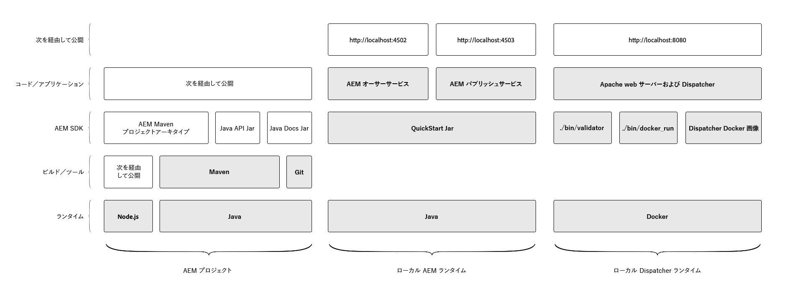

# ローカル開発環境の設定

このチュートリアルでは、AEMをCloud ServiceSDKとして使用して、Adobe Experience Manager(AEM)用のローカル開発環境をセットアップする手順を説明します。 AEMプロジェクトの開発、構築、コンパイルに必要な開発ツールや、ローカルの実行時に開発者が新機能をローカルで検証し、AEMにCloud ServiceとしてAdobeCloud Managerを介して展開できるようにするツールが含まれます。

>[!VIDEO](https://video.tv.adobe.com/v/32565/?quality=12&learn=on)

AEMのローカル開発環境は、次の3つの論理グループに分類できます。

+ __AEMプロジェクト__&#x200B;には、カスタムAEMアプリケーションのカスタムコード、設定、およびコンテンツが含まれています。
+ AEM AuthorサービスとPublishサービスのローカルバージョンをローカルで実行する&#x200B;__Local AEM Runtime__。
+ Apache HTTP Webサーバーとディスパッチャーのローカルバージョンを実行する&#x200B;__Local Dispatcher Runtime__。

このチュートリアルでは、上の図で強調表示されている項目をインストールして設定する方法を紹介し、AEMの開発に安定したローカル開発環境を提供します。

## ファイルシステムの構成

このチュートリアルでは、AEMの場所をCloud ServiceSDKアーティファクトとAEMプロジェクトコードとして次のように確立しました。

+ `~/aem-sdk` は、AEMがCloud ServiceSDKとして提供する様々なツールを含む組織フォルダーです
+ `~/aem-sdk/author` にAEM Author Serviceが含まれる
+ `~/aem-sdk/publish` にAEM発行サービスが含まれる
+ `~/aem-sdk/dispatcher` には、ディスパッチャーツールが含まれます。
+ `~/code/<project name>` カスタムAEMプロジェクトソースコードが含まれます。

`~`はユーザーのディレクトリの略記法です。 Windowsでは、`%HOMEPATH%`；と同じです。

## AEMプロジェクト用開発ツール

AEMプロジェクトは、Cloud Managerを介してAEMにCloud Serviceとしてデプロイされるコード、設定およびコンテンツを含むカスタムコードベースです。 基準プロジェクト構造は、[AEM Project Maven Archetype](https://github.com/adobe/aem-project-archetype)を介して生成されます。

チュートリアルのこの節では、次の方法を示します。

+ インストール [!DNL Java]
+ [!DNL Node.js] （およびnpm）をインストールします
+ インストール [!DNL Maven]
+ インストール [!DNL Git]

[AEMプロジェクト用の開発ツールの設定](./development-tools.md)

## ローカルAEMランタイム

Cloud ServiceSDKとしてのAEMは、AEMのローカルバージョンを実行する[!DNL QuickStart Jar]を提供します。 [!DNL QuickStart Jar]は、AEM Author ServiceまたはAEM Publish Serviceをローカルで実行するために使用できます。 [!DNL QuickStart Jar]はローカルな開発経験を提供しますが、AEMでCloud Serviceとして利用できる機能の一部が[!DNL QuickStart Jar]に含まれているわけではありません。

チュートリアルのこの節では、次の方法を示します。

+ インストール [!DNL Java]
+ AEM SDKのダウンロード
+ [!DNL AEM Author Service]を実行
+ [!DNL AEM Publish Service]を実行

[ローカルAEMランタイムの設定](./aem-runtime.md)

## ローカル[!DNL Dispatcher]ランタイム

AEMは、Cloud ServiceSDKのディスパッチャーツールとして、ローカル[!DNL Dispatcher]ランタイムのセットアップに必要なすべてを提供します。 [!DNL Dispatcher] ツールは [!DNL Docker]ベースで、 [!DNL Apache HTTP] Webサーバーと [!DNL Dispatcher] 設定ファイルを互換性のある形式に変換し、 [!DNL Dispatcher] コンテナで [!DNL Docker] 実行するように展開するためのコマンドラインツールを提供します。

チュートリアルのこの節では、次の方法を示します。

+ AEM SDKのダウンロード
+ [!DNL Dispatcher]ツールをインストール
+ ローカル[!DNL Dispatcher]ランタイムを実行

[LocalRuntimeの設定 [!DNL Dispatcher] ](./dispatcher-tools.md)
