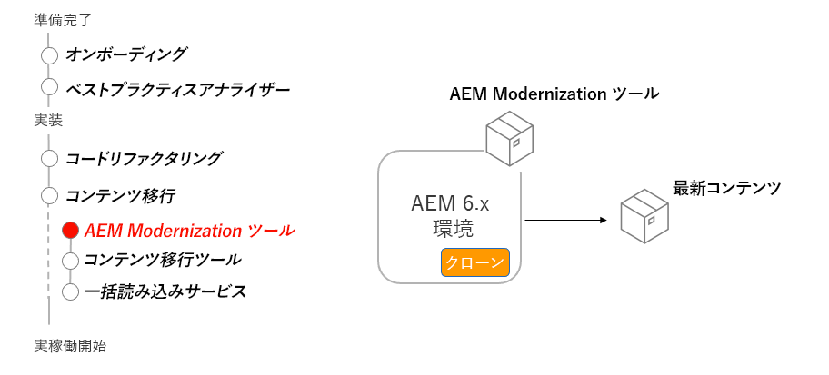

# AEM 最新化ツール

AEM Modernization Tools を使用して、既存の AEM Sites コンテンツをアップグレードし、AEM as a Cloud Service との互換性を保ち、ベストプラクティスに合わせる方法を説明します。

## オールインワンコンバーター

>[!VIDEO](https://video.tv.adobe.com/v/338802?quality=12&learn=on)

## ページコンバージョン

>[!VIDEO](https://video.tv.adobe.com/v/338799?quality=12&learn=on)

## コンポーネントの変換

>[!VIDEO](https://video.tv.adobe.com/v/338788?quality=12&learn=on)

## ポリシーの読み込み

>[!VIDEO](https://video.tv.adobe.com/v/338797?quality=12&learn=on)

## AEM Modernization Tools の使用

AEM Modernization Tools は、編集可能なテンプレート、AEM Core WCM コンポーネント、レイアウトコンテナなどの最新のアプローチを使用するために、従来の静的テンプレート、基盤コンポーネント、parsys で構成された既存の AEM のページを自動的に変換します。

## 重要なアクティビティ

+ AEM 6.x 実稼動環境をクローンして AEM Modernization Tools を実行
+ パッケージマネージャーを介して AEM 6.x 実稼動のクローンに[最新の AEM Modernizations Tools](https://github.com/adobe/aem-modernize-tools/releases/latest) をダウンロードしインストールする

+ [ページ構造コンバーター](https://opensource.adobe.com/aem-modernize-tools/pages/structure/about.html)レイアウトコンテナを用いて、既存のページコンテンツを静的テンプレートからマッピングされた編集可能なテンプレートに更新する
   + OSGi 設定を使用してコンバージョンルールを定義する
   + 既存のページに対してページ構造コンバーターを実行する

+ [コンポーネントコンバーター](https://opensource.adobe.com/aem-modernize-tools/pages/component/about.html)レイアウトコンテナを使用して、既存のページコンテンツを静的テンプレートからマッピングされた編集可能テンプレートに更新する
   + JCR ノード定義／XML を使用して変換ルールを定義する
   + 既存のページに対してコンポーネントコンバーターツールを実行する

+ [ポリシーインポーター](https://opensource.adobe.com/aem-modernize-tools/pages/policy/about.html)デザイン設定からポリシーを作成する
   + JCR ノード定義／XML を使用して変換ルールを定義する
   + 既存のデザイン定義に対してポリシーインポーターを実行する
   + 読み込んだポリシーの AEM コンポーネントおよびコンテナへの適用

## 実践練習

この実践練習で学んだことを試して、知識を適用します。

実践練習を行う前に、上記のビデオを視聴し、理解し、次の資料を確認してください。

+ [AEM as a Cloud Service についての考え方](./introduction.md)
+ [リポジトリの最新化](./repository-modernization.md)
+ [可変コンテンツと不変コンテンツ](../../developing/basics/mutable-immutable.md)
+ [AEM プロジェクトの構造](https://experienceleague.adobe.com/docs/experience-manager-cloud-service/implementing/developing/aem-project-content-package-structure.html?lang=ja)

また、前の実践演習を完了していることを確認します。

+ [BPA と CAM のハンズオン演習](./bpa-and-cam.md#hands-on-exercise)

<table style="border-width:0">
    <tr>
        <td style="width:150px">
                    
        </td>
        <td style="width:100%;margin-bottom:1rem;">
            
AEM のモダナイゼーションに関する実践

            

                AEM Modernization Tools を使用して、AEM as a Cloud Service のベストプラクティスに従って従来の WKND サイトを更新する方法を説明します。
            

            <a  rel="noreferrer"
                target="_blank"
                href="https://github.com/adobe/aem-cloud-engineering-video-series-exercises/tree/session2-migration#bootcamp---session-2-migration-methodology" class="spectrum-Button spectrum-Button--primary spectrum-Button--sizeM">
                AEM Modernization Tools を試す
            </a>
        </td>
    </tr>
</table>

## その他のリソース

+ [AEM Modernizations Tools のダウンロード](https://github.com/adobe/aem-modernize-tools/releases/latest)
+ [AEM Modernization Tools のドキュメント](https://opensource.adobe.com/aem-modernize-tools/)
+ [AEM Gems - AEM Modernization Suite の概要](https://helpx.adobe.com/jp/experience-manager/kt/eseminars/gems/Introducing-the-AEM-Modernization-Suite.html)

1. ローカルの AEM SDK に、新しく最新化された wknd-legacy サイトをデプロイします。AEM ASK は次の場所からダウンロードできます。
   + [ソフトウェア配布ポータル](https://experience.adobe.com/#/downloads/content/software-distribution/jp/general.html).
