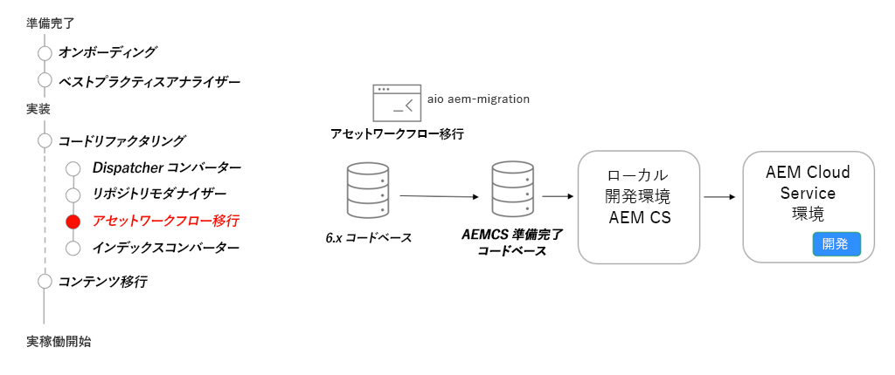

# AEM Assets マイクロサービス - AEM as a Cloud Service への移行

AEM Assets as a Cloud Service の Asset Compute マイクロサービスで、従来の AEM ワークフローのこの役割に代わって、アセットに関するレンディションを自動的かつ効率的に生成する方法を説明します。

>[!VIDEO](https://video.tv.adobe.com/v/3454285?quality=12&learn=on&captions=jpn)

## ワークフロー移行ツール

コードベースのリファクタリングの一環として、[Asset ワークフロー移行ツール](https://experienceleague.adobe.com/docs/experience-manager-cloud-service/moving/refactoring-tools/asset-workflow-migration-tool.html?lang=ja)を使用して既存のワークフローを移行し、AEM as a Cloud Service で Asset Compute マイクロサービスを使用するようにします。

## 重要なアクティビティ

+ [Adobe I/O Workflow Migrator](https://github.com/adobe/aio-cli-plugin-aem-cloud-service-migration#command-aio-aem-migrationworkflow-migrator) ツールを使用してアセット処理ワークフローを移行し、Asset Compute マイクロサービスを使用します。
+ [ローカル開発環境](https://experienceleague.adobe.com/docs/experience-manager-learn/cloud-service/local-development-environment-set-up/overview.html?lang=ja)を設定して更新されたワークフローをデプロイします。 複雑なワークフローでは、手動の調整が必要になる場合があります。
+ 更新されたローカル開発が機能パリティと一致するまで、AEM SDK を使用したワークフロー環境で繰り返し処理を行います。
+ 更新されたコードベースを AEM as a Cloud Service の開発環境にデプロイし、検証を続行します。

## 実践練習

この実践練習で学んだことを試して、知識を適用します。

実践練習を行う前に、上記のビデオを視聴し、理解し、次の資料を確認してください。

+ [AEM as a Cloud Service についての考え方](./introduction.md)
+ [オンボーディング](./onboarding.md)

また、前の実践演習を完了していることを確認します。

+ [検索とインデックス作成の実践演習](./search-and-indexing.md#hands-on-exercise)

<table style="border-width:0">
    <tr>
        <td style="width:150px">
                    
        </td>
        <td style="width:100%;margin-bottom:1rem;">
            
アセットのアップロードに関する実践

            

                AEM Assets 処理プロファイルを定義してフォルダーに割り当て、「aem-upload」npm CLI モジュールを使用してアセットを AEM にアップロードする方法を調べます。
            

            <a  rel="noreferrer"
                target="_blank"
                href="https://github.com/adobe/aem-cloud-engineering-video-series-exercises/tree/session8-assets#cloud-acceleration-bootcamp---session-8-assets-and-microservices" class="spectrum-Button spectrum-Button--primary spectrum-Button--sizeM">
                アセット管理の試み
            </a>
        </td>
    </tr>
</table>
