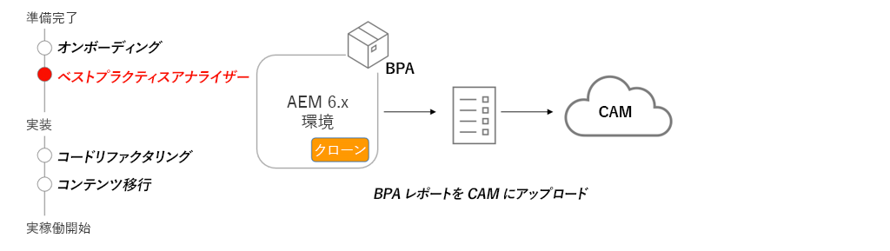

# ベストプラクティスアナライザーと Cloud Acceleration Manager

ベストプラクティスアナライザー（BPA）と Cloud Acceleration Manager（CAM）が、AEM as a Cloud Service への移行に関するカスタマイズされたガイドを提供する過程を説明します。 

>[!VIDEO](https://video.tv.adobe.com/v/336957?quality=12&learn=on)

## BPA と CAM の使用

BPA パッケージは、AEM 6.x の実稼動環境のクローンにインストールする必要があります。BPA は、CAM にアップロードできるレポートを生成し、AEM as a Cloud Service への移行に必要な主要なアクティビティに関するガイダンスを提供します。

## 主要なアクティビティ

+ 6.x 実稼動環境のクローンを作成します。コンテンツを移行しコードをリファクタリングする際に、実稼動環境のクローンを作成すると、様々なツールや変更をテストする際に役立ちます。
+ 最新の BPA ツールを[ソフトウェア配布ポータル](https://experience.adobe.com/#/downloads/content/software-distribution/jp/aemcloud.html)からダウンロードし、AEM 6.x のクローン環境にインストールします。
+ BPA ツールを使用して、Cloud Acceleration Manager（CAM）にアップロード可能なレポートを生成します。CAM には、[https://experience.adobe.com/](https://experience.adobe.com/)／**Experience Manager**／**Cloud Acceleration Manager** からアクセスできます。
+ AEM as a Cloud Service に移行するには現在のコードベースと環境にどのような更新を行う必要があるかについて、CAM を使用してガイダンスを提供します。

## 実践練習

この実践練習で学んだことを試して、知識を適用します。

実践練習を行う前に、上記のビデオを視聴し、理解し、次の資料を確認してください。

+ [AEM as a Cloud Service についての考え方](./introduction.md)
+ [AEM as a Cloud Service とは](https://experienceleague.adobe.com/docs/experience-manager-learn/cloud-service/introduction/what-is-aem-as-a-cloud-service.html?lang=ja)
+ [AEM as a Cloud Service のアーキテクチャ](https://experienceleague.adobe.com/docs/experience-manager-learn/cloud-service/introduction/architecture.html?lang=ja)
+ [可変コンテンツと不変コンテンツ](https://experienceleague.adobe.com/docs/experience-manager-learn/cloud-service/developing/basics/mutable-immutable.html?lang=ja)
+ [AEM as a Cloud Service 用と AEM 6.x 用の開発の違い](https://experienceleague.adobe.com/docs/experience-manager-cloud-service/implementing/developing/development-guidelines.html?lang=ja#developing)

<table style="border-width:0">
    <tr>
        <td style="width:150px">
                    
        </td>
        <td style="width:100%;margin-bottom:1rem;">
            
ベストプラクティスアナライザーを使用した実践

            

                ベストプラクティスアナライザー（BPA）を調べ、違反の例を含んだレガシー WKND コードベースに対してアナライザーを実行し、結果を確認します。
            

            <a  rel="noreferrer"
                target="_blank"
                href="https://github.com/adobe/aem-cloud-engineering-video-series-exercises/tree/session1-differently#bootcamp---session-1-introduction-and-thinking-differently" class="spectrum-Button spectrum-Button--primary spectrum-Button--sizeM">
 ベストプラクティスアナライザーの試用
 </a>
        </td>
    </tr>
</table>

## その他のリソース

+ [ベストプラクティスアナライザーのダウンロード](https://experience.adobe.com/#/downloads/content/software-distribution/en/aemcloud.html?lang=ja&amp;fulltext=Best*+Practices*+Analyzer*&amp;orderby=%40jcr%3Acontent%2Fjcr%3AlastModified&amp;orderby.sort=desc&amp;layout=list&amp;p.offset=0&amp;p.limit=1)