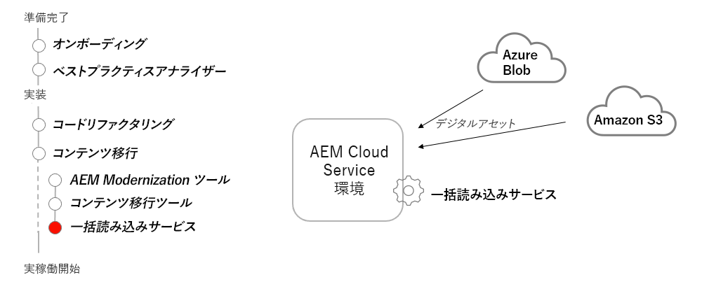

# 一括読み込みサービス

AEM as a AEM Bulk Import Service を使用して、非Cloud Servicesソースからアセットを読み込む方法を説明します。

>[!VIDEO](https://video.tv.adobe.com/v/336969?quality=12&learn=on)

## 一括読み込みサービスの使用

一括読み込みサービスは、Azure Blob ストレージまたはAmazon S3 ストレージに保存されたファイルを、アセットとしてAEM as a Cloud Serviceに転送するために使用されます。

## 主要なアクティビティ

+ インポートするファイルをクラウドストレージプロバイダー (Azure Blob ストレージまたはAmazon S3) にアップロードします。
+ AEM as a Cloud Service Author サービスを設定して、一括読み込みサービスを実行します。
+ 一括サービスインポーターを 1 回限りのインポートとして実行するか、定期的なインポートのスケジュールを設定します。

## その他のリソース

+ [Adobe Developers Liveセッション（アセット取り込み時）](https://experienceleague.adobe.com/docs/adobe-developers-live-events/events/2021/feb2021/asset-bulk-ingestion.html?lang=en)

