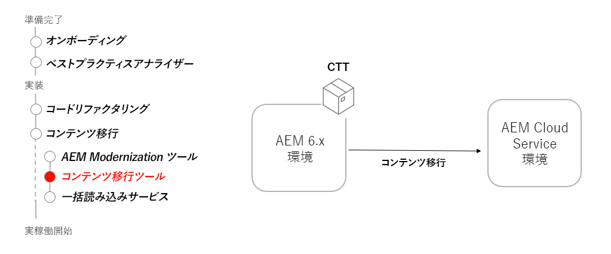

# コンテンツ転送ツール

コンテンツ転送ツールを使用して、AEM 6.3 以降から AEM as a Cloud Service にコンテンツを移行する方法について説明します。

>[!VIDEO](https://video.tv.adobe.com/v/336970?quality=12&learn=on)

## コンテンツ転送ツールの使用

コンテンツ転送ツールは、AEM 6.3 以降にインストールされ、AEM as a Cloud Service にコンテンツを転送します。

## 重要なアクティビティ

+ [最新のコンテンツ転送ツール](https://experience.adobe.com/#/downloads/content/software-distribution/jp/aemcloud.html?fulltext=Content*+Transfer*+Tool*&amp;1_group.propertyvalues.property=.%2Fjcr%3Acontent%2Fmetadata%2Fdc%3AsoftwareType&amp;1_group.propertyvalues.operation=equals&amp;1_group.propertyvalues.0_values=software-type%3Atooling&amp;orderby=%40jcr%3Acontent%2Fjcr%3AlastModified&amp;orderby.sort=desc&amp;layout=list&amp;p.offset=0&amp;p.limit=2)をダウンロードします。
+ AEM オーサー 6.3 以降の最終コンテンツを AEM as a Cloud Service オーサーサービスに転送します。
   + 転送する最終コンテンツを含む AEM 6.3 以降のオーサーにコンテンツ転送ツールをインストールします。
   + コンテンツ転送ツールをバッチで実行し、コンテンツのセットを転送します。
+ AEM パブリッシュ 6.3 以降の最終コンテンツを AEM as a Cloud Service パブリッシュサービスに転送します。
   + 転送する最終コンテンツを含む AEM 6.3 以降のパブリッシュにコンテンツ転送ツールをインストールします。
   + コンテンツ転送ツールをバッチで実行し、コンテンツのセットを転送します。
+ オプションで、最後のコンテンツ転送以降に新しいコンテンツを転送して、AEM as a Cloud Service のコンテンツを「追加」します

## 実践練習

この実践練習で学んだことを試して、知識を適用します。

実践練習を行う前に、上記のビデオを視聴し、理解し、次の資料を確認してください。

+ [AEM 最新化ツール](../aem-modernization-tools.md)
+ [オンボーディング](../onboarding.md)
+ [Cloud Manager](../cloud-manager.md)

また、前の実践演習を完了していることを確認します。

+ [Dispatcher 実践演習](../dispatcher.md#hands-on-exercise)

<table style="border-width:0">
    <tr>
        <td style="width:150px">
                    
        </td>
        <td style="width:100%;margin-bottom:1rem;">
            
コンテンツ転送ツールを使用した実践

            

                コンテンツ転送ツールを使用して、AEM 6 から AEM as a Cloud Service にコンテンツを自動的に移動する方法を調べます。
            

            <a  rel="noreferrer"
                target="_blank"
                href="https://github.com/adobe/aem-cloud-engineering-video-series-exercises/tree/session6-transfercontent#cloud-acceleration-bootcamp---session-6-content" class="spectrum-Button spectrum-Button--primary spectrum-Button--sizeM">
 コンテンツ転送ツールを試す
 </a>
        </td>
    </tr>
</table>

## その他のリソース

+ [コンテンツ転送ツールのダウンロード](https://experience.adobe.com/#/downloads/content/software-distribution/jp/aemcloud.html?fulltext=Content*+Transfer*+Tool*&amp;1_group.propertyvalues.property=.%2Fjcr%3Acontent%2Fmetadata%2Fdc%3AsoftwareType&amp;1_group.propertyvalues.operation=equals&amp;1_group.propertyvalues.0_values=software-type%3Atooling&amp;orderby=%40jcr%3Acontent%2Fjcr%3AlastModified&amp;orderby.sort=desc&amp;layout=list&amp;p.offset=0&amp;p.limit=2)
+ [一括読み込みサービスのチュートリアルビデオ](https://experienceleague.adobe.com/docs/experience-manager-learn/cloud-service/migration/bulk-import.html?lang=ja)

