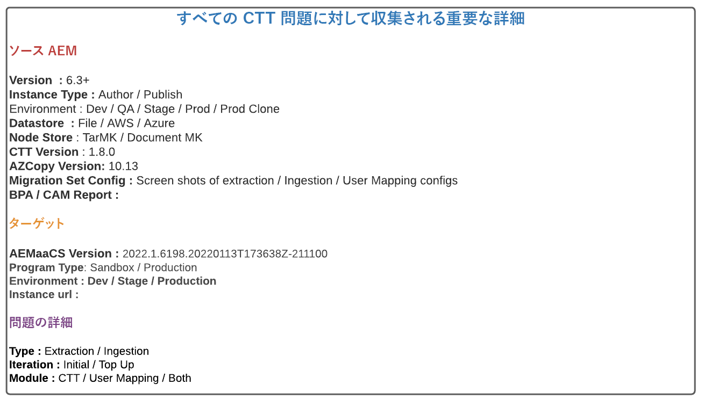
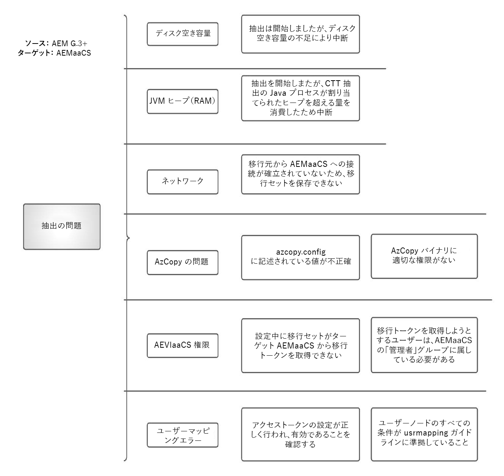
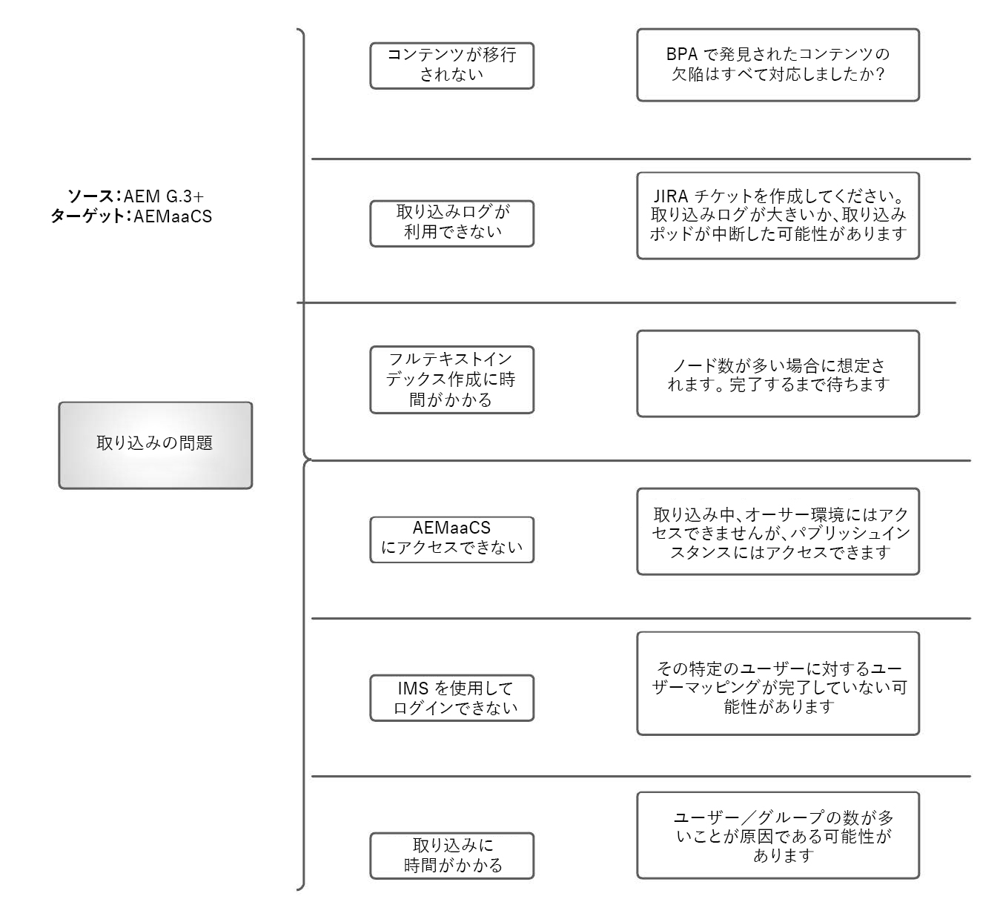

# AEM as a Cloud Service コンテンツの移行に関する FAQ

AEM as a Cloud Service へのコンテンツの移行に関するよくある質問への回答を示します。

## 用語

+ **AEMaaCS**： [AEM as a Cloud Service](https://experienceleague.adobe.com/docs/experience-manager-cloud-service/content/overview/introduction.html?lang=ja)
+ **BPA**：[ベストプラクティスアナライザー](https://experienceleague.adobe.com/docs/experience-manager-cloud-service/content/migration-journey/cloud-migration/best-practices-analyzer/overview-best-practices-analyzer.html?lang=ja)
+ **CTT**：[コンテンツトランスファーツール](https://experienceleague.adobe.com/docs/experience-manager-cloud-service/content/migration-journey/cloud-migration/content-transfer-tool/overview-content-transfer-tool.html?lang=ja)
+ **CAM**：[Cloud Acceleration Manager](https://experienceleague.adobe.com/docs/experience-manager-cloud-service/content/migration-journey/cloud-acceleration-manager/using-cam/getting-started-cam.html?lang=ja)
+ **IMS**：[Identity Management System](https://experienceleague.adobe.com/docs/experience-manager-cloud-service/content/security/ims-support.html?lang=ja)
+ **DM**：[Dynamic Media](https://experienceleague.adobe.com/docs/experience-manager-cloud-service/content/assets/dynamicmedia/dm-journey/dm-journey-part1.html?lang=ja)

CTT 関連のアドビのサポートチケットの作成時に詳細を提供するには、以下のテンプレートを使用します。

 {align="center"}

## コンテンツ移行に関する一般的な質問

### Q：コンテンツを AEM as Cloud Services に移行する様々な方法を教えてください。

次の 3 つの方法を使用できます

+ コンテンツトランスファーツールの使用（AEM 6.3 以降 → AEMaaCS）
+ パッケージマネージャーの使用（AEM → AEMaaCS）
+ 標準で用意されているアセットの一括読み込みサービスの使用（S3／Azure → AEMaaCS）

### Q：CTT を使用して転送できるコンテンツの量に制限はありますか。

いいえ。CTT をツールとして使用すると、AEM ソースから抽出して AEMaaCS に取り込むことができます。ただし、AEMaaCS プラットフォームには、移行前に考慮すべき特定の制限があります。

詳しくは、[クラウド移行の前提条件](https://experienceleague.adobe.com/docs/experience-manager-cloud-service/content/migration-journey/cloud-migration/content-transfer-tool/prerequisites-content-transfer-tool.html?lang=ja)を参照してください。

### Q：ソース システムから最新の BPA レポートを取得していますが、これを使用するにはどうすればよいですか？

レポートを CSV 形式で書き出し、[IMS 組織に関連付けられている](https://experienceleague.adobe.com/docs/experience-manager-cloud-service/content/migration-journey/cloud-acceleration-manager/using-cam/getting-started-cam.html?lang=ja) Cloud Acceleration Manager にアップロードします。次に、[準備段階で説明されている](https://experienceleague.adobe.com/docs/experience-manager-cloud-service/content/migration-journey/cloud-acceleration-manager/using-cam/cam-readiness-phase.html?lang=ja)レビュープロセスを実行します。

ツールが提供するコードとコンテンツの複雑さの評価を確認し、コードリファクタリングバックログまたはクラウド移行評価につながる、関連するアクション項目をメモしておいてください。

### Q：ソースオーサーで抽出し、AEMaaCS オーサーに取り込んでパブリッシュすることをお勧めしますか？

オーサー層とパブリッシュ層の間では、1:1 抽出と取り込みを実行することを常にお勧めします。 ただし、ソース実稼動オーサーを抽出して、開発、ステージ、実稼動の CS に取り込むこともできます。

### Q：CTT を使用したソース AEM から AEMaaCS へのコンテンツ移行にかかる時間を見積もる方法はありますか。

移行プロセスは、インターネット帯域幅、CTT プロセスに割り当てられたヒープ、使用可能な空きメモリ、各ソースシステムに固有のディスク IO に依存するので、移行の証明を早期に実行し、そのデータポイントの推定に基づいて見積もります。

### Q：CTT 抽出プロセスを開始した場合、ソース AEM のパフォーマンスはどのような影響を受けますか。

CTT ツールは、最大 4 GB のヒープを使用する専用の Java™ プロセスで実行されます。このプロセスは、OSGi 設定を通じて設定できます。この数字は変わる場合がありますが、Java™プロセスに対して grep を実行すると確認できます。

AZCopy がインストールされている場合、または事前コピー／検証機能が有効になっている場合、AZCopy プロセスは CPU サイクルを消費します。

このツールは JVM の他にディスク IO も使用してデータを一時領域に保存し、抽出サイクル後にクリーンアップします。CTT ツールは、RAM、CPU および ディスク IO 以外にも、ソースシステムのネットワーク帯域幅を使用して、Azure Blob ストアにデータをアップロードします。

CTT 抽出プロセスで使用されるリソースの量は、ノード数、Blob の数および集計されたサイズによって異なります。数式を設定するのは困難なので、小規模な移行の検証を実行し、ソースサーバーのアップサイズ要件を決定することをお勧めします。

クローン環境を移行に使用する場合、実稼動サーバーのリソース稼働率に影響はありませんが、実稼動環境とクローンの間のコンテンツの同期に関して不都合な点があります。

### Q：CTT では「ワイプ」および「上書き」という用語にはどのような意味がありますか？

[抽出フェーズ](https://experienceleague.adobe.com/docs/experience-manager-cloud-service/content/migration-journey/cloud-migration/content-transfer-tool/getting-started-content-transfer-tool.html?lang=ja#extraction-setup-phase)では、前の抽出サイクルからのステージングコンテナのデータを上書きするか、差分（追加／更新／削除）をこのデータに追加します。ステージングコンテナは、移行セットに関連付けられた Blob ストレージコンテナにすぎません。移行セットごとに、専用のステージングコンテナが用意されています。

[取り込みフェーズ](https://experienceleague.adobe.com/docs/experience-manager-cloud-service/content/migration-journey/cloud-migration/content-transfer-tool/ingesting-content.html?lang=ja)では、AEMaaCS のコンテンツリポジトリ全体を置き換えるか、ステージング移行コンテナからのコンテンツの差分（追加／更新／削除）を同期します。

### Q：ソースシステムには、複数の web サイト、関連アセット、ユーザーおよびグループがあります。これらを AEMaaCS に段階的に移行することは可能ですか？

はい、可能ですが、以下の点について慎重な計画が必要です。

+ サイトやアセットがそれぞれの階層にあることを想定して移行セットを作成する
   + すべてのアセットを 1 つの移行セットの一部として移行することが可能かどうかを確認してから、それらのアセットを使用しているサイトを段階的に取り込む
+ 現在の状態では、パブリッシュ層でコンテンツを提供できる場合でも、オーサーの取り込みプロセスにより、オーサーインスタンスがコンテンツオーサリングで使用できなくなる
   + このため、オーサーへの取り込みが完了するまで、コンテンツオーサリングアクティビティは凍結される
+ グループは移行されますが、ユーザーは移行されなくなりました。

移行を計画する前に、ドキュメントに記載されている追加抽出および取り込みプロセスを確認してください。

### Q：AEMaaCS オーサーインスタンスまたはパブリッシュインスタンスへの取り込みが行われても、エンドユーザーは web サイトを使用できますか？

はい。コンテンツ移行アクティビティによってエンドユーザーのトラフィックが中断されることはありません。ただし、オーサーの取り込みは、コンテンツのオーサリングが完了するまで凍結されます。

### Q：元のレンディションが見つからないことに関連する項目が BPA レポートに表示されます。抽出前にソース上でそれらをクリーンアップする必要がありますか？

はい。元のレンディションが見つからない場合、アセットバイナリが最初に正しくアップロードされていません。不正なデータと見なされる場合は、必要に応じてパッケージマネージャーを使用して確認およびバックアップし、抽出を実行する前にソース AEM から削除してください。不正なデータは、アセット処理ステップに悪い結果をもたらします。

### Q：フォルダーの `jcr:content` ノードが見つからない件に関連する項目が BPA レポートにあります。どうすればよいでしょうか？

`jcr:content` がフォルダーレベルで見つからない場合、処理プロファイルなどの設定を親から伝達するアクションがこのレベルで中断されます。`jcr:content` が見つからない理由を確認してください。これらのフォルダーも移行できるとは言え、そのようなフォルダーはユーザーエクスペリエンスを低下させ、後で不要なトラブルシューティングサイクルを引き起こすことに注意してください。

### Q：移行セットを作成しました。そのサイズを調べることは可能ですか？

はい、[サイズを確認](https://experienceleague.adobe.com/docs/experience-manager-cloud-service/content/migration-journey/cloud-migration/content-transfer-tool/getting-started-content-transfer-tool.html?lang=ja#migration-set-size)機能（CTT の一部）に含まれています。

### Q：移行（抽出、取り込み）を実行しています。 抽出したすべてのコンテンツが Target に取り込まれていることを検証できますか？

はい、[検証](https://experienceleague.adobe.com/docs/experience-manager-cloud-service/content/migration-journey/cloud-migration/content-transfer-tool/validating-content-transfers.html?lang=ja)機能（CTT の一部）に含まれています。

### Q：お客様は、AEMaaCS Dev から AEMaaCS Stage や AEMaaCS Prod など、AEMaaCS 環境間でコンテンツを移動する必要があります。 これらの使用例でコンテンツトランスファーツールを使用できますか？

残念ですが、できません。CTT の使用例は、オンプレミス／AMS でホストされている AEM 6.3 以降のソースから AEMaaCS クラウド環境にコンテンツを移行する場合です。 [CTT ドキュメントを参照してください](https://experienceleague.adobe.com/docs/experience-manager-cloud-service/content/migration-journey/cloud-migration/content-transfer-tool/overview-content-transfer-tool.html?lang=ja)。

### Q：抽出中にどのような問題が予想されますか？

抽出フェーズは複雑なプロセスで、期待どおりに動作するために複数の側面が必要です。 発生する可能性のある様々な種類の問題と、その軽減方法を認識することで、コンテンツ移行の全体的な成功率が向上します。

公開ドキュメントは、学習に基づいて継続的に改善されていますが、いくつかの大まかな問題カテゴリと考えられる基礎的な理由を次に示します。

 {align="center"}

### Q：取り込み中にどのような問題が予想されますか？

取り込み段階はクラウドプラットフォームで完全に行われ、AEMaaCS インフラストラクチャにアクセスできるリソースのヘルプが必要です。 詳しいヘルプを参照するには、サポートチケットを作成してください。

考えられる問題カテゴリを次に示します（これを唯一のリストとみなさないでください）。

 {align="center"}

### Q：CTT が機能するには、送信元サーバーにアウトバウンドインターネット接続が必要ですか？

短く答えると、「**はい**」です。

CTT プロセスでは、以下のリソースに接続する必要があります。

+ ターゲット AEM as a Cloud Service 環境：`author-p<program_id>-e<env_id>.adobeaemcloud.com`
+ Azure BLOB ストレージサービス：`casstorageprod.blob.core.windows.net`

[ソース接続](https://experienceleague.adobe.com/docs/experience-manager-cloud-service/content/migration-journey/cloud-migration/content-transfer-tool/getting-started-content-transfer-tool.html?lang=ja#source-environment-connectivity)の詳細については、ドキュメントを参照してください。

## アセット処理に関する Dynamic Media 関連の質問

### Q：AEMaaCS での取り込み後、アセットは自動的に再処理されますか？

いいえ。アセットを処理するには、再処理のリクエストを開始する必要があります。

### Q：AEMaaCS での取り込み後、アセットのインデックスは自動的に再作成されますか？

はい。アセットのインデックスは、AEMaaCS で使用可能なインデックス定義に基づいて再作成されます。

### Q：ソース AEM は Dynamic Media と統合されています。 コンテンツ移行の前に考慮する必要がある特定の事項はありますか？

はい、ソース AEM が Dynamic Media 統合を使用する場合は、次の点を考慮してください。

+ AEMaaCS は、Dynamic Media Scene7 モードのみをサポートします。 ソースシステムがハイブリッドモードの場合、Scene7 モードへの DM 移行が必要です。
+ ソースクローンインスタンスから移行する方法の場合は、CTT に使用するクローンの DM 統合を無効にしても安全です。 この手順は、DM への書き込みを避けるか、DM トラフィックの負荷を避けるためだけのものです。
+ CTT は、移行セットのノード、メタデータをソース AEM から AEMaaCS に移行します。 DM に対して直接操作を実行しません。

### Q：DM 統合がソース AEM に存在する場合、異なる移行方法は何ですか？

先に上記の質問と回答をお読みください

（これら 2 つのオプションが可能ですが、この 2 つに限定されるわけではありません）。 UAT、パフォーマンステスト、利用可能な環境に対するお客様のアプローチ方法、およびクローンを移行に使用しているかどうかによって異なります。 この 2 つを議論の出発点と考えてください。

**オプション 1**

ソース環境内のアセット／ノードの数が低い（～ 100K）場合は、抽出と取り込みを含め、24 時間 + 72 時間にわたって移行できると仮定すると、より適切なアプローチは次のとおりです。

+ 本番環境から直接移行を実行
+ `wipe=true` を使用して、AEMaaCS に最初の抽出と取り込みを実行
   + この手順は、すべてのノードとバイナリを移行します。
+ オンプレミス／AMS 実稼働オーサーで作業を続ける
+ 今後、他のすべての移行証明サイクルを `wipe=true` で実行する
   + この操作は、完全なノードストアを移行しますが、BLOB 全体とは異なり、変更された BLOB のみを移行します。以前の BLOB セットは、ターゲット AEMaaCS インスタンスの Azure BLOB ストアにあります。
   + 移行期間、テスト、その他すべての機能の検証を測定するには、この移行の証明を使用します。
+ 最後に、運用開始の週の前に、wipe=true 移行を実行する
   + AEMaaCS で Dynamic Media を接続します。
   + AEMオンプレミスのソースから DM 設定を切断します。

このオプションを使用すると、On-prem Dev → AEMaaCS Dev など、移行を 1 対 1 で実行できます。そして、それぞれの環境から DM 設定を移動させます。

（クローンからの移行を予定している場合）

**オプション 2**

+ 実稼動作成者のクローンを作成し、クローンから DM 設定を削除
+ オンプレミスクローンの移行 → AEMaaCS 開発／ステージング
   + 実稼動用 DM の会社を AEMaaCS 開発／ステージに容易に接続して、検証を行います。
   + DM 接続がアクティブな間は、AEMaaCS へのアセットの取り込みを避けます。
   + これにより、CTT、DM 固有の検証を行うことができます。
+ AEMaaCS でのテスト完了後
   + オンプレミスステージから AEMaaCS ステージにワイプ移行を実行します。

オンプレミスの開発から AEMaaCS 開発へのワイプ移行を実行します。

上記の方法は、移行期間を測定するだけなら可能ですが、後でクリーニングする必要があります。

## その他のリソース

+ [Cloud 内の Experience Manager への移行に関するヒントとテクニック（Summit 2022）](https://business.adobe.com/summit/2022/sessions/tips-and-tricks-for-migrating-to-experience-manage-tw109.html?lang=ja)

+ [CTT エキスパートシリーズビデオ](https://experienceleague.adobe.com/docs/experience-manager-learn/cloud-service/migration/moving-to-aem-as-a-cloud-service/content-migration/content-transfer-tool.html?lang=ja)

+ [他の AEMaaCS トピックに関するエキスパートシリーズビデオ](https://experienceleague.adobe.com/docs/experience-manager-learn/cloud-service/expert-resources/aem-experts-series.html?lang=ja)
