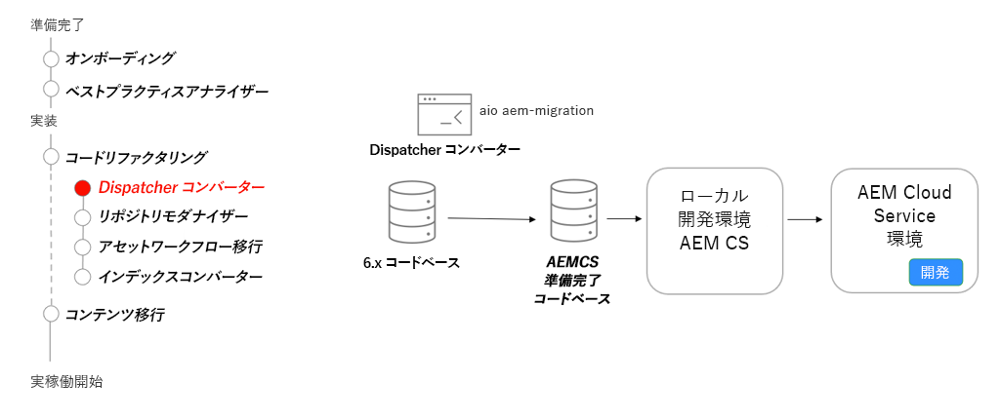

# Dispatcher

Dispatcher for AEM 6 からの主要な変更点、Dispatcher 変換ツールおよび Dispatcher ツール SDK の使用方法に重点を置いて、AEM as a Cloud Service 用の AEM Dispatcher について説明します。

>[!VIDEO](https://video.tv.adobe.com/v/3455389?quality=12&learn=on&captions=jpn)

## Dispatcher コンバーター

コードベースのリファクタリングの一環として、[AEM Dispatcher Converter](https://experienceleague.adobe.com/docs/experience-manager-cloud-service/content/migration-journey/refactoring-tools/dispatcher-transformation-utility-tools.html?lang=ja) を使用して、既存のオンプレミスまたは Adobe Managed Services の Dispatcher 設定を、AEM as a Cloud Service と互換性のある Dispatcher 設定にリファクタリングします。

## 重要なアクティビティ

+ 既存の Dispatcher 設定を移行するには、[Adobe I/O Dispatcher コンバーターツール](https://github.com/adobe/aio-cli-plugin-aem-cloud-service-migration#aio-aem-migrationdispatcher-converter)を使用します。
+ ベストプラクティスとして、[AEM プロジェクトアーキタイプ](https://github.com/adobe/aem-project-archetype/tree/develop/src/main/archetype/dispatcher.cloud)の Dispatcher モジュールを参照します。
+ Cloud Service 環境でテストする前に、[ローカル Dispatcher ツールをセットアップ](https://experienceleague.adobe.com/docs/experience-manager-learn/cloud-service/local-development-environment-set-up/dispatcher-tools.html?lang=ja)して、Dispatcher の検証を行います。

## 実践練習

この実践練習で学んだことを試して、知識を適用します。

実践練習を行う前に、上記のビデオを視聴し、理解し、次の資料を確認してください。

+ [AEM 最新化ツール](./aem-modernization-tools.md)
+ [オンボーディング](./onboarding.md)
+ [Cloud Manager](./cloud-manager.md)

また、前の実践演習を完了していることを確認します。

+ [Cloud Manager 実践演習](./cloud-manager.md#hands-on-exercise)

<table style="border-width:0">
    <tr>
        <td style="width:150px">
                    
        </td>
        <td style="width:100%;margin-bottom:1rem;">
            
Dispatcher ツールを使用した実践演習

            

                AEM SDK の Dispatcher ツールを使用した Dispatcher 設定の検証および Docker を使用したローカルでの AEM Dispatcher の実行を調べます。
            

            <a  rel="noreferrer"
                target="_blank"
                href="https://github.com/adobe/aem-cloud-engineering-video-series-exercises/tree/session5-dispatcher#cloud-acceleration-bootcamp---session-5-dispatcher" class="spectrum-Button spectrum-Button--primary spectrum-Button--sizeM">
 Dispatcher ツールを試す
 </a>
        </td>
    </tr>
</table>
