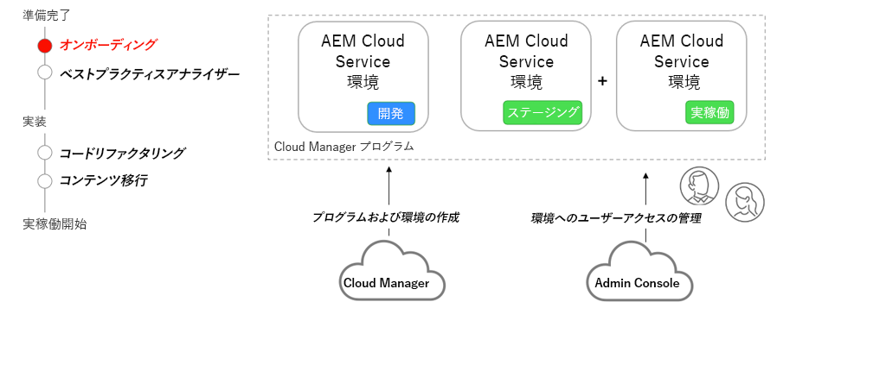

# AEM as a Cloud Service のオンボーディング

契約段階から Cloud Manager を使用した環境のセットアップまで、AEM as a Cloud Service へのオンボーディングについて説明します。

>[!VIDEO](https://video.tv.adobe.com/v/336959?quality=12&learn=on)

## Cloud Manager および Admin Console

オンボーディングの重要な部分は、AEM as a Cloud Service のプログラムを作成し、Adobe Cloud Manager を使用して様々な環境をプロビジョニングすることです。[Admin Console](https://adminconsole.adobe.com/) は、役割を割り当て、組織内のユーザーに AEM 環境へのアクセスを提供するために使用します。

## 重要なアクティビティ

+ システム管理者は、[Admin Console](https://adminconsole.adobe.com/) を使用して 1 人以上のユーザーを [Cloud Manager - ビジネスオーナー](https://experienceleague.adobe.com/docs/experience-manager-cloud-manager/using/requirements/setting-up-users-and-roles.html?lang=ja)製品プロファイルに割り当てます。
+ ビジネスオーナー製品プロファイルに割り当てられたユーザーは、[Cloud Manager](https://experienceleague.adobe.com/docs/experience-manager-cloud-manager/using/introduction-to-cloud-manager.html?lang=ja) のセルフサービス機能を使用して、[プログラムを作成](https://experienceleague.adobe.com/docs/experience-manager-cloud-service/content/implementing/using-cloud-manager/programs/creating-production-programs.html?lang=ja)し、[環境を追加](https://experienceleague.adobe.com/docs/experience-manager-cloud-service/implementing/using-cloud-manager/manage-environments.html?lang=ja)します
+ [Admin Console](https://adminconsole.adobe.com/) を使用して、開発者とユーザーを別の [Cloud Manager の役割](https://experienceleague.adobe.com/docs/experience-manager-cloud-manager/using/requirements/setting-up-users-and-roles.html?lang=ja)に割り当てたり、様々な AEM 環境に権限を付与したりできます。

## 実践練習

この実践練習で学んだことを試して、知識を適用します。

実践練習を行う前に、上記のビデオを視聴し、理解し、次の資料を確認してください。

+ [AEM as a Cloud Service についての考え方](./introduction.md)
+ [Cloud Manager](./cloud-manager.md)

また、前の実践演習を完了していることを確認します。

+ [AEM 最新化ツールの実践演習](./aem-modernization-tools.md#hands-on-exercise)

<table style="border-width:0">
    <tr>
        <td style="width:150px">
                    
        </td>
        <td style="width:100%;margin-bottom:1rem;">
            
オンボーディングの実践

            

                AEM as a Cloud Service のオンボーディングプロセスと、AEM SDK に AEM アプリケーションをデプロイする方法について説明します。
            

            <a  rel="noreferrer"
                target="_blank"
                href="https://github.com/adobe/aem-cloud-engineering-video-series-exercises/tree/session3-onboarding#bootcamp---session-3-on-boarding" class="spectrum-Button spectrum-Button--primary spectrum-Button--sizeM">
 オンボーディングを試す
 </a>
        </td>
    </tr>
</table>
