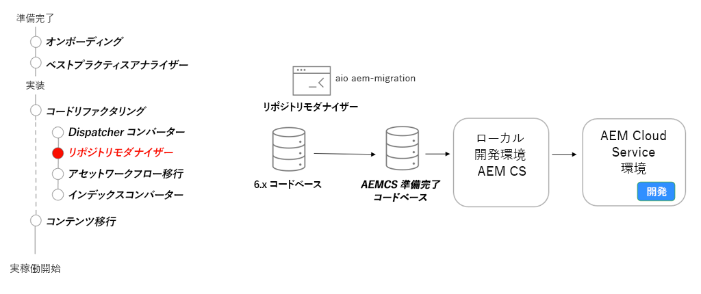

# リポジトリの最新化

リポジトリの最新化、可変コンテンツと不変コンテンツ、パッケージ構造および Repository Modernizer CLI ツールについて説明します。

>[!VIDEO](https://video.tv.adobe.com/v/336958?quality=12&learn=on)

## Repository Modernizer ツール

コードベースのリファクタリングの一環として、[Repository Modernizer ツール](https://experienceleague.adobe.com/docs/experience-manager-cloud-service/moving/refactoring-tools/repo-modernizer.html?lang=ja)を使用して 6.x コードベースをより現代的な構造に再構築します。

## 重要なアクティビティ

* [Adobe I/O Repository Modernizer](https://github.com/adobe/aio-cli-plugin-aem-cloud-service-migration#command-aio-aem-migrationrepository-modernizer) ツールを使用して、AEM as a Cloud Service プロジェクトで期待される構造に合わせてプロジェクトを再構築します。
* 更新されたコードベースのビルドエラーを手動で調整し、修正します。
* [ローカル開発環境](https://experienceleague.adobe.com/docs/experience-manager-learn/cloud-service/local-development-environment-set-up/overview.html?lang=ja)を設定し、更新されたコードベースをデプロイします。プロジェクトが安定した状態になるまで繰り返し実行します。
* 更新されたコードベースを AEM as a Cloud Service の開発環境にデプロイし、検証を続行します。
