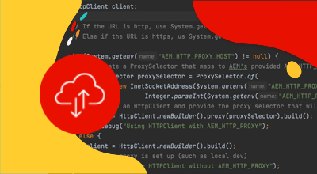

# フレキシブルポートエグレス

フレキシブルポートエグレスをセットアップし使用して、AEM as a Cloud Service から外部サービスへの外部接続をサポートする方法について説明します。

## フレキシブルポートエグレスとは

フレキシブルポートエグレスにより、特定のカスタムポート転送ルールを AEM as a Cloud Service に付加することができ、AEM から外部サービスへの接続が可能になります。

Cloud Manager プログラムでは、__単一の__&#x200B;ネットワークインフラストラクチャタイプのみを持つことができます。次のコマンドを実行する前に、専用のエグレス IP アドレスが AEM as a Cloud Service に最も[適切なタイプのネットワークインフラストラクチャ](./advanced-networking.md)であることを確認してください。

>[!MORELIKETHIS]
>
> フレキシブルポートエグレスについて詳しくは、AEM as a Cloud Service の[高度なネットワーク設定に関するドキュメント](https://experienceleague.adobe.com/docs/experience-manager-cloud-service/content/security/configuring-advanced-networking.html?lang=ja#flexible-port-egress)を参照してください。

## 前提条件

フレキシブルポートエグレスをセットアップするには、以下が必要です。

+ Cloud Manager API が有効になっている Adobe Developer Console プロジェクトと [Cloud Manager のビジネスオーナー権限](https://developer.adobe.com/experience-cloud/cloud-manager/guides/getting-started/permissions/)
+ [Cloud Manager API の認証資格情報](https://developer.adobe.com/experience-cloud/cloud-manager/guides/getting-started/create-api-integration/)へのアクセス
   + 組織 ID（別名 IMS 組織 ID）
   + クライアント ID（API キー）
   + アクセストークン（Bearer トークン）
+ Cloud Manager プログラム ID
+ Cloud Manager 環境 ID

詳しくは、次の Cloud Manager API 資格情報の設定、構成、取得方法、およびそれらを使用した Cloud Manager API 呼び出しの作成方法に関するチュートリアルを参照してください。

>[!VIDEO](https://video.tv.adobe.com/v/342235?quality=12&learn=on)

このチュートリアルでは、`curl` を使用して Cloud Manager API を設定します。指定された `curl` コマンドは、Linux／macOS 構文を想定しています。 Windows のコマンドプロンプトを使用する場合は、`\` 改行文字を `^` で置換します。

## プログラムごとのフレキシブルポートエグレスの有効化

AEM as a Cloud Service でフレキシブルポートエグレスを有効にするところから始めます。

1. まず、Cloud Manager API の [listRegions](https://developer.adobe.com/experience-cloud/cloud-manager/reference/api/) 操作を使用して、高度なネットワークが設定されている地域を特定します。`region name` は後続の Cloud Manager API 呼び出しを行うために必要です。 通常、実稼動環境が存在する地域が使用されます。

   [Cloud Manager](https://my.cloudmanager.adobe.com) で、[環境の詳細](https://experienceleague.adobe.com/docs/experience-manager-cloud-service/content/implementing/using-cloud-manager/manage-environments.html?lang=ja#viewing-environment)の下にある AEM as a Cloud Service 環境の地域を見つけます。Cloud Manager に表示される地域名は、Cloud Manager API で使用される[地域コードにマッピング](https://developer.adobe.com/experience-cloud/cloud-manager/guides/api-usage/creating-programs-and-environments/#creating-aem-cloud-service-environments?lang=ja)できます。

   __listRegions HTTP リクエスト__

   ```shell
   $ curl -X GET https://cloudmanager.adobe.io/api/program/{programId}/regions \
       -H 'x-gw-ims-org-id: <ORGANIZATION_ID>' \
       -H 'x-api-key: <CLIENT_ID>' \
       -H 'Authorization: Bearer <ACCESS_TOKEN>' \
       -H 'Content-Type: application/json' 
   ```

1. Cloud Manager API の [createNetworkInfrastructure](https://developer.adobe.com/experience-cloud/cloud-manager/reference/api/) 操作を使用して、Cloud Manager プログラムのフレキシブルポートエグレスを有効にします。Cloud Manager API の `listRegions` 操作から取得した適切な `region` コードを使用します。

   __createNetworkInfrastructure HTTP リクエスト__

   ```shell
   $ curl -X POST https://cloudmanager.adobe.io/api/program/{programId}/networkInfrastructures \
       -H 'x-gw-ims-org-id: <ORGANIZATION_ID>' \
       -H 'x-api-key: <CLIENT_ID>' \ 
       -H 'Authorization: Bearer <ACCESS_TOKEN>' \
       -H 'Content-Type: application/json' \
       -d '{ "kind": "flexiblePortEgress", "region": "va7" }'
   ```

   Cloud Manager プログラムがネットワークインフラストラクチャをプロビジョニングするまで 15 分待ちます。

1. 環境が、Cloud Manager API の [getNetworkInfrastructure](https://developer.adobe.com/experience-cloud/cloud-manager/reference/api/#operation/getNetworkInfrastructure) 操作を使用して&#x200B;__フレキシブルポートエグレス__&#x200B;の設定を完了したことを、前の手順で createNetworkInfrastructure HTTP リクエストから返された `id` を使用して確認します。

   __getNetworkInfrastructure HTTP リクエスト__

   ```shell
   $ curl -X GET https://cloudmanager.adobe.io/api/program/{programId}/networkInfrastructure/{networkInfrastructureId} \
       -H 'x-gw-ims-org-id: <ORGANIZATION_ID>' \
       -H 'x-api-key: <CLIENT_ID>' \ 
       -H 'Authorization: Bearer <ACCESS_TOKEN>' \
       -H 'Content-Type: application/json'
   ```

   HTTP 応答に、__準備完了__&#x200B;の&#x200B;__ステータス__&#x200B;が含まれていることを確認します。まだ完了していない場合は、数分ごとにステータスを再確認します。

## 環境ごとのフレキシブルポートエグレスプロキシの設定

1. Cloud Manager API の [enableEnvironmentAdvancedNetworkingConfiguration](https://developer.adobe.com/experience-cloud/cloud-manager/reference/api/) 操作を使用して、AEM as a Cloud Service 環境ごとに&#x200B;__フレキシブルポートエグレス__&#x200B;の有効化と設定を行います。

   __enableEnvironmentAdvancedNetworkingConfiguration HTTP リクエスト__

   ```shell
   $ curl -X PUT https://cloudmanager.adobe.io/api/program/{programId}/environment/{environmentId}/advancedNetworking \
       -H 'x-gw-ims-org-id: <ORGANIZATION_ID>' \
       -H 'x-api-key: <CLIENT_ID>' \ 
       -H 'Authorization: Bearer <ACCESS_TOKEN>' \
       -H 'Content-Type: application/json' \
       -d @./flexible-port-egress.json
   ```

   `flexible-port-egress.json` で JSON パラメーターを定義し、`... -d @./flexible-port-egress.json` を介して curl に提供します。

   [サンプルの flexible-port-egress.json](./assets/flexible-port-egress.json) をダウンロードします。このファイルは例に過ぎません。 [enableEnvironmentAdvancedNetworkingConfiguration](https://developer.adobe.com/experience-cloud/cloud-manager/reference/api/) に記載されているオプション／必須フィールドに基づいて、必要に応じてファイルを設定します。 

   ```json
   {
       "portForwards": [
           {
               "name": "mysql.example.com",
               "portDest": 3306,
               "portOrig": 30001
           },
           {
               "name": "smtp.sendgrid.com",
               "portDest": 465,
               "portOrig": 30002
           }
       ]
   }
   ```

   各 `portForwards` マッピングでは、詳細ネットワークは次の転送ルールを定義します。

   | プロキシホスト | プロキシポート |  | 外部ホスト | 外部ポート |
   |---------------------------------|----------|----------------|------------------|----------|
   | `AEM_PROXY_HOST` | `portForwards.portOrig` | → | `portForwards.name` | `portForwards.portDest` |

   これらのルールは HTTP または HTTPS 以外のリクエストにのみ必要なので、AEM デプロイメントに外部サービスへの HTTP または HTTPS 接続（ポート 80 または 443）__のみ__&#x200B;必要な場合、`portForwards` 配列は空のままにします。

1. 各環境で、Cloud Manager API の [getEnvironmentAdvancedNetworkingConfiguration](https://developer.adobe.com/experience-cloud/cloud-manager/reference/api/) 操作を使用して送信ルールが有効であることを検証します。

   __getEnvironmentAdvancedNetworkingConfiguration HTTP リクエスト__

   ```shell
   $ curl -X GET https://cloudmanager.adobe.io/api/program/{programId}/environment/{environmentId}/advancedNetworking \
       -H 'x-gw-ims-org-id: <ORGANIZATION_ID>' \
       -H 'Authorization: Bearer <ACCESS_TOKEN>' \
       -H 'x-api-key: <CLIENT_ID>' \ 
       -H 'Content-Type: application/json'
   ```

1. フレキシブルポートエグレス設定は、Cloud Manager API の [enableEnvironmentAdvancedNetworkingConfiguration](https://developer.adobe.com/experience-cloud/cloud-manager/reference/api/) 操作を使用して更新できます。`enableEnvironmentAdvancedNetworkingConfiguration` は `PUT` 操作なので、この操作を呼び出すたびにすべてのルールを指定する必要があることに注意してください。

1. これで、カスタムの AEM コードおよび設定でフレキシブルポートエグレス設定を使用できるようになりました。


## フレキシブルポートエグレスでの外部サービスへの接続

フレキシブルポートエグレスプロキシを有効にすると、AEM コードおよび設定でそれらを使用して外部サービスを呼び出すことができます。外部呼び出しには、AEM での処理方法が 2 種類あります。

1. 非標準ポートでの外部サービスへの HTTP／HTTPS 呼び出し
   + 標準の 80 または 443 ポート以外のポートで動作するサービスに対して行われる HTTP／HTTPS 呼び出しが含まれます。
1. 外部サービスへの HTTP／HTTPS 以外の呼び出し
   + HTTP 以外の呼び出し（メールサーバーとの接続、SQL データベース、HTTP／HTTPS 以外のプロトコルで実行されるサービスなど）が含まれます。

標準ポート（80 または 443）での AEM からの HTTP／HTTPS リクエストはデフォルトで許可されており、追加の設定や考慮は不要です。


### 非標準ポートでの HTTP／HTTPS

AEM からの非標準ポート（80 または 443 以外）での HTTP／HTTPS 接続を作成する場合、接続は特別なホストとポート（プレースホルダーで指定）を使用して行う必要があります。

AEM には、AEM の HTTP／HTTPS プロキシにマッピングされる 2 組の特別な Java™ システム変数が用意されています。

| 変数名 | 使用方法 | Java™ コード | OSGi 設定 |
| - |  - | - | - |
| `AEM_PROXY_HOST` | HTTP／HTTPS 接続の両方のプロキシホスト | `System.getenv().getOrDefault("AEM_PROXY_HOST", "proxy.tunnel")` | `$[env:AEM_PROXY_HOST;default=proxy.tunnel]` |
| `AEM_HTTP_PROXY_PORT` | HTTPS 接続のプロキシポート（フォールバックを `3128` に設定） | `System.getenv().getOrDefault("AEM_HTTP_PROXY_PORT", 3128)` | `$[env:AEM_HTTP_PROXY_PORT;default=3128]` |
| `AEM_HTTPS_PROXY_PORT` | HTTPS 接続のプロキシポート（フォールバックを `3128` に設定） | `System.getenv().getOrDefault("AEM_HTTPS_PROXY_PORT", 3128)` | `$[env:AEM_HTTPS_PROXY_PORT;default=3128]` |

非標準ポートで外部サービスに対して HTTP／HTTPS 呼び出しを行う場合、ポート転送「ルール」が「コード内」で定義されているので、対応する `portForwards` を Cloud Manager API の `enableEnvironmentAdvancedNetworkingConfiguration` 操作を使用して定義しないでください。

>[!TIP]
>
> [完全なルーティングルールセット](https://experienceleague.adobe.com/docs/experience-manager-cloud-service/content/security/configuring-advanced-networking.html?lang=ja#flexible-port-egress-traffic-routing)については、AEM as a Cloud Service のフレキシブルポートエグレスのドキュメントを参照してください。

#### コードの例

<table>
<tr>
<td>
    <a  href="./examples/http-on-non-standard-ports-flexible-port-egress.md"></a>
    <div><strong><a href="./examples/http-on-non-standard-ports-flexible-port-egress.md">非標準ポートでの HTTP／HTTPS</a></strong></div>
    <p>
        非標準の HTTP／HTTPS ポートを使用して AEM as a Cloud Service から外部サービスへの HTTP／HTTPS 接続を作成する Java™ コードの例。
    </p>
</td>   
<td></td>   
<td></td>   
</tr>
</table>

### 外部サービスへの HTTP／HTTPS 以外の接続

AEM から HTTP／HTTPS 以外の接続を作成する場合（例：SQL、SMTP など）、接続は AEM から提供される特別なホスト名を使用して行う必要があります。

| 変数名 | 使用方法 | Java™ コード | OSGi 設定 |
| - |  - | - | - |
| `AEM_PROXY_HOST` | HTTP／HTTPS 以外の接続用のプロキシホスト | `System.getenv().getOrDefault("AEM_PROXY_HOST", "proxy.tunnel")` | `$[env:AEM_PROXY_HOST;default=proxy.tunnel]` |


外部サービスへの接続は、その後、`AEM_PROXY_HOST` とマッピングされたポート（`portForwards.portOrig`）を使用しで呼び出されます。次に、AEM はこれをマッピングされた外部ホスト名（`portForwards.name`）とポート（`portForwards.portDest`）にルーティングします。

| プロキシホスト | プロキシポート |  | 外部ホスト | 外部ポート |
|---------------------------------|----------|----------------|------------------|----------|
| `AEM_PROXY_HOST` | `portForwards.portOrig` | → | `portForwards.name` | `portForwards.portDest` |

#### コードの例

<table><tr>
   <td>
      <a  href="./examples/sql-datasourcepool.md"></a>
      <div><strong><a href="./examples/sql-datasourcepool.md">JDBC DataSourcePool を使用した SQL 接続</a></strong></div>
      <p>
            AEM JDBC データソースプールを設定して外部 SQL データベースに接続する Java™コード例。
      </p>
    </td>   
   <td>
      <a  href="./examples/sql-java-apis.md"></a>
      <div><strong><a href="./examples/sql-java-apis.md">Java™ API を使用した SQL 接続</a></strong></div>
      <p>
            Java™ の SQL API を使用して外部 SQL データベースに接続する Java™ コードの例。
      </p>
    </td>   
   <td>
      <a  href="./examples/email-service.md"></a>
      <div><strong><a href="./examples/email-service.md">メールサービス</a></strong></div>
      <p>
        外部のメールサービスに接続するために AEM を使用する OSGi 設定例です。
      </p>
    </td>   
</tr></table>
