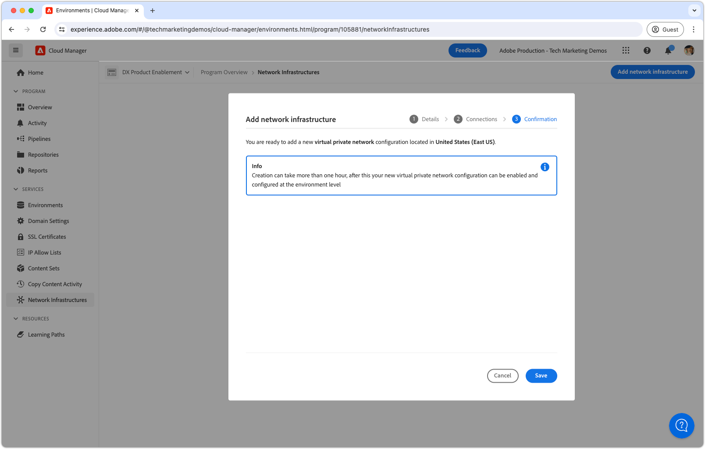

# 仮想プライベートネットワーク（VPN）

AEM as a Cloud Service を VPN に接続して、AEM と内部サービスの間に安全な通信チャネルを作成する方法を説明します。

## 仮想プライベートネットワークとは

仮想プライベートネットワーク（VPN）により、AEM as a Cloud Service のお客様は、Cloud Manager プログラム内の **AEM 環境**&#x200B;を、[サポートされている](https://experienceleague.adobe.com/en/docs/experience-manager-cloud-service/content/security/configuring-advanced-networking)既存の VPN に接続できます。 VPN を使用すると、AEMas a Cloud Serviceと顧客のネットワーク内のサービスとの間で、安全で制御された接続を確立できます。

Cloud Manager プログラムでは、__単一の__&#x200B;ネットワークインフラストラクチャタイプのみを持つことができます。 次のコマンドを実行する前に、仮想プライベートネットワークが AEM as a Cloud Service に最も[適切なタイプのネットワークインフラストラクチャ](https://experienceleague.adobe.com/en/docs/experience-manager-cloud-service/content/security/configuring-advanced-networking)であることを確認してください。

>[!NOTE]
>
>ビルド環境を Cloud Manager から VPN に接続することはサポートされていません。 プライベートリポジトリからバイナリアーティファクトにアクセスする必要がある場合は、[ここで説明するように](https://experienceleague.adobe.com/en/docs/experience-manager-cloud-service/content/implementing/using-cloud-manager/create-application-project/setting-up-project)、パブリックインターネット上からアクセスできる URL を使用して、パスワードで保護されたセキュアなリポジトリを設定する必要があります。

>[!MORELIKETHIS]
>
> 仮想プライベートネットワークについて詳しくは、AEM as a Cloud Service の[詳細なネットワーク設定ドキュメント](https://experienceleague.adobe.com/en/docs/experience-manager-cloud-service/content/security/configuring-advanced-networking)を参照してください。

## 前提条件

Cloud Manager API を使用して仮想プライベートネットワークを設定する場合は、以下が必要です。

+ [Cloud Manager のビジネスオーナー権限](https://developer.adobe.com/experience-cloud/cloud-manager/guides/getting-started/permissions/)のある Adobeアカウント
+ [Cloud Manager API の認証資格情報](https://developer.adobe.com/experience-cloud/cloud-manager/guides/getting-started/create-api-integration/)へのアクセス
   + 組織 ID（別名 IMS 組織 ID）
   + クライアント ID（API キー）
   + アクセストークン（Bearer トークン）
+ Cloud Manager プログラム ID
+ Cloud Manager 環境 ID
+ 必要なすべての接続パラメーターにアクセスできる&#x200B;**ルートに戻づいた**&#x200B;仮想プライベートネットワーク。

詳しくは、次の Cloud Manager API 資格情報の設定、構成、取得方法、およびそれらを使用した Cloud Manager API 呼び出しの作成方法に関するチュートリアルを参照してください。

>[!VIDEO](https://video.tv.adobe.com/v/342235?quality=12&learn=on)

このチュートリアルでは、`curl` を使用して Cloud Manager API を設定します。 指定された `curl` コマンドは、Linux／macOS 構文を想定しています。 Windows のコマンドプロンプトを使用する場合は、`\` 改行文字を `^` で置換します。

## プログラムごとの仮想プライベートネットワークの有効化

AEM as a Cloud Service の仮想プライベートネットワークを有効化することから始めます。


>[!BEGINTABS]

>[!TAB Cloud Manager]

Cloud Manager を使用して、フレキシブルポートエグレスを有効にできます。 次の手順では、Cloud Manager を使用してAEM as a Cloud Serviceでフレキシブルポートエグレスを有効にする方法の概要を説明します。

1. にログインします [Adobe Experience Manager Cloud Manager](https://experience.adobe.com/cloud-manager/) cloud Manager ビジネスオーナーとして。
1. 目的のプログラムに移動します。
1. 左側のメニューで、に移動します。 __[ サービス ]>[ ネットワーク インフラストラクチャ ]__.
1. 「」を選択します __ネットワークインフラストラクチャの追加__ ボタン。

   

1. が含まれる __ネットワークインフラストラクチャの追加__ ダイアログで、 __仮想プライベートネットワーク__ オプション。 フィールドに入力して選択 __続行__. 組織のネットワーク管理者と協力して、正しい値を取得します。

   

1. 1 つ以上の VPN 接続を作成します。 接続に意味のある名前を付け、 __接続を追加__ ボタン。

   

1. VPN 接続を設定します。 組織のネットワーク管理者と協力して、正しい値を取得します。 を選択 __保存__ 接続の追加を確認します。

   

1. 複数の VPN 接続が必要な場合は、必要に応じてさらに接続します。 すべての VPN 接続が追加されたら、 __続行__.

   

1. を選択 __保存__ vpn と設定済みのすべての接続の追加を確認します。

   

1. ネットワークインフラストラクチャが作成され、としてマークされるのを待ちます。 __準備完了__. この処理には最大 1 時間かかる場合があります。

   

VPN を作成したら、以下に説明するように、Cloud Manager API を使用して VPN を設定できるようになります。

>[!TAB Cloud Manager の API]

仮想プライベートネットワークは、Cloud Manager API を使用して有効にできます。 次の手順では、Cloud Manager API を使用してAEMas a Cloud Serviceで VPN を有効にする方法の概要を説明します。

1. まず、Cloud Manager API の [listRegions](https://developer.adobe.com/experience-cloud/cloud-manager/reference/api/) 操作を使用して、詳細なネットワーク構成が必要な地域を決定します。 `region name` は後続の Cloud Manager API 呼び出しを行うために必要です。 通常、実稼動環境が存在する地域が使用されます。

   [Cloud Manager](https://my.cloudmanager.adobe.com) で、[環境の詳細](https://experienceleague.adobe.com/en/docs/experience-manager-cloud-service/content/implementing/using-cloud-manager/manage-environments)の下にある AEM as a Cloud Service 環境の地域を見つけます。 Cloud Manager に表示される地域名は、Cloud Manager API で使用される[地域コードにマッピング](https://developer.adobe.com/experience-cloud/cloud-manager/guides/api-usage/creating-programs-and-environments/#creating-aem-cloud-service-environments?lang=ja)できます。

   __listRegions HTTP リクエスト__

   ```shell
   $ curl -X GET https://cloudmanager.adobe.io/api/program/{programId}/regions \
       -H 'x-gw-ims-org-id: <ORGANIZATION_ID>' \
       -H 'x-api-key: <CLIENT_ID>' \
       -H 'Authorization: Bearer <ACCESS_TOKEN>' \
       -H 'Content-Type: application/json'
   ```

1. Cloud Manager API の [createNetworkInfrastructure](https://developer.adobe.com/experience-cloud/cloud-manager/reference/api/) 操作を使用して、Cloud Manager プログラムの仮想プライベートネットワークを有効化します。 Cloud Manager API の `listRegions` 操作から取得した適切な `region` コードを使用します。

   __createNetworkInfrastructure HTTP リクエスト__

   ```shell
   $ curl -X POST https://cloudmanager.adobe.io/api/program/{programId}/networkInfrastructures \
       -H 'x-gw-ims-org-id: <ORGANIZATION_ID>' \
       -H 'x-api-key: <CLIENT_ID>' \
       -H 'Authorization: Bearer <ACCESS_TOKEN>' \
       -H 'Content-Type: application/json'
       -d @./vpn-create.json
   ```

   `vpn-create.json` で JSON パラメーターを定義し、`... -d @./vpn-create.json` を介して curl に提供します。

   [サンプルの vpn-create.json をダウンロードします](./assets/vpn-create.json)。  このファイルは一例です。 [enableEnvironmentAdvancedNetworkingConfiguration](https://developer.adobe.com/experience-cloud/cloud-manager/reference/api/) に記載されているオプション／必須フィールドに基づいて、必要に応じてファイルを設定します。

   ```json
   {
       "kind": "vpn",
       "region": "va7",
       "addressSpace": [
           "10.104.182.64/26"
       ],
       "dns": {
           "resolvers": [
               "10.151.201.22",
               "10.151.202.22",
               "10.154.155.22"
           ],
           "domains": [
               "wknd.site",
               "wknd.com"
           ]
       },
       "connections": [{
           "name": "connection-1",
           "gateway": {
               "address": "195.231.212.78",
               "addressSpace": [
                   "10.151.0.0/16",
                   "10.152.0.0/16",
                   "10.153.0.0/16",
                   "10.154.0.0/16",
                   "10.142.0.0/16",
                   "10.143.0.0/16",
                   "10.124.128.0/17"
               ]
           },
           "sharedKey": "<secret_shared_key>",
           "ipsecPolicy": {
               "dhGroup": "ECP256",
               "ikeEncryption": "AES256",
               "ikeIntegrity": "SHA256",
               "ipsecEncryption": "AES256",
               "ipsecIntegrity": "SHA256",
               "pfsGroup": "ECP256",
               "saDatasize": 102400000,
               "saLifetime": 3600
           }
       }]
   }
   ```

   Cloud Manager プログラムがネットワークインフラストラクチャをプロビジョニングするまで 45 ～ 60 分待ちます。

1. 環境が終了したことを確認します。 __仮想プライベートネットワーク__ cloud Manager API を使用した設定 [getNetworkInfrastructure](https://developer.adobe.com/experience-cloud/cloud-manager/reference/api/#operation/getNetworkInfrastructure) 操作、使用する `id` 返される `createNetworkInfrastructure` 前の手順の HTTP リクエスト。

   __getNetworkInfrastructure HTTP リクエスト__

   ```shell
   $ curl -X GET https://cloudmanager.adobe.io/api/program/{programId}/networkInfrastructure/{networkInfrastructureId} \
       -H 'x-gw-ims-org-id: <ORGANIZATION_ID>' \
       -H 'x-api-key: <CLIENT_ID>' \
       -H 'Authorization: <YOUR_BEARER_TOKEN>' \
       -H 'Content-Type: application/json'
   ```

   HTTP 応答に、__準備完了__&#x200B;の&#x200B;__ステータス__&#x200B;が含まれていることを確認します。 まだ準備完了ではない場合は、数分ごとにステータスを再確認します。


VPN を作成したら、以下に説明するように、Cloud Manager API を使用して VPN を設定できるようになります。

>[!ENDTABS]

## 環境ごとの仮想プライベートネットワークプロキシの設定

1. Cloud Manager API の [enableEnvironmentAdvancedNetworkingConfiguration](https://developer.adobe.com/experience-cloud/cloud-manager/reference/api/) 操作を使用して、各 AEM as a Cloud Service 環境で&#x200B;__仮想プライベートネットワーク__&#x200B;の設定を作成します。

   __enableEnvironmentAdvancedNetworkingConfiguration HTTP リクエスト__

   ```shell
   $ curl -X PUT https://cloudmanager.adobe.io/api/program/{programId}/environment/{environmentId}/advancedNetworking \
       -H 'x-gw-ims-org-id: <ORGANIZATION_ID>' \
       -H 'x-api-key: <CLIENT_ID>' \
       -H 'Authorization: Bearer <ACCESS_TOKEN>' \
       -H 'Content-Type: application/json' \
       -d @./vpn-configure.json
   ```

   `vpn-configure.json` で JSON パラメーターを定義し、`... -d @./vpn-configure.json` を介して curl に提供します。

[サンプル vpn-configure.json のダウンロード](./assets/vpn-configure.json)

   ```json
   {
       "nonProxyHosts": [
           "example.net",
           "*.example.org"
       ],
       "portForwards": [
           {
               "name": "mysql.example.com",
               "portDest": 3306,
               "portOrig": 30001
           },
           {
               "name": "smtp.sendgrid.com",
               "portDest": 465,
               "portOrig": 30002
           }
       ]
   }
   ```

   `nonProxyHosts` は、ポート 80 または 443 が専用のエグレス IP ではなくデフォルトの共有 IP アドレス範囲を介してルーティングされるホストのセットを宣言します。 `nonProxyHosts` は、共有 IP を介して送信されたトラフィックがAdobeによって自動的に最適化される場合に役立ちます。

   各 `portForwards` マッピングでは、詳細ネットワークは次の転送ルールを定義します。

   | プロキシホスト | プロキシポート |  | 外部ホスト | 外部ポート |
   |---------------------------------|----------|----------------|------------------|----------|
   | `AEM_PROXY_HOST` | `portForwards.portOrig` | → | `portForwards.name` | `portForwards.portDest` |

   AEM デプロイメントで必要とする外部サービスが HTTP／HTTPS __のみ__&#x200B;の場合は、`portForwards` 配列を空のままにします。これらのルールは非 HTTP／HTTPS リクエストにのみ必要なためです。


2. 環境ごとに、Cloud Manager API を使用して、VPN ルーティングルールが有効であることを検証します。 [getEnvironmentAdvancedNetworkingConfiguration](https://developer.adobe.com/experience-cloud/cloud-manager/reference/api/) 操作。

   __getEnvironmentAdvancedNetworkingConfiguration HTTP リクエスト__

   ```shell
   $ curl -X GET https://cloudmanager.adobe.io/api/program/{programId}/environment/{environmentId}/advancedNetworking \
       -H 'x-gw-ims-org-id: <ORGANIZATION_ID>' \
       -H 'x-api-key: <CLIENT_ID>' \
       -H 'Authorization: Bearer <ACCESS_TOKEN>' \
       -H 'Content-Type: application/json'
   ```

3. 仮想プライベートネットワークのプロキシ設定は、Cloud Manager API の [enableEnvironmentAdvancedNetworkingConfiguration](https://developer.adobe.com/experience-cloud/cloud-manager/reference/api/) 操作を使用して更新できます。 `enableEnvironmentAdvancedNetworkingConfiguration` は `PUT` 操作であるため、この操作を呼び出すたびにすべてのルールを提供する必要があることに注意してください。

4. これで、カスタム AEM コードおよび設定で、仮想プライベートネットワークのエグレス設定を使用できるようになりました。

## 仮想プライベートネットワーク経由での外部サービスへの接続

仮想プライベートネットワークを有効にすると、AEM のコードと設定で使用して、VPN 経由で外部サービスを呼び出すことができます。 外部呼び出しには、AEM での処理方法が 2 種類あります。

1. 外部サービスへの HTTP／HTTPS 呼び出し
   + 標準の 80 または 443 ポート以外のポートで動作するサービスに対して行われる HTTP／HTTPS 呼び出しが含まれます。
1. 外部サービスへの HTTP／HTTPS 以外の呼び出し
   + HTTP 以外の呼び出し（メールサーバーとの接続、SQL データベース、HTTP／HTTPS 以外のプロトコルで実行されるサービスなど）が含まれます。

標準ポート（80 または 443）でのAEMからの HTTP/HTTPS リクエストはデフォルトで許可されていますが、以下のように適切に設定されていない場合は、VPN 接続を使用しないでください。

### HTTP／HTTPS

AEM から HTTP／HTTPS で接続する場合、VPN を使用すると、HTTP／HTTPS 接続が自動的 AEM からプロキシされます。 HTTP／HTTPS 接続をサポートするために、追加のコードや設定は必要ありません。

>[!TIP]
>
> [ルーティングルールの完全なセット](https://experienceleague.adobe.com/en/docs/experience-manager-cloud-service/content/security/configuring-advanced-networking)については、AEM as a Cloud Service の仮想プライベートネットワークのドキュメントを参照してください。

#### コードの例

<table>
<tr>
<td>
    <a  href="./examples/http-dedicated-egress-ip-vpn.md"></a>
    <div><strong><a href="./examples/http-dedicated-egress-ip-vpn.md">HTTP／HTTPS</a></strong></div>
    <p>
        HTTP/HTTPS プロトコルを使用して、AEMからの HTTP/HTTPS 接続を外部サービスにas a Cloud Serviceさせる Java™ コードの例。
    </p>
</td>
<td></td>
<td></td>
</tr>
</table>

### 非 HTTP／HTTPS 接続コードの例

AEM から HTTP／HTTPS 以外の接続を作成する場合（例：SQL、SMTP など）、接続は AEM から提供される特別なホスト名を使用して行う必要があります。

| 変数名 | 使用方法 | Java™ コード | OSGi 設定 |
| - |  - | - | - |
| `AEM_PROXY_HOST` | HTTP／HTTPS 以外の接続用のプロキシホスト | `System.getenv("AEM_PROXY_HOST")` | `$[env:AEM_PROXY_HOST]` |


外部サービスへの接続は、その後、`AEM_PROXY_HOST` とマッピングされたポート（`portForwards.portOrig`）を使用しで呼び出されます。次に、AEM はこれをマッピングされた外部ホスト名（`portForwards.name`）とポート（`portForwards.portDest`）にルーティングします。

| プロキシホスト | プロキシポート |  | 外部ホスト | 外部ポート |
|---------------------------------|----------|----------------|------------------|----------|
| `AEM_PROXY_HOST` | `portForwards.portOrig` | → | `portForwards.name` | `portForwards.portDest` |


#### コードの例

<table><tr>
   <td>
      <a  href="./examples/sql-datasourcepool.md"></a>
      <div><strong><a href="./examples/sql-datasourcepool.md">JDBC DataSourcePool を使用した SQL 接続</a></strong></div>
      <p>
            AEM JDBC データソースプールを設定して外部 SQL データベースに接続する Java™コード例。
      </p>
    </td>
   <td>
      <a  href="./examples/sql-java-apis.md"></a>
      <div><strong><a href="./examples/sql-java-apis.md">Java™ API を使用した SQL 接続</a></strong></div>
      <p>
            Java™ の SQL API を使用して外部 SQL データベースに接続する Java™ コードの例。
      </p>
    </td>
   <td>
      <a  href="./examples/email-service.md"></a>
      <div><strong><a href="./examples/email-service.md">メールサービス</a></strong></div>
      <p>
        外部のメールサービスに接続するためにAEMを使用する OSGi 設定例です。
      </p>
    </td>
</tr></table>

### AEM as a Cloud Service へのVPN 経由でのアクセスの制限

仮想プライベートネットワークの設定で、AEM as a Cloud Service 環境へのアクセスを VPN に制限します。

#### 設定例

<table><tr>
   <td>
      <a href="https://experienceleague.adobe.com/en/docs/experience-manager-cloud-service/content/implementing/using-cloud-manager/ip-allow-lists/apply-allow-list"></a>
      <div><strong><a href="https://experienceleague.adobe.com/en/docs/experience-manager-cloud-service/content/implementing/using-cloud-manager/ip-allow-lists/apply-allow-list">IP 許可リストの適用</a></strong></div>
      <p>
            VPN トラフィックのみが AEM にアクセスできるように IP 許可リストを設定します。
      </p>
    </td>
   <td>
      <a  href="https://experienceleague.adobe.com/en/docs/experience-manager-cloud-service/content/security/configuring-advanced-networking"></a>
      <div><strong><a href="https://experienceleague.adobe.com/en/docs/experience-manager-cloud-service/content/security/configuring-advanced-networking">AEM パブリッシュへのパスベースの VPN アクセス制限</a></strong></div>
      <p>
            AEM パブリッシュ上の特定のパスに対して VPN アクセスを要求します。
      </p>
    </td>
   <td></td>
</tr></table>
