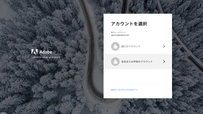
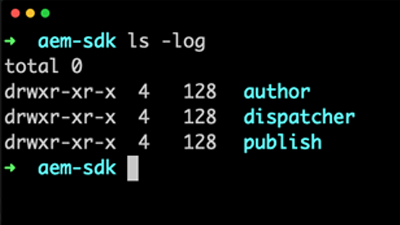

# 概要 {#overview}

Adobe Experience Manager（AEM）は as a Cloud Service として利用可能になりました。AEMは、Cloud Serviceとして次世代のExperience Manager製品ラインを導入し、過去の投資や革新性に基づいて構築され、すべての使用事例や機能を保持し、拡張しています。

>[!VIDEO](https://video.tv.adobe.com/v/31085/?quality=12&learn=on)

## 新機能

* **[外部アプリケーションからのCloud ServiceとしてのAEMへの認証（チュートリアル）](../headless-tutorial/authentication/overview.md)**

   *HTTP経由のCloud ServiceとしてAEMとやり取りするために、トークンベースの認証を使用する方法を学びます。*

* **[一括インポート（ビデオ）](./migration/bulk-import.md)**

   *Azure BlobストレージまたはAmazonS3からAEMにアセットを一括インポートする方法を説明します*

* **[asset computeメタデータワーカー（チュートリアル）](./asset-compute/advanced/metadata.md)**

   *asset computeワーカーからAEMにアセットのメタデータを書き戻す方法を説明します。*

* **[asset computeマイクロサービスの拡張機能（チュートリアル）](./asset-compute/overview.md)**

   *asset computeワーカーを開発し、カスタムアセットレンディションを生成する方法を学びます。*

* **[Cloud ServiceとしてのAEMへのアクセスの設定（チュートリアル）](./accessing/overview.md)**

   *AEMにアクセスできるように、Adobe Admin ConsoleでIMSユーザーを設定する方法を説明します。*

## スタッフの選考

<table>
   <td>
      
      

         <a href="./accessing/overview.md">
         <strong>AEMへのアクセスの設定</strong>
         </a>
      

      

         <em>AEMにアクセスするように、Adobe Admin ConsoleでIMSユーザーを設定します。</em>
      

   </td>   
   <td>
      
      

         <a href="./local-development-environment/overview.md">
         <strong>ローカル開発環境のセットアップチュートリアル</strong>
         </a>
      

      

         <em>ローカルの開発マシンを、Cloud Service開発としてAEMに対応させます。</em>
      

   </td>   
   <td>
      
      

         <a href="./debugging/aem-sdk-local-quickstart/overview.md">
         <strong>AEM SDKのデバッグ</strong>
         </a>
      

      

         <em>Cloud ServiceSDKのローカルクイックスタートとして、AEM上のアプリケーションのデバッグに使用するツールを調査します。</em>
      

   </td>
</table>

## その他のリソース

* [Experience League-Adobe Experience Managerを探索](https://experienceleague.adobe.com/#recommended/solutions/experience-manager)
* [Cloud Service文書としてのAdobe Experience Manager](https://docs.adobe.com/content/help/ja-JP/experience-manager-cloud-service/landing/home.html)
