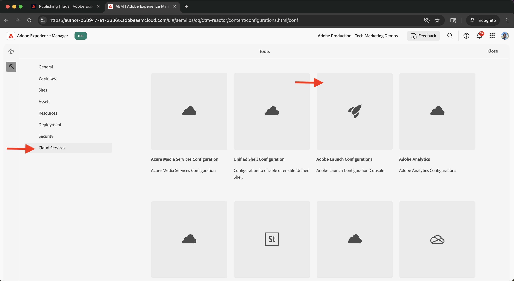

# Adobe Experience Platformでのタグの統合

AEM as a Cloud Service（AEMCS）をAdobe Experience Platformのタグと統合する方法を説明します。 タグ（Launch）統合を使用すると、Adobe web SDKをデプロイし、データ収集およびパーソナライゼーションのためのカスタム JavaScriptをAEM ページに挿入できます。

この統合により、マーケティングチームや開発チームは、AEM コードを再デプロイしなくても、パーソナライゼーションやデータ収集のためにJavaScriptを管理およびデプロイできます。

## 手順の概要

統合プロセスには、AEMと Tags の間のつながりを確立する 4 つの主な手順が含まれます。

1. **Adobe Experience Platformでタグプロパティを作成、設定および公開する**
2. **AEMのタグのAdobe IMS設定の確認**
3. **AEMでのタグ設定の作成**
4. **タグ設定をAEMページに適用する**

## Adobe Experience Platformでのタグプロパティの作成、設定および公開

まず、Adobe Experience Platformでタグプロパティを作成します。 このプロパティを使用すると、パーソナライゼーションやデータ収集に必要なAdobe web SDKやカスタム JavaScriptのデプロイメントを管理できます。

1. [Adobe Experience Platform](https://experience.adobe.com/platform) に移動し、Adobe IDでログインして、左側のメニューから **タグ** に移動します。\
   

2. **新規プロパティ** をクリックして、新しいタグプロパティを作成します。\
   

3. **プロパティを作成** ダイアログで、以下を入力します。
   - **プロパティ名**：タグプロパティの名前
   - **プロパティタイプ**:**Web** を選択します
   - **ドメイン**：プロパティをデプロイするドメイン（例：`.adobeaemcloud.com`）

   「**保存**」をクリックします。

   

4. 新規プロパティを開きます。 **Core** 拡張機能は既に含まれている必要があります。 後で、**データストリーム ID** などの追加の設定が必要なので、実験のユースケースを設定する際に **Web SDK** 拡張機能を追加します。\
   

5. **公開フロー** に移動し、「ライブラリを追加」 **をクリックして、タグプロパティを公開し** デプロイメントライブラリを作成します。
   

6. **ライブラリを作成** ダイアログで、次の情報を指定します。
   - **名前**: ライブラリの名前
   - **環境**:「**開発**」を選択します
   - **リソースの変更**:「**変更されたすべてのリソースを追加**」を選択します

   **開発用に保存およびビルド** をクリックします。

   

7. ライブラリを実稼動環境に公開するには、「**承認して実稼動環境に公開**」をクリックします。 公開が完了すると、プロパティがAEMで使用できるようになります。\
   

## AEMでのタグのAdobe IMS設定の確認

AEMCS 環境がプロビジョニングされると、対応するAdobe Developer Console プロジェクトと共にタグのAdobe IMS設定が自動的に含まれます。 この設定により、AEMとタグの間で安全な API 通信が確保されます。

1. AEMで、**ツール**/**セキュリティ**/**Adobe IMS設定** に移動します。\
   

2. **Adobe Launch** 設定を見つけます。 使用可能な場合は、そのオプションを選択し、「**ヘルスチェック**」をクリックして接続を確認します。 成功の応答が表示されます。\
   

## AEMでのタグ設定の作成

AEMでタグ設定を作成し、サイトページに必要なプロパティと設定を指定します。

1. AEMで、**ツール**/**クラウドサービス**/**Adobe Launch 設定** に移動します。\
   

2. サイトのルートフォルダー（WKND Site など）を選択し、「**作成**」をクリックします。\
   

3. ダイアログで、以下を入力します。
   - **タイトル**：例：「Adobe Tags」
   - **IMS 設定**：検証済みの **Adobe Launch** IMS 設定を選択します
   - **会社**：タグプロパティにリンクする会社を選択します
   - **プロパティ**：前に作成したタグプロパティを選択します

   「**次へ**」をクリックします。

   

4. デモ目的で、**ステージング** 環境と **実稼動** 環境のデフォルト値を維持します。 「**作成**」をクリックします。\
   

5. 新しく作成した設定を選択し、「**公開**」をクリックしてサイトページで使用できるようにします。\
   

## AEM サイトへのタグ設定の適用

Tags 設定を適用して、web SDKとパーソナライゼーションロジックをサイトページに挿入します。

1. AEMで、**Sites** に移動して、ルートサイトフォルダー（WKND Site など）を選択し、**プロパティ** をクリックします。\
   

2. **サイトのプロパティ** ダイアログで、「**詳細**」タブを開きます。 **設定** で、「`/conf/wknd` クラウド設定 **」に** が選択されていることを確認します。\
   

## 統合の検証

タグの設定が正しく動作していることを確認するには、次の操作を実行します。

1. AEM パブリッシュページのビューソースを確認するか、ブラウザーのデベロッパーツールを使用して調べます。
2. [Adobe Experience Platform Debugger](https://chromewebstore.google.com/detail/adobe-experience-platform/bfnnokhpnncpkdmbokanobigaccjkpob) を使用して、Web SDKとJavaScriptのインジェクションを検証します

## その他のリソース

- [Adobe Experience Platform Debugger の概要](https://experienceleague.adobe.com/ja/docs/experience-platform/debugger/home)
- [Tags の概要](https://experienceleague.adobe.com/ja/docs/experience-platform/tags/home)
