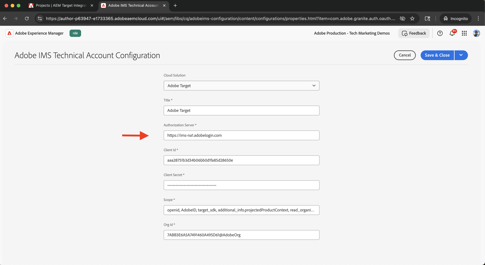

# Adobe Target を統合

AEM as a Cloud Service（AEMCS）をAdobe Targetと統合して、パーソナライズされたコンテンツ（エクスペリエンスフラグメントなど）をAdobe Targetのオファーとしてアクティブ化する方法を説明します。

統合により、マーケティングチームは、パーソナライズされたコンテンツをAEMで一元的に作成および管理できます。 その後、このコンテンツはAdobe Targetのオファーとしてシームレスにアクティブ化できます。

>[!IMPORTANT]
>
>AEMを一元的なコンテンツリポジトリとして使用せずに、Adobe Target内でオファー全体を管理する場合は、統合手順はオプションです。

## 手順の概要

統合プロセスには、AEMとAdobe Target間の接続を確立する 4 つの主な手順が含まれます。

1. **Adobe Developer Console プロジェクトの作成と設定**
2. **AEMでの Target のAdobe IMS設定の作成**
3. **AEMでの従来のAdobe Target設定の作成**
4. **エクスペリエンスフラグメントへのAdobe Target設定の適用**

## Adobe Developer Console プロジェクトの作成と設定

AEMがAdobe Targetと安全に通信できるようにするには、OAuth サーバー間認証を使用してAdobe Developer Console プロジェクトを設定する必要があります。 既存のプロジェクトを使用することも、新しいプロジェクトを作成することもできます。

1. [Adobe Developer Console](https://developer.adobe.com/console) に移動し、Adobe IDでサインインします。

2. 新しいプロジェクトを作成するか、既存のプロジェクトを選択します。\
   

3. 「**API を追加**」をクリックします。 **API を追加** ダイアログで、**Experience Cloud** でフィルタリングし、「**Adobe Target**」を選択して **次へ** をクリックします。\
   

4. **API の設定** ダイアログで、「**OAuth サーバー間**」認証方法を選択して、「**次へ**」をクリックします。\
   

5. **製品プロファイルを選択** 手順で、「**デフォルトのWorkspace**」を選択し、「**設定済み API を保存**」をクリックします。\
   

6. 左側のナビゲーションで **OAuth サーバー間** を選択し、設定の詳細を確認します。 クライアント ID とクライアント秘密鍵に注意します。AEMで IMS 統合を設定するには、これらの値が必要です。
   

## AEMでの Target のAdobe IMS設定の作成

AEMで、Adobe Developer Consoleの資格情報を使用して Target のAdobe IMS設定を作成します。 この設定により、AEMがAdobe Target API を使用して認証できるようになります。

1. AEMで、**ツール**/**セキュリティ** に移動し、**Adobe IMS設定** を選択します。\
   

2. 「**作成**」をクリックします。\
   

3. **Adobe IMSテクニカルアカウント設定** ページで、次の情報を入力します。
   - **クラウドソリューション**:Adobe Target
   - **タイトル**:「Adobe Target」などの設定のラベル
   - **認証サーバー**: `https://ims-na1.adobelogin.com`
   - **クライアント ID**:Adobe Developer Consoleから
   - **クライアント秘密鍵**:Adobe Developer Consoleから
   - **範囲**:Adobe Developer Consoleから
   - **組織 ID**:Adobe Developer Consoleから

   次に、「**作成**」をクリックします。

   

4. 設定を選択し、**ヘルスチェック** をクリックして接続を確認します。 AEMがAdobe Targetに接続できることを確認するエラーメッセージが表示されます。\
   

## AEMでの従来のAdobe Target設定の作成

エクスペリエンスフラグメントをオファーとしてAdobe Targetに書き出すには、AEMで従来のAdobe Target設定を作成します。

1. AEMで、**ツール**/**Cloud Services** に移動して、「**従来の Cloud Services**」を選択します。\
   

2. 「**Adobe Target**」セクションで、「**今すぐ設定**」をクリックします。\
   

3. **設定を作成** ダイアログで、「Adobe Target Legacy」などの名前を入力し、「作成 **をクリックし** す。\
   

4. **Adobe Targetの従来の設定** ページで、次の情報を指定します。
   - **認証**：IMS
   - **クライアントコード**：お使いのAdobe Target クライアントコード（Adobe Targetの **管理**/**実装** にあります）
   - **IMS 設定**：以前に作成した IMS 設定

   **Adobe Targetに接続** をクリックして、接続を検証します。

   

## エクスペリエンスフラグメントへのAdobe Target設定の適用

Adobe Target設定をエクスペリエンスフラグメントに関連付け、Target に書き出してオファーとして使用できるようにします。

1. AEMで、**エクスペリエンスフラグメント** に移動します。\
   

2. エクスペリエンスフラグメントを含んだルートフォルダー（例えば、`WKND Site Fragments`）を選択し、**プロパティ** をクリックします。\
    プロパティ）

3. **プロパティ** ページで、「**クラウドサービス**」タブを開きます。 「**Cloud Service設定**」セクションで、Adobe Target設定を選択します。\
   

4. 表示される「**Adobe Target**」セクションで、次の操作を行います。
   - **Adobe Target書き出しフォーマット** : HTML
   - **Adobe Target Workspace**：使用するワークスペースを選択します（「デフォルトのWorkspace」など）。
   - **Externalizer ドメイン**：外部 URL を生成するためのドメインを入力します

   

5. **保存して閉じる** をクリックして、設定を適用します。

## 統合の検証

統合が正しく動作することを確認するには、書き出し機能をテストします。

1. AEMで、新しいエクスペリエンスフラグメントを作成するか、既存のエクスペリエンスフラグメントを開きます。 ツールバーの **Adobe Targetに書き出し** をクリックします。\
   

2. Adobe Targetで、「**オファー**」セクションに移動し、エクスペリエンスフラグメントがオファーとして表示されることを確認します。\
   

## その他のリソース

- [Target API の概要 ](https://experienceleague.adobe.com/en/docs/target-dev/developer/api/target-api-overview)
- [ ターゲットオファー ](https://experienceleague.adobe.com/en/docs/target/using/experiences/offers/manage-content)
- [Adobe Developer Console](https://developer.adobe.com/developer-console/docs/guides/)
- [AEMのエクスペリエンスフラグメント ](https://experienceleague.adobe.com/en/docs/experience-manager-learn/sites/experience-fragments/experience-fragments-feature-video-use)