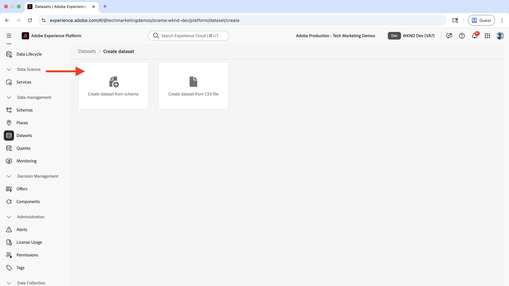
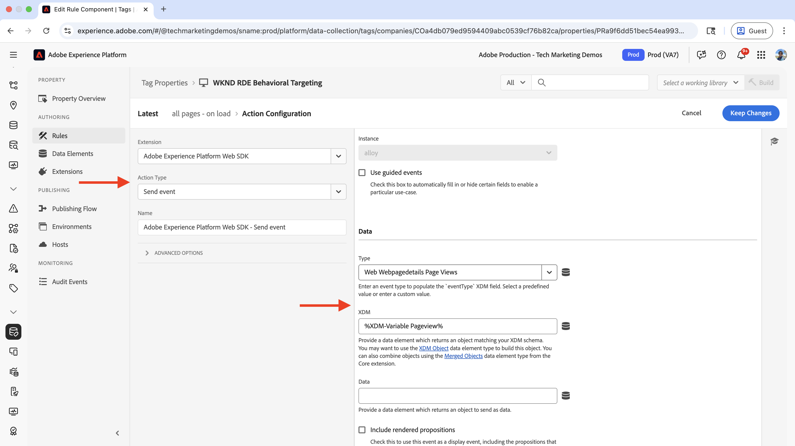
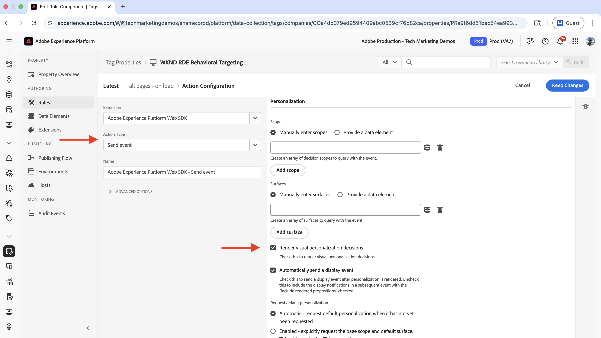
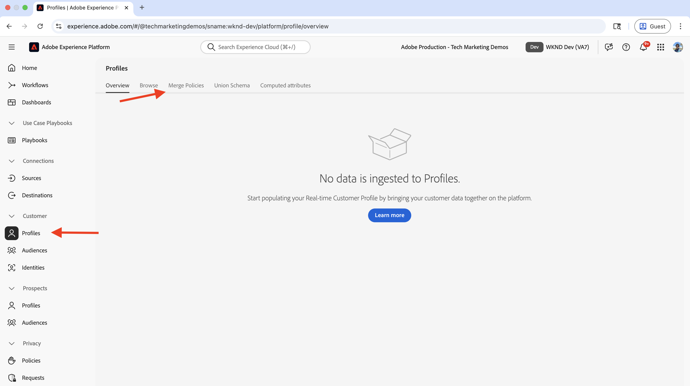
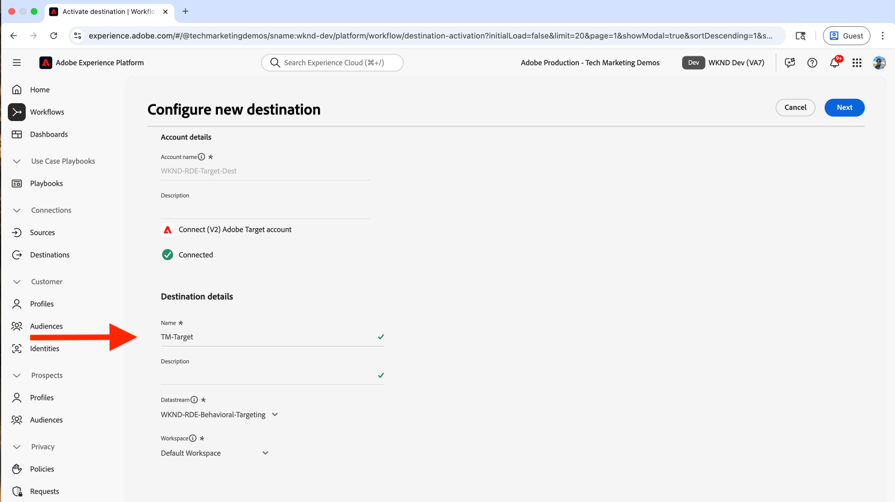
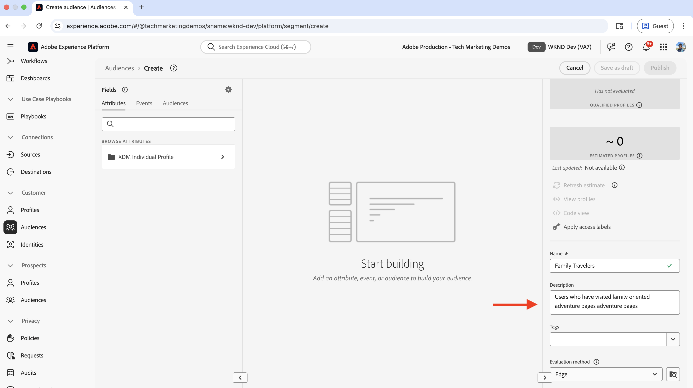

# 行動ターゲティング

Adobe Experience Platform（AEP）とAdobe Targetを使用して、ユーザーの行動に基づいてコンテンツをパーソナライズする方法を説明します。

行動ターゲティングは、訪問したページ、参照した製品やカテゴリなどのユーザー行動に基づいて、次のページのパーソナライゼーションを提供するのに役立ちます。 一般的なシナリオを次に示します。

- **ヒーローセクションPersonalization**：ユーザーのブラウジングアクティビティに基づいて、パーソナライズされたヒーローコンテンツを次のページに表示します
- **コンテンツ要素のカスタマイズ**：ユーザーのブラウジングアクティビティに基づいて、ヘッドライン、画像またはcall-to-action ボタンを変更します
- **ページコンテンツの適応**：ユーザーの閲覧アクティビティに基づいて、ページコンテンツ全体を変更します

## デモの使用例

このチュートリアルでは、**Bali Surf Camp**、_Riverside Camp_、または _Tahoe Skiing_ のいずれかのアドベンチャーページを訪問した _匿名ユーザー_ が、WKND ホームページの **Next Adventures** セクションの上にパーソナライズされたヒーローを表示する方法を、プロセスで示します。


デモの目的で、このブラウジング動作を持つユーザーは「家族旅行者 **オーディエンスに分類さ** ます。

### ライブデモ

[WKND イネーブルメント web サイト &#x200B;](https://wknd.enablementadobe.com/us/en.html) にアクセスして、行動ターゲティングの動作を確認します。 このサイトでは、3 つの異なる行動ターゲティングエクスペリエンスを提供します。

- **ホームページ**：ユーザーが _Bali Surf Camp_、_Riverside Camp_、_Tahoe Skiing_ のいずれかのアドベンチャーページを閲覧した後にホームページにアクセスすると、**家族旅行者** オーディエンスに分類され、「_次のアドベンチャー_」セクションの上にパーソナライズされたヒーローセクションが表示されます。

- **アドベンチャーページ**：ユーザーが _Bali Surf Camp_ または _Surf Camp （コスタリカ）_ アドベンチャーページを表示すると、**サーフィンの興味** オーディエンスに分類され、アドベンチャーページにパーソナライズされたヒーローセクションが表示されます。

- **マガジンページ**：ユーザーが _3 つ以上_ の記事を読むと、それらは **マガジンリーダー** オーディエンスに分類され、マガジンページにパーソナライズされたヒーローセクションが表示されます。

>[!VIDEO](https://video.tv.adobe.com/v/3474001/?learn=on&enablevpops)

>[!TIP]
>
>最初のオーディエンスはリアルタイムのパーソナライゼーションに対して **Edge** の評価を使用し、2 番目と 3 番目のオーディエンスはパーソナライゼーションに対して **バッチ** の評価を使用しています。これは、再訪問者に最適です。

## 前提条件

行動ターゲティングのユースケースを進める前に、以下を完了していることを確認してください。

- [Adobe Targetの統合 &#x200B;](../setup/integrate-adobe-target.md)：チームがパーソナライズされたコンテンツをAEMで一元的に作成および管理し、Adobe Targetでオファーとしてアクティブ化できるようにします。
- [Adobe Experience Platformのタグの統合 &#x200B;](../setup/integrate-adobe-tags.md):AEM コードを再デプロイしなくても、チームがJavaScriptを管理して、パーソナライゼーションやデータ収集のためにデプロイできるようになります。

[Adobe Experience Cloud ID サービス（ECID） &#x200B;](https://experienceleague.adobe.com/ja/docs/id-service/using/home) および [Adobe Experience Platform](https://experienceleague.adobe.com/ja/docs/experience-platform/landing/home) の概念（スキーマ、データストリーム、オーディエンス、ID、プロファイルなど）についても理解している。

Adobe Targetではシンプルなオーディエンスを作成できますが、Adobe Experience Platform（AEP）では、行動データやトランザクションデータなどの様々なデータソースを使用して、オーディエンスを作成および管理し、完全な顧客プロファイルを構築するための最新のアプローチを提供します。

## 手順の概要

行動ターゲティングの設定プロセスには、Adobe Experience Platform、AEMおよびAdobe Targetをまたいだ手順が含まれます。

1. **Adobe Experience Platformの場合：**
   1. スキーマの作成と設定
   2. データセットの作成と設定
   3. データストリームの作成と設定
   4. タグプロパティの作成と設定
   5. プロファイルの結合ポリシーの設定
   6. （V2）Adobe Targetの宛先の設定
   7. オーディエンスの作成と設定

2. **AEMの場合：**
   1. エクスペリエンスフラグメントを使用したパーソナライズされたオファーの作成
   2. AEM ページへのタグプロパティの統合と挿入
   3. Adobe Targetの統合とパーソナライズされたオファーのAdobe Targetへの書き出し

3. **Adobe Targetの場合：**
   1. オーディエンスとオファーの検証
   2. アクティビティの作成と設定

4. **AEM ページで行動ターゲティングの実装を検証する**

AEPの様々なソリューションを使用して、行動データの収集、管理および取得を行い、オーディエンスを作成します。 これらのオーディエンスは、Adobe Targetでアクティブ化されます。 Adobe Targetのアクティビティを使用すると、オーディエンス条件に一致するユーザーにパーソナライズされたエクスペリエンスが配信されます。

## Adobe Experience Platformの手順

行動データに基づいてオーディエンスを作成するには、ユーザーが web サイトに訪問したり、web サイトとやり取りしたりする際に、データを収集して保存する必要があります。 この例では、ユーザーを **家族旅行者** オーディエンスとして分類するには、ページビューデータを収集する必要があります。 プロセスは、Adobe Experience Platformから開始して、このデータの収集に必要なコンポーネントを設定します。

[Adobe Experience Cloud](https://experience.adobe.com/) にログインし、アプリ切り替えボタンまたは「クイックアクセス」セクションから **2&rbrace;Experience Platform&rbrace; に移動します。**


### スキーマの作成と設定

スキーマは、Adobe Experience Platformで収集するデータの構造および形式を定義します。 データの一貫性を確保し、標準化されたデータフィールドに基づいて意味のあるオーディエンスを作成できます。 行動ターゲティングの場合、ページビューイベントとユーザーインタラクションをキャプチャできるスキーマが必要です。

行動ターゲティング用のページビューデータを収集するスキーマを作成します。

- **Adobe Experience Platform** のホームページで、左側のナビゲーションから「**スキーマ**」をクリックし、「**スキーマを作成**」をクリックします。

  

- **スキーマを作成** ウィザードの **スキーマの詳細** 手順で「**エクスペリエンスイベント**」オプションを選択し、「**次へ**」をクリックします。

  

- **名前とレビュー** ステップには、次を入力します。
   - **スキーマ表示名**:WKND-RDE-Behavioral-Targeting
   - **選択されたクラス**:XDM ExperienceEvent

  

- スキーマを次のように更新します。
   - **フィールドグループを追加**:AEP Web SDK ExperienceEvent
   - **プロファイル**：有効にする

  

- 「**保存**」をクリックして、スキーマを作成します。

### データセットの作成と設定

データセットは、特定のスキーマに従うデータのコンテナです。 行動データを収集および整理するストレージの場所として機能します。 オーディエンスの作成とパーソナライゼーションを可能にするには、プロファイルに対してデータセットを有効にする必要があります。

ページビューデータを格納するデータセットを作成しましょう。

- **Adobe Experience Platform** で、左側のナビゲーションから **データセット** をクリックし、**データセットを作成** をクリックします。
  

- **データセットを作成** の手順で「**スキーマからデータセットを作成**」オプションを選択し、「次へ **をクリックし** す。
  

- **スキーマからデータセットを作成** ウィザードの **スキーマを選択** 手順で、**WKND-RDE-Behavior-Targeting** スキーマを選択し **「次へ** をクリックします。
  

- **データセットを設定** 手順については、次を入力します。
   - **名前**:WKND-RDE-Behavioral-Targeting
   - **説明**：ページビューデータを格納するデータセット

  

  「**終了**」をクリックして、データセットを作成します。

- 次のようにデータセットを更新します。
   - **プロファイル**：有効にする

  

### データストリームの作成と設定

データストリームとは、web サイトからAdobe Experience Platformに Web SDKを介してデータを送信する方法を定義する設定です。 Web サイトとプラットフォームの間のブリッジとして機能し、データが適切にフォーマットされ、正しいデータセットにルーティングされるようにします。 行動ターゲティングの場合、Edge セグメント化やPersonalization Destinations などの特定のサービスを有効にする必要があります。

ページビューデータを web SDK経由でExperience Platformに送信するデータストリームを作成します。

- **Adobe Experience Platform** で、左側のナビゲーションから **データストリーム** をクリックし、**データストリームを作成** をクリックします。

- **新しいデータストリーム** 手順で、以下を入力します。
   - **名前**:WKND-RDE-Behavioral-Targeting
   - **説明**：ページビューデータをExperience Platformに送信するデータストリーム
   - **マッピングスキーマ**:WKND-RDE-Behavioral-Targeting
「**保存**」をクリックして、データストリームを作成します。

  

- データストリームを作成したら、「**サービスを追加**」をクリックします。

  

- **サービスを追加** の手順で、ドロップダウンから「**Adobe Experience Platform**」を選択し、次の情報を入力します。
   - **イベントデータセット**:WKND-RDE 行動ターゲティング
   - **プロファイルデータセット**:WKND-RDE 行動ターゲティング
   - **Offer Decisioning**：有効にする
   - **Edgeのセグメント化**：有効にする
   - **Personalizationの宛先**：有効にする

  「**保存**」をクリックして、サービスを追加します。

  

- **サービスを追加** 手順で、ドロップダウンから「**Adobe Target**」を選択し、**ターゲット環境 ID** を入力します。 Target 環境 ID は、Adobe Targetの **管理**/**環境** にあります。 「**保存**」をクリックして、サービスを追加します。
  

### タグプロパティの作成と設定

タグプロパティは、web サイトからデータを収集してAdobe Experience Platformに送信するJavaScript コードのコンテナです。 これは、ユーザーのインタラクションとページビューをキャプチャするデータ収集レイヤーとして機能します。 行動ターゲティングの場合、ページ名、URL、サイトセクション、ホスト名などの特定のページの詳細を収集して、意味のあるオーディエンスを作成します。

ユーザーが web サイトを訪問した際に、ページビューデータを取得するタグプロパティを作成します。

このユースケースでは、ページ名、URL、サイトセクション、ホスト名などのページの詳細が収集されます。 これらの詳細は、行動オーディエンスの作成に使用されます。

[Adobe タグの統合 &#x200B;](../setup/integrate-adobe-tags.md) 手順で作成したタグプロパティを更新できます。 ただし、簡単にするために、新しいタグプロパティが作成されます。

#### タグプロパティの作成

タグプロパティを作成するには、次の手順を実行します。

- **Adobe Experience Platform** で、左側のナビゲーションから「**タグ**」をクリックし、「**新しいプロパティ**」ボタンをクリックします。
  

- **プロパティを作成** ダイアログで、以下を入力します。
   - **プロパティ名**:WKND-RDE-Behavioral-Targeting
   - **プロパティタイプ**:**Web** を選択します
   - **ドメイン**：プロパティをデプロイするドメイン（例：`.adobeaemcloud.com`）

  **保存** をクリックして、プロパティを作成します。

  

- 新しいプロパティを開き、左側のナビゲーションで **拡張機能** をクリックして、「**カタログ**」タブをクリックします。 **Web SDK** を検索し、「**インストール**」ボタンをクリックします。
  

- **拡張機能をインストール** ダイアログで、前に作成した **データストリーム** を選択し、「**保存**」をクリックします。
  

#### データ要素の追加

データ要素は、web サイトから特定のデータポイントを取得し、ルールや他のタグ設定で使用できるようにする変数です。 これらはデータ収集の構成要素として機能し、ユーザーのインタラクションやページビューから意味のある情報を抽出できます。 行動ターゲティングの場合、オーディエンスセグメントを作成するために、ホスト名、サイトセクション、ページ名などのページの詳細を取り込む必要があります。

次のデータ要素を作成して、重要なページの詳細を取り込みます。

- 左側のナビゲーションから **データ要素** をクリックし、「**新しいデータ要素の作成**」ボタンをクリックします。
  

- **新しいデータ要素を作成** ダイアログで、次の情報を入力します。
   - **Name**：ホスト名
   - **拡張機能**: **Core** を選択します
   - **データ要素タイプ**: **カスタムコード** を選択します
   - **エディターを開く** ボタンをクリックし、次のコードスニペットを入力します。

     ```javascript
     if(window && window.location && window.location.hostname) {
         return window.location.hostname;
     }
     ```

  

- 同様に、次のデータ要素を作成します。

   - **名前**：サイトセクション
   - **拡張機能**: **Core** を選択します
   - **データ要素タイプ**: **カスタムコード** を選択します
   - **エディターを開く** ボタンをクリックし、次のコードスニペットを入力します。

     ```javascript
     if(event && event.component && event.component.hasOwnProperty('repo:path')) {
         let pagePath = event.component['repo:path'];
     
         let siteSection = '';
     
         //Check for html String in URL.
         if (pagePath.indexOf('.html') > -1) { 
         siteSection = pagePath.substring(0, pagePath.lastIndexOf('.html'));
     
         //replace slash with colon
         siteSection = siteSection.replaceAll('/', ':');
     
         //remove `:content`
         siteSection = siteSection.replaceAll(':content:','');
         }
     
         return siteSection 
     }        
     ```

   - **名前**：ページ名
   - **拡張機能**: **Core** を選択します
   - **データ要素タイプ**: **カスタムコード** を選択します
   - **エディターを開く** ボタンをクリックし、次のコードスニペットを入力します。

     ```javascript
     if(event && event.component && event.component.hasOwnProperty('dc:title')) {
         // return value of 'dc:title' from the data layer Page object, which is propagated via 'cmp:show' event
         return event.component['dc:title'];
     }        
     ```

- 次に、**変数** 型のデータ要素を作成します。 このデータ要素には、Experience Platformに送信する前にページの詳細が入力されています。

   - **名前**:XDM 変数ページビュー
   - **拡張機能**:「**Adobe Experience Platform Web SDK**」を選択します
   - **データ要素タイプ**: **変数** を選択します

  右側のパネルで、

   - **サンドボックス**：サンドボックスを選択します
   - **スキーマ**:**WKND-RDE-Behaviour-Targeting** スキーマを選択します

  「**保存**」をクリックして、データ要素を作成します。

  

- **データ要素** リストには、次の 4 つのデータ要素が含まれている必要があります。

  

#### ルールの追加

ルールでは、データを収集しAdobe Experience Platformに送信するタイミングと方法を定義します。 これらは、web サイトで特定のイベントが発生した場合の処理を決定するロジックレイヤーとして機能します。 行動ターゲティングの場合、ページ表示イベントを取得するルールを作成し、収集した情報をデータ要素に入力してから、プラットフォームに送信します。

Experience Platformに送信する前に、他のデータ要素を使用して **XDM-Variable Pageview** データ要素にデータを入力するためのルールを作成します。 このルールは、ユーザーが WKND web サイトを閲覧するとトリガーされます。

- 左側のナビゲーションから **ルール** をクリックし、「**新規ルールを作成**」ボタンをクリックします。
  

- **新規ルールを作成** ダイアログで、以下を入力します。

   - **名前**：すべてのページ – 読み込み時

   - 「**イベント**」セクションで「**追加**」をクリックして **イベント設定** ウィザードを開きます。
      - **拡張機能**: **Core** を選択します
      - **イベントタイプ**: **カスタムコード** を選択します
      - **エディターを開く** ボタンをクリックし、次のコードスニペットを入力します。

        ```javascript
        var pageShownEventHandler = function(evt) {
            // defensive coding to avoid a null pointer exception
            if(evt.hasOwnProperty("eventInfo") && evt.eventInfo.hasOwnProperty("path")) {
                //trigger Launch Rule and pass event
                console.debug("cmp:show event: " + evt.eventInfo.path);
                var event = {
                    //include the path of the component that triggered the event
                    path: evt.eventInfo.path,
                    //get the state of the component that triggered the event
                    component: window.adobeDataLayer.getState(evt.eventInfo.path)
                };
        
                //Trigger the Launch Rule, passing in the new 'event' object
                // the 'event' obj can now be referenced by the reserved name 'event' by other Launch data elements
                // i.e 'event.component['someKey']'
                trigger(event);
            }
        }
        
        //set the namespace to avoid a potential race condition
        window.adobeDataLayer = window.adobeDataLayer || [];
        
        //push the event listener for cmp:show into the data layer
        window.adobeDataLayer.push(function (dl) {
            //add event listener for 'cmp:show' and callback to the 'pageShownEventHandler' function
            dl.addEventListener("cmp:show", pageShownEventHandler);
        });
        ```

   - 「**条件**」セクションで「**追加**」をクリックして **条件設定** ウィザードを開きます。
      - **論理タイプ**:「**標準**」を選択します
      - **拡張機能**: **Core** を選択します
      - **条件タイプ**:「**カスタムコード**」を選択します
      - **エディターを開く** ボタンをクリックし、次のコードスニペットを入力します。

        ```javascript
        if(event && event.component && event.component.hasOwnProperty('@type') && event.component.hasOwnProperty('xdm:template')) {
            console.log('The cmp:show event is from PAGE HANDLE IT');
            return true;
        }else{
            console.log('The cmp:show event is NOT from PAGE IGNORE IT');
            return false;
        }            
        ```

   - 「**アクション**」セクションで「**追加**」をクリックして **アクションの設定** ウィザードを開きます。
      - **拡張機能**:「**Adobe Experience Platform Web SDK**」を選択します
      - **アクションタイプ**:**変数を更新** を選択します
      - **web**/**webPageDetails**/**name** を **Page Name** データ要素にマッピングします

        

      - 同様に、**server** を **Host Name** データ要素にマッピングし、**siteSection** を **Site Section** データ要素にマッピングします。 **pageView**/**value** は、`1` と入力してページビューイベントを指定します。

      - 「**変更を保持**」をクリックして、アクション設定を保存します。

   - もう一度「**追加**」をクリックして別のアクションを追加し、「**アクションの設定** ウィザードを開きます。
      - **拡張機能**:「**Adobe Experience Platform Web SDK**」を選択します
      - **アクションタイプ**: **イベントを送信** を選択します
      - 右パネルの「**データ**」セクションで、**XDM-Variable Pageview** データ要素を **Web Webpagedetails ページビュー** タイプにマッピングします。

     

      - また、右側のパネルの「**Personalization**」セクションで、「**ビジュアルパーソナライゼーションの決定をレンダリング**」オプションをオンにします。  次に、「**変更を保持**」をクリックしてアクションを保存します。

     

   - 「**変更を保持**」をクリックして、ルールを保存します。

- ルールは次のようになります。

  

上記のルール作成手順には多くの詳細があるので、ルールを作成する際は注意が必要です。 複雑に聞こえるかもしれませんが、これらの設定手順により、AEM コードを更新したりアプリケーションを再デプロイしたりしなくても、プラグアンドプレイで動作することを覚えておいてください。

#### ライブラリの追加と公開

ライブラリは、Web サイトに構築およびデプロイされるすべてのタグ設定（データ要素、ルール、拡張機能）のコレクションです。 データ収集が正しく機能するように、すべてをまとめます。 行動ターゲティングの場合は、ライブラリが公開され、web サイト上でデータ収集ルールがアクティブになります。

- 左側のナビゲーションから **公開フロー** をクリックし、「**ライブラリを追加**」ボタンをクリックします。
  

- **ライブラリを追加** ダイアログで、次の情報を入力します。
   - **名前**:1.0
   - **環境**:「**開発**」を選択します
   - 「**変更されたすべてのリソースを追加**」をクリックして、すべてのリソースを選択します。

  **保存して開発用にビルド** をクリックして、ライブラリを作成します。

  

- **開発** スイムレーン用にライブラリがビルドされたら、省略記号（3 つのドット）をクリックし、「**承認して実稼動環境に公開**」オプションを選択します。
  

これで完了です。ページの詳細を収集してExperience Platformに送信するルールを含むタグプロパティを作成しました。 これは、行動オーディエンスを作成するための基本的な手順です。

### プロファイルの結合ポリシーの設定

結合ポリシーは、複数のソースからの顧客データを単一のプロファイルに統合する方法を定義します。 競合が発生した場合に、どのデータが優先されるかを決定し、行動ターゲティングに関する各顧客の完全で一貫性のあるビューを確保します。

このユースケースでは、以下の結合ポリシーが作成または更新されます。

- **デフォルトの結合ポリシー**：有効にする
- **Active-On-Edge結合ポリシー**：有効にします

結合ポリシーを作成するには、次の手順を実行します。

- **Adobe Experience Platform** で、左側のナビゲーションから「**プロファイル**」をクリックし、「**結合ポリシー**」タブをクリックします。

  

- 既存の結合ポリシーを使用できますが、このチュートリアルでは、次の設定を使用して新しい結合ポリシーを作成します。

  

- 必ず「**デフォルトの結合ポリシー**」オプションと「**Edgeでアクティブ化の結合ポリシー**」オプションの両方を有効にします。 これらの設定により、行動データが適切に統合され、リアルタイムオーディエンス評価に使用できるようになります。

### （V2）Adobe Targetの宛先の設定

Adobe Targetの宛先（V2）を使用すると、Experience Platformで作成した行動オーディエンスをAdobe Targetで直接アクティブ化できます。 これにより、行動オーディエンスをAdobe Targetのパーソナライゼーションアクティビティに使用できます。

- **Adobe Experience Platform** で、左側のナビゲーションから **宛先** をクリックし、「**カタログ**」タブをクリックして **Personalizationでフィルタリングし、** （v2）Adobe Target **の宛先を選択し** す。

  

- **宛先のアクティブ化** 手順で、宛先の名前を指定し、「**宛先に接続**」ボタンをクリックします。
  

- 「**宛先の詳細**」セクションで、次の情報を入力します。
   - **名前**:WKND-RDE-Behaviour-Targeting-Destination
   - **説明**：行動ターゲティングオーディエンスの宛先
   - **データストリーム**：以前に作成した **データストリーム** を選択します
   - **Workspace**: Adobe Target Workspace を選択します

  

- **次へ** をクリックして、宛先の設定を完了します。

設定が完了すると、この宛先を使用して、パーソナライゼーションアクティビティで使用するために、Experience PlatformからAdobe Targetに対して行動オーディエンスをアクティブ化できます。

### オーディエンスの作成と設定

オーディエンスは、行動パターンと特性に基づいて特定のユーザーグループを定義します。 この手順では、行動データルールを使用して、「家族旅行者」オーディエンスを作成します。

オーディエンスを作成するには、次の手順を実行します。

- **Adobe Experience Platform** で、左側のナビゲーションから **オーディエンス** をクリックし、「**オーディエンスを作成** ボタンをクリックします。
  

- **オーディエンスを作成** ダイアログで「**ルールを作成**」オプションを選択し、「**作成**」ボタンをクリックします。
  

- **作成** 手順で、以下を入力します。
   - **名前**：ファミリートラベラー
   - **説明**：家族に優しいアドベンチャーページを訪問したユーザー
   - **評価方法**:**Edge** を選択します（リアルタイムのオーディエンス評価用）

  

- 次に、「**イベント**」タブをクリックして **Web**/**Web ページの詳細** に移動し、「**URL**」フィールドを「**イベントルール**」セクションにドラッグ&amp;ドロップします。 「**URL**」フィールドをさらに「**イベントルール**」セクションに 2 回ドラッグします。 以下の値を入力します。
   - **URL**:「**contains**」オプションを選択して、`riverside-camping-australia` を入力します
   - **URL**:「**contains**」オプションを選択して、`bali-surf-camp` を入力します
   - **URL**:「**contains**」オプションを選択して、`gastronomic-marais-tour` を入力します

  

- 「**イベント**」セクションで、「**今日**」オプションを選択します。 オーディエンスは次のようになります。

  

- オーディエンスをレビューし、「**宛先に対してアクティブ化** ボタンをクリックします。

  

- **宛先に対してアクティブ化** ダイアログで、前の手順で作成したAdobe Targetの宛先を選択し、手順に従ってオーディエンスをアクティブ化します。

  

- AEPにはまだデータがないので、オーディエンス数は 0 になります。 ユーザーが web サイトに訪問し始めると、データが収集され、オーディエンス数が増加します。

  

これで完了です。オーディエンスを作成し、Adobe Targetの宛先に対してアクティブ化しました。

これでAdobe Experience Platformの手順が完了し、パーソナライズされたエクスペリエンスをAEMで作成してAdobe Targetで使用するプロセスの準備が整いました。

## AEMの手順

AEMでは、タグ プロパティが統合され、ページビューデータが収集されてExperience Platformに送信されます。 Adobe Targetは、「ファミリーのお客様 **のオーディエンス向けに、統合されたパーソナライズされたオファーも作成** ます。 これらの手順により、AEMは、Experience Platformで作成された行動ターゲティングの設定と連携できるようになります。

まず、AEM オーサーサービスにログインして、パーソナライズされたコンテンツを作成し設定します。

- [Adobe Experience Cloud](https://experience.adobe.com/) にログインし、アプリ切り替えボタンまたは「クイックアクセス」セクションから **2&rbrace;Experience Manager&rbrace; に移動します。**

  

- AEM オーサー環境に移動して、「**Sites**」ボタンをクリックします。
  

### タグプロパティのAEMページへの統合と挿入

この手順では、前に作成した Tags プロパティをAEM ページに統合して、行動ターゲティングのためのデータ収集を有効にします。 タグプロパティは、ユーザーが web サイトを訪問したときに、ページビューデータを自動的にキャプチャしてExperience Platformに送信します。

タグプロパティをAEM ページに統合するには、[Adobe Experience Platformでのタグの統合 &#x200B;](../setup/integrate-adobe-tags.md) の手順に従います。

別のプロパティではなく、以前に作成した **WKND-RDE-Behaviour-Targeting** タグプロパティを使用してください。


統合すると、タグプロパティはAEM ページから行動データを収集し、オーディエンス作成のためにExperience Platformに送信するようになります。

### Adobe Targetの統合とパーソナライズされたオファーのAdobe Targetへの書き出し

この手順では、Adobe TargetをAEMと統合し、パーソナライズされたコンテンツ（エクスペリエンスフラグメント）をAdobe Targetに書き出せるようにします。 この連携により、Adobe Targetでは、AEMで作成されたコンテンツを、Experience Platformで作成された行動オーディエンスと共にパーソナライゼーションアクティビティに使用できます。

Adobe Targetを統合し、**ファミリートラベラー** オーディエンスオファーをAdobe Targetに書き出すには、[Adobe Experience PlatformでのAdobe Targetの統合 &#x200B;](../setup/integrate-adobe-target.md) の手順に従います。

Target 設定がエクスペリエンスフラグメントに適用され、パーソナライゼーションアクティビティで使用するためにAdobe Targetに書き出すことができることを確認します。


統合すると、エクスペリエンスフラグメントをAEMからAdobe Targetに書き出し、行動オーディエンスのパーソナライズされたオファーとして使用できます。

### ターゲットオーディエンス向けにパーソナライズされたオファーを作成

エクスペリエンスフラグメントは、パーソナライズされたオファーとしてAdobe Targetに書き出すことができる、再利用可能なコンテンツコンポーネントです。 行動ターゲティングの場合、コンテンツは、ユーザーが行動基準に一致した場合に表示される **ファミリートラベラー** オーディエンス向けに特別に設計されて作成されます。

家族旅行のオーディエンス用にパーソナライズされたコンテンツを含む新しいエクスペリエンスフラグメントを作成します。

- AEMで、「エクスペリエンスフラグメント **をクリック** ます。

  

- **WKND サイトフラグメント** フォルダーに移動してから **おすすめ** サブフォルダーに移動して、「**作成**」ボタンをクリックします。

  

- **エクスペリエンスフラグメントを作成** ダイアログで、「Web バリエーションテンプレート」を選択し、「**次へ**」をクリックします。

  

- ティーザーコンポーネントを追加して新しく作成したエクスペリエンスフラグメントを作成し、家族の旅行者に関連するコンテンツを使用してカスタマイズします。 アドベンチャートラベルに興味があるファミリーにアピールする、魅力的な見出し、説明、call-to-actionを追加します。

  

- 作成したエクスペリエンスフラグメントを選択し、「**Adobe Targetに書き出し** ボタンをクリックします。

  

これで完了です。**Family Travelers** オーディエンスオファーを作成してAdobe Targetに書き出しました。 エクスペリエンスフラグメントは、パーソナライゼーションアクティビティで使用できるパーソナライズされたオファーとしてAdobe Targetで使用できるようになりました。

## Adobe Targetの手順

Adobe Targetでは、Experience Platformで作成された行動オーディエンスと、AEMから書き出されたパーソナライズされたオファーが適切に使用可能であることが検証されます。 次に、オーディエンスのターゲティングとパーソナライズされたコンテンツを組み合わせ、行動ターゲティングエクスペリエンスを提供するアクティビティを作成します。

- [Adobe Experience Cloud](https://experience.adobe.com/) にログインし、アプリ切り替えボタンまたは「クイックアクセス」セクションから **2&rbrace;Adobe Target&rbrace; に移動します。**

  

### オーディエンスとオファーの検証

パーソナライゼーションアクティビティを作成する前に、Experience Platformの行動オーディエンスとAEMのパーソナライズされたオファーがAdobe Targetで適切に使用できることを確認します。 これにより、行動ターゲティングに必要なすべてのコンポーネントが適切に配置されます。

- Adobe Targetで **オーディエンス** をクリックし、ファミリートラベラーズオーディエンスが作成されていることを確認します。

  

- オーディエンスをクリックすると、オーディエンスの詳細が表示され、適切に設定されていることを確認できます。

  

- 次に、「**オファー** をクリックし、AEMから書き出したオファーが存在することを確認します。 私の場合、オファー（またはエクスペリエンスフラグメント）は **家族全員のための冒険の味** と呼ばれます。

  

### アクティビティの作成と設定

Adobe Targetのアクティビティは、パーソナライズされたコンテンツを特定のオーディエンスに配信するタイミングと方法を定義する、パーソナライゼーションキャンペーンです。 行動ターゲティングの場合は、ファミリートラベラーズオーディエンスの条件に一致するユーザーにパーソナライズされたオファーを表示するアクティビティが作成されます。

これで、パーソナライズされたエクスペリエンスを「家族のお客様 **オーディエンスのホームページに提供するアクティビティ** 作成されました。

- Adobe Targetで、「**アクティビティ**」をクリックし、「**アクティビティを作成**」ボタンをクリックして、「**エクスペリエンスのターゲット設定**」アクティビティタイプを選択します。
  

- **エクスペリエンスのターゲット設定アクティビティを作成** ダイアログで、「**Web** type and **Visual** composer」オプションを選択し、WKND サイトのホームページの URL を入力します。 「**作成** ボタンをクリックして、アクティビティを作成します。

  

- エディターで、「**家族旅行** オーディエンスを選択し、「次のアドベンチャー **セクションの前に** 家族全員のアドベンチャーの味 **オファーを追加します**。 参考のために以下のスクリーンショットを参照してください。

  

- 「**次へ**」をクリックして「**目標と設定**」セクションを適切な目標と指標で設定し、アクティブ化して、変更をライブにプッシュします。

  

これで完了です。パーソナライズされたエクスペリエンスを WKND サイトのホームページの **ファミリートラベラー** オーディエンスに提供するためのアクティビティを作成し、開始しました。 アクティビティがライブになり、行動条件に一致するユーザーにパーソナライズされたコンテンツが表示されます。

## AEMページでの行動ターゲティングの実装の検証

これで行動ターゲティングフローが完全に設定されたので、すべてが正しく機能していることが検証されます。 この検証プロセスにより、データ収集、オーディエンスの評価およびパーソナライゼーションがすべて期待どおりに機能することが保証されます。

AEMページで行動ターゲティングの実装を検証します。

- 公開されたサイト（例えば、[WKND イネーブルメント web サイト &#x200B;](https://wknd.enablementadobe.com/us/en.html)）にアクセスして、_Bali Surf Camp_ または _Riverside Camping_ または _Tahoe Skiing_ のアドベンチャーページを参照します。 ページビューイベントをトリガーし、データを収集できるように、ページに 30 秒以上かけてください。

- 次に、ホームページに再度アクセスすると、「次のアドベンチャー **セクションの前に、** ファミリー旅行者 **オーディエンスのパーソナライズされたエクスペリエンスが表示** れます。

  

- ブラウザーのデベロッパーツールを開き、「**ネットワーク**」タブをチェックします。 `interact` でフィルタリングして、web SDK リクエストを見つけます。 リクエストには、web SDK イベントの詳細を表示する必要があります。

  

- 応答には、**ファミリートラベラー** オーディエンスに含まれていることを示す、Adobe Targetによるパーソナライゼーションの決定が含まれている必要があります。

  

これで完了です。AEM ページで行動ターゲティングの実装を検証しました。 データ収集からオーディエンス評価、パーソナライゼーションまでの完全なフローが正しく機能するようになりました。

## ライブデモ

行動のターゲティングの動作を確認するには、[WKND イネーブルメント web サイト &#x200B;](https://wknd.enablementadobe.com/us/en.html) を参照してください。 行動ターゲティングエクスペリエンスには、次の 3 つがあります。

- **ホームページ**：家族旅行のオーディエンスの場合、「次のアドベンチャー _セクションの上にパーソナライズされたヒーローオファーが表示さ_ ます。 ユーザーがホームページを訪問して _Bali Surf Camp_ または _Riverside Camp_ または _Tahoe Skiing_ アドベンチャーページを訪問した場合、そのユーザーは **ファミリー旅行者** オーディエンスに分類されます。 オーディエンスのタイプは **Edge** なので、評価はリアルタイムで行われます。

- **アドベンチャーページ**：サーフィン愛好家の場合、アドベンチャーページはパーソナライズされたヒーローセクションで表示されます。 ユーザーが _Bali Surf Camp_ または _Surf Camp （コスタリカ）_ のアドベンチャーページを閲覧すると、ユーザーは **サーフィンの興味** オーディエンスに分類されます。 オーディエンスタイプは **バッチ** なので、評価はリアルタイムではなく、1 日のような期間にわたって行われます。 再訪問者に便利です。

  

- **マガジンページ**：マガジンリーダーの場合、マガジンページはパーソナライズされたヒーローセクションとともに表示されます。 ユーザーが _3 つ以上_ の記事を読むと、そのユーザーは **雑誌読者** オーディエンスに分類されます。 オーディエンスタイプは **バッチ** なので、評価はリアルタイムではなく、1 日のような期間にわたって行われます。 再訪問者に便利です。

  

最初のオーディエンスはリアルタイムのパーソナライゼーションに対して **Edge** の評価を使用し、2 番目と 3 番目のオーディエンスはパーソナライゼーションに対して **バッチ** の評価を使用しています。これは、再訪問者に最適です。


## その他のリソース

- [Adobe Experience Platform Web SDK](https://experienceleague.adobe.com/ja/docs/experience-platform/web-sdk/home)
- [&#x200B; データストリームの概要 &#x200B;](https://experienceleague.adobe.com/ja/docs/experience-platform/datastreams/overview)
- [Visual Experience Composer （VEC） &#x200B;](https://experienceleague.adobe.com/ja/docs/target/using/experiences/vec/visual-experience-composer)
- [Edgeのセグメント化 &#x200B;](https://experienceleague.adobe.com/ja/docs/experience-platform/segmentation/methods/edge-segmentation)
- [&#x200B; オーディエンスタイプ &#x200B;](https://experienceleague.adobe.com/ja/docs/experience-platform/segmentation/types/overview)
- [Adobe Target接続 &#x200B;](https://experienceleague.adobe.com/ja/docs/experience-platform/destinations/catalog/personalization/adobe-target-connection)
