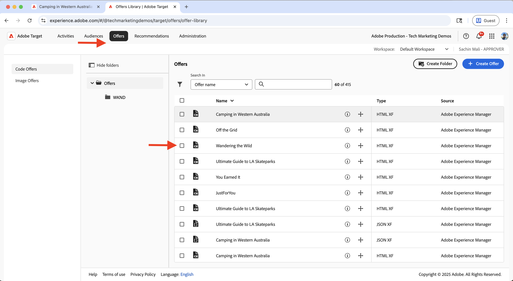
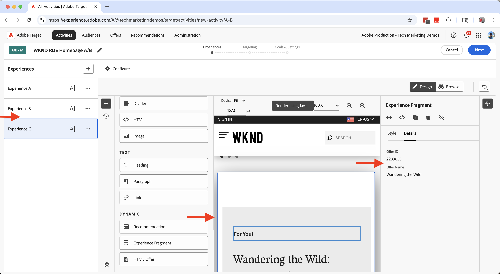

# 実験（A/B テスト）

Adobe Targetを使用して、AEM as a Cloud Service（AEMCS） web サイト上で様々なコンテンツバリエーションをテストする方法を説明します。

A/B テストは、コンテンツの様々なバージョンを比較して、ビジネス目標を達成する上でどのパフォーマンスが高いかを判断するのに役立ちます。 一般的なシナリオを次に示します。

- ランディングページ上の見出し、画像またはcall-to-action ボタンのバリエーションのテスト
- 製品詳細ページの様々なレイアウトやデザインの比較
- プロモーション・オファーまたは割引戦略の評価

## デモの使用例

このチュートリアルでは、WKND web サイトの **西オーストラリアでのキャンプ** エクスペリエンスフラグメント（XF）の A/B テストを設定します。 3 つの XF バリエーションを作成し、Adobe Targetを通じて A/B テストを管理します。

バリエーションは WKND ホームページに表示され、パフォーマンスを測定し、エンゲージメントとコンバージョンを向上させるバージョンを判断できます。

### ライブデモ

[WKND イネーブルメント web サイト ](https://wknd.enablementadobe.com/us/en.html) にアクセスして、実行中の A/B テストを確認します。 以下のビデオでは、3 つのバリエーションの **西オーストラリアでのキャンプ** がすべて、異なるブラウザーを使用してホームページに表示されています。

>[!VIDEO](https://video.tv.adobe.com/v/3473005/?learn=on&enablevpops)

## 前提条件

実験のユースケースを進める前に、次の手順を完了していることを確認してください。

- [Adobe Targetの統合 ](../setup/integrate-adobe-target.md)：パーソナライズされたコンテンツをAEMで一元的に作成および管理し、Adobe Targetでオファーとしてアクティブ化できるようにします。
- [Adobe Experience Platformのタグ統合 ](../setup/integrate-adobe-tags.md): AEM コードを再デプロイしなくても、チームがJavaScriptを管理してパーソナライゼーションやデータ収集のためにデプロイできます。

## 手順の概要

A/B テストの設定プロセスには、実験を作成して設定する 6 つの主な手順が含まれます。

1. **AEMでのコンテンツバリエーションの作成**
2. **バリエーションをオファーとしてAdobe Targetに書き出す**
3. **Adobe Targetでの A/B テストアクティビティの作成**
4. **Adobe Experience Platformでのデータストリームの作成と設定**
5. **Web SDK拡張機能を使用したタグプロパティの更新**
6. **AEM ページで A/B テストの実装を確認する**

## AEMでのコンテンツバリエーションの作成

この例では、AEM WKND プロジェクトの **西オーストラリアでのキャンプ** エクスペリエンスフラグメント（XF）を使用して、A/B テスト用に WKND web サイトのホームページで使用される 3 つのバリエーションを作成します。

1. AEMで、「**エクスペリエンスフラグメント**」カードをクリックし、**Camping in Western Australia** に移動して **編集** をクリックします。
   

1. エディターの「**バリエーション**」セクションで、「**作成**」をクリックし、「**バリエーション**」を選択します。\
   

1. **バリエーションを作成** ダイアログで、次の手順を実行します。
   - **テンプレート**：エクスペリエンスフラグメント Web バリエーションテンプレート
   - **タイトル**：例：「Off the Grid」

   「**完了**」をクリックします。

   

1. マスターバリエーションから **ティーザー** コンポーネントをコピーしてバリエーションを作成し、コンテンツをカスタマイズします（例：タイトルと画像を更新）。\
   

   >[!TIP]
   >[ バリエーションを生成 ](https://experience.adobe.com/aem/generate-variations/) を使用して、マスター XF から新しいバリエーションをすばやく作成できます。

1. 手順を繰り返して、別のバリエーション（「野生をさまよう」など）を作成します。\
   

   これで、A/B テスト用のエクスペリエンスフラグメントのバリエーションが 3 つ作成されました。

1. Adobe Targetを使用してバリエーションを表示する前に、ホームページから既存の静的ティーザーを削除する必要があります。 エクスペリエンスフラグメントのバリエーションは Target を介して動的に挿入されるので、コンテンツの重複を防ぎます。

   - **English** ホームページ `/content/wknd/language-masters/en` ージに移動します
   - エディターで、「**西オーストラリアでのキャンプ** ティーザーコンポーネントを削除します。\
     

1. **米国/英語** ホームページ（`/content/wknd/us/en`）に変更をロールアウトして、更新を反映させます。\
   

1. **US/英語** ホームページを公開して、更新をライブにします。\
   

## バリエーションをオファーとしてAdobe Targetに書き出す

エクスペリエンスフラグメントのバリエーションを書き出して、A/B テスト用のAdobe Targetでオファーとして使用できるようにします。

1. AEMで、**Camping in Western Australia** に移動して、3 つのバリエーションを選択し、**Adobe Targetに書き出し** をクリックします。\
   

2. Adobe Targetで **オファー** に移動し、バリエーションがインポートされていることを確認します。\
   

## Adobe Targetでの A/B テストアクティビティの作成

次に、A/B テストアクティビティを作成して、ホームページで実験を実行します。

1. [Adobe Experience Cloud Visual Editing Helper](https://chromewebstore.google.com/detail/adobe-experience-cloud-vi/kgmjjkfjacffaebgpkpcllakjifppnca) Chrome拡張機能をインストールします。

1. Adobe Targetで、**アクティビティ** に移動し、**アクティビティを作成** をクリックします。\
   

1. **A/B テストアクティビティを作成** ダイアログで、以下を入力します。
   - **タイプ**:Web
   - **Composer**：ビジュアル
   - **アクティビティ URL**：例：`https://wknd.enablementadobe.com/us/en.html`

   「**作成**」をクリックします。

   

1. アクティビティの名前を意味のある名前に変更します（例：「WKND ホームページ A/B テスト」）。\
   

1. **エクスペリエンス A** で、「**最近の記事** セクションの上に **エクスペリエンスフラグメント** コンポーネントを追加します。\
   

1. コンポーネントダイアログで、「**オファーを選択**」をクリックします。\
   

1. **Camping in Western Australia** バリエーションを選択し、「**追加**」をクリックします。\
   

1. **エクスペリエンス B** と **C** に対して繰り返し、それぞれ **グリッドから外れる** と **野生をさまよう** を選択します。\
   

1. 「**ターゲティング**」セクションで、トラフィックがすべてのエクスペリエンスに均等に分割されていることを確認します。\
   

1. **目標と設定** で、成功指標（エクスペリエンスフラグメントに対するCTAのクリックなど）を定義します。\
   

1. 右上隅の **アクティブ化** をクリックして、テストを開始します。\
   

## Adobe Experience Platformでのデータストリームの作成と設定

Adobe Web SDKをAdobe Targetに接続するには、Adobe Experience Platformでデータストリームを作成します。 データストリームは、web SDKとAdobe Targetの間のルーティングレイヤーとして機能します。

1. Adobe Experience Platformで、**データストリーム** に移動し、「**データストリームを作成**」をクリックします。\
   

1. **データストリームを作成** ダイアログで、データストリームの **名前** を入力し、「**保存**」をクリックします。\
   

1. データストリームを作成したら、「**サービスを追加**」をクリックします。\
   

1. **サービスを追加** 手順で、ドロップダウンから「**Adobe Target**」を選択し、**ターゲット環境 ID** を入力します。 Target 環境 ID は、Adobe Targetの **管理**/**環境** にあります。 「**保存**」をクリックして、サービスを追加します。\
   

1. データストリームの詳細をレビューして、Adobe Target サービスがリストされ、正しく設定されていることを確認します。\
   

## Web SDK拡張機能を使用したタグプロパティの更新

AEM ページからパーソナライゼーションイベントやデータ収集イベントを送信するには、Web SDK拡張機能をタグプロパティに追加し、ページ読み込み時にトリガーを発生させるルールを設定します。

1. Adobe Experience Platformで、**Tags** に移動し、[Adobe タグの統合 ](../setup/integrate-adobe-tags.md) 手順で作成したプロパティを開きます。
   

1. 左側のメニューから **拡張機能** をクリックし、「**カタログ**」タブに切り替えて **Web SDK** を検索します。 右側のパネルで **インストール** をクリックします。\
   

1. **拡張機能をインストール** ダイアログで、前に作成した **データストリーム** を選択し、「**保存**」をクリックします。\
   

1. インストール後、**Adobe Experience Platform Web SDK** と **Core** の両方の拡張機能が **インストール済み** タブの下に表示されることを確認します。\
   

1. 次に、ライブラリが読み込まれたときに web SDK イベントを送信するルールを設定します。 左側のメニューから **ルール** に移動し、「**新規ルールを作成**」をクリックします。

   

   >[!TIP]
   >
   >ルールを使用すると、ユーザーのインタラクションまたはブラウザーイベントに基づいて、タグを実行するタイミングと方法を定義できます。

1. **ルールの作成** 画面で、ルール名（例：`All Pages - Library Loaded - Send Event`）を入力し、「**イベント**」セクションの「**+追加**」をクリックします。
   

1. **イベント設定** ダイアログで、次の手順を実行します。
   - **拡張機能**: **Core** を選択します
   - **イベントタイプ**：選択 **ライブラリ読み込み（ページのトップ）**
   - **名前**:`Core - Library Loaded (Page Top)` を入力します

   「**変更を保持**」をクリックして、イベントを保存します。

   

1. 「**アクション**」セクションで「**+追加**」をクリックして、イベントの発生時に発生するアクションを定義します。

1. **アクション設定** ダイアログで、次の手順を実行します。
   - **拡張機能**:「**Adobe Experience Platform Web SDK**」を選択します
   - **アクションタイプ**: **イベントを送信** を選択します
   - **名前**: **AEP Web SDK - イベントを送信** を選択します

   

1. 右側のパネルの「**Personalization**」セクションで、「**ビジュアルパーソナライゼーションの決定をレンダリング** オプションをオンにします。 次に、「**変更を保持**」をクリックしてアクションを保存します。\
   

   >[!TIP]
   >
   >   このアクションは、ページが読み込まれたときにAEP web SDK イベントを送信し、Adobe Targetがパーソナライズされたコンテンツを配信できるようにします。

1. 完了したルールを確認し、「**保存**」をクリックします。
   

1. 変更を適用するには、**公開フロー** に移動して、更新されたルールを **ライブラリ** に追加します。\
   

1. 最後に、ライブラリを **実稼動** に昇格します。
   

## AEMページで A/B テストの実装を確認する

アクティビティが実稼働し、タグライブラリが実稼動環境に公開されたら、AEM ページで A/B テストを検証できます。

1. 公開済みのサイト（例：[WKND イネーブルメント web サイト ](https://wknd.enablementadobe.com/us/en.html)）にアクセスして、表示されるバリエーションを確認します。 別のブラウザーまたはモバイルデバイスからアクセスして、代替のバリエーションを確認します。
   

1. ブラウザーのデベロッパーツールを開き、「**ネットワーク**」タブをチェックします。 `interact` でフィルタリングして、web SDK リクエストを見つけます。 リクエストには、web SDK イベントの詳細が必要です。

   

応答には、どのバリエーションが提供されたかを示し、Adobe Targetが行ったパーソナライゼーションの決定を含める必要があります。\

1. または、[Adobe Experience Platform Debugger](https://chromewebstore.google.com/detail/adobe-experience-platform/bfnnokhpnncpkdmbokanobigaccjkpob) Chrome拡張機能を使用して、web SDK イベントを調べることもできます。
   

## ライブデモ

A/B テストの動作を確認するには、[WKND イネーブルメント web サイトを参照し ](https://wknd.enablementadobe.com/us/en.html) ホームページに表示されるエクスペリエンスフラグメントの様々なバリエーションを確認します。

## その他のリソース

- [A/B テストの概要 ](https://experienceleague.adobe.com/ja/docs/target/using/activities/abtest/test-ab)
- [Adobe Experience Platform Web SDK](https://experienceleague.adobe.com/ja/docs/experience-platform/web-sdk/home)
- [ データストリームの概要 ](https://experienceleague.adobe.com/ja/docs/experience-platform/datastreams/overview)
- [Visual Experience Composer （VEC） ](https://experienceleague.adobe.com/ja/docs/target/using/experiences/vec/visual-experience-composer)
