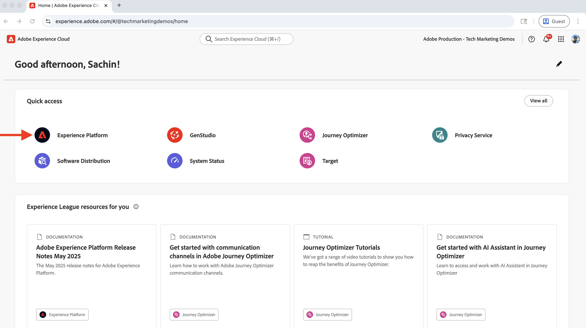
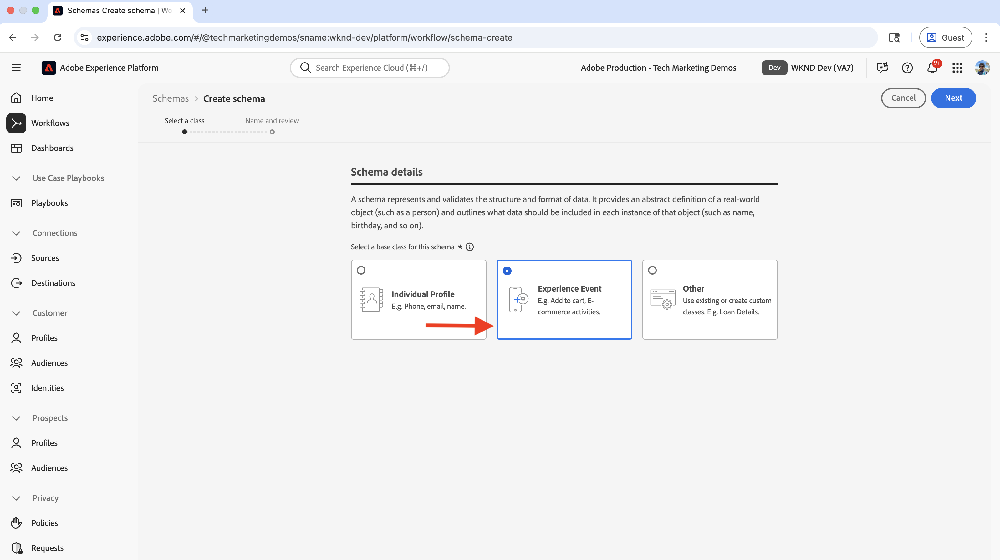
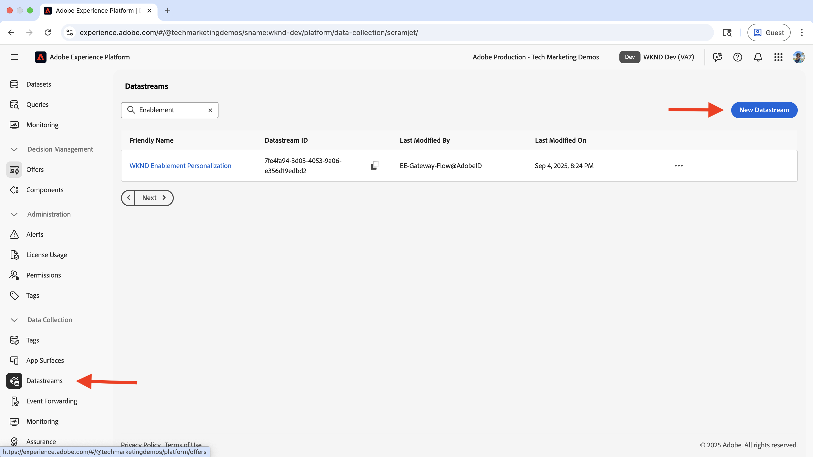
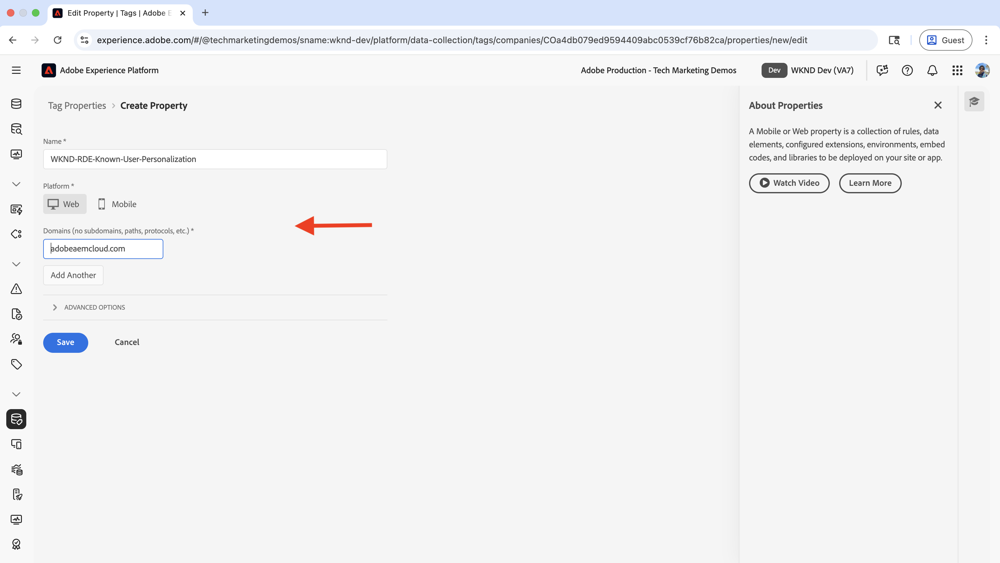
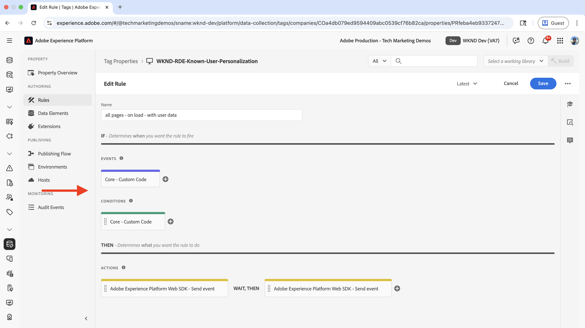
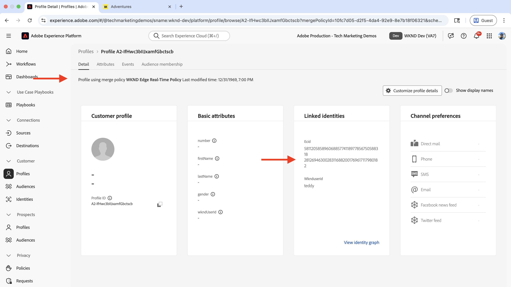
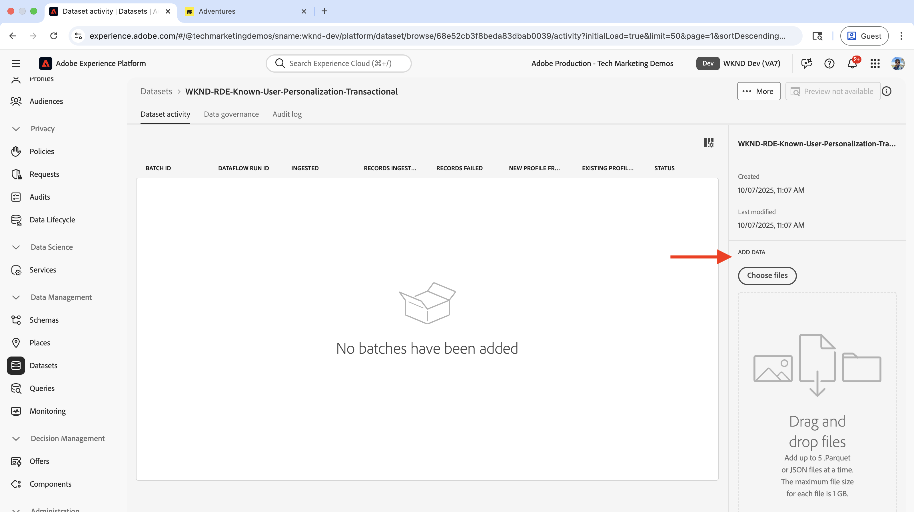
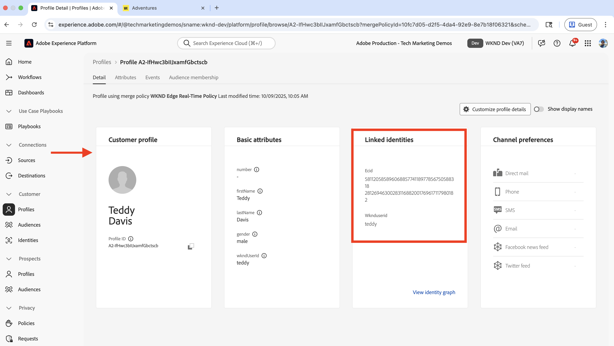
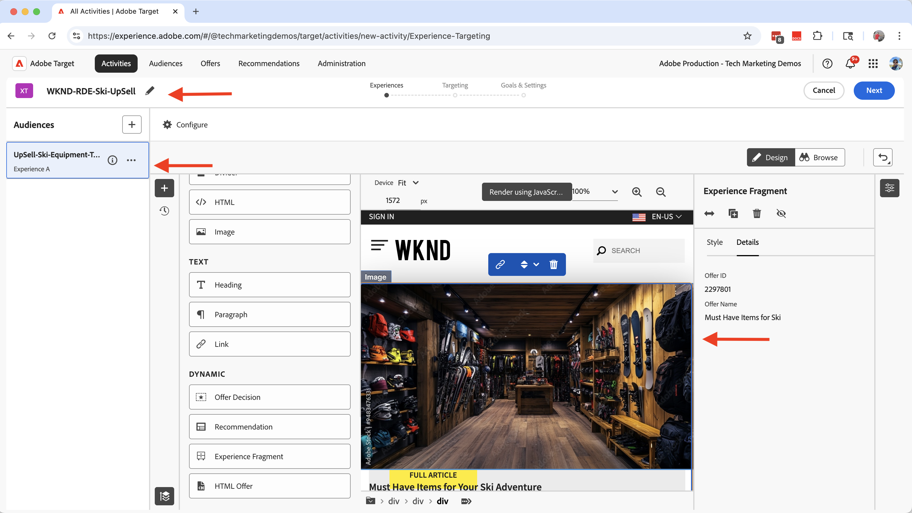

# 既知のユーザーパーソナライゼーション

購入履歴、CRM データ、ユーザーに関して収集されたその他のデータなど、既知のユーザーデータに基づいてコンテンツをパーソナライズする方法を説明します。

既知のユーザーパーソナライゼーションは、ユーザーに関して収集したデータに基づいて、パーソナライズされたエクスペリエンスをユーザーに提供するのに役立ちます。 _ユーザーデータは、様々なシステムや_ web サイト、モバイルアプリ、コールセンターなどのチャネルを通じて収集された可能性があります。 この _データはステッチされて完全なユーザープロファイルが作成され_ エクスペリエンスのパーソナライズに使用されます。

一般的なシナリオを次に示します。

- **コンテンツのパーソナライゼーション**：ユーザーのプロファイルデータに基づいてパーソナライズされたエクスペリエンスを表示します。 例えば、ユーザーの購入履歴に基づいて、ホームページにパーソナライズされたヒーローを表示します。
- **アップセルとクロスセル**：ユーザーの購入履歴に基づいて、パーソナライズされたアップセルとクロスセルのレコメンデーションを表示します。 例えば、ユーザーの購入履歴に対してパーソナライズされたアップセルのレコメンデーションを表示します。
- **ロイヤルティプログラム**：ユーザーの購入履歴に基づいて、パーソナライズされたロイヤルティプログラムの特典を表示します。 例えば、ユーザーの購入履歴にパーソナライズされたロイヤルティプログラムの特典を表示します。

組織によっては、既知のユーザーパーソナライゼーションのユースケースが異なる場合があります。 上記は、ほんの一例です。

## 使用例


このチュートリアルでは、[ サンプル WKND サイト ](https://github.com/adobe/aem-guides-wknd) を使用して、**スキー** アドベンチャーを購入した **ログインユーザー** が **WKND ホームページ** でどのようにパーソナライズされたヒーローを表示するかをプロセスで示します。

ヒーローエクスペリエンスは、_スキー_ アドベンチャーを購入したユーザーにとって不可欠なスキー用具である **アップセル** を試みます。 **スキー** アドベンチャーを購入していないユーザーには、デフォルトのヒーローコンテンツが表示されます。 したがって、ヒーローエクスペリエンスは、購入履歴とログインステータスに基づいてユーザーに対してパーソナライズされます。 このパーソナライゼーションを有効にするには、様々なシステムのデータを結合して完全な顧客プロファイルを作成し、パーソナライゼーションアクティビティに使用します。


### システム全体でのユーザーデータ管理

デモ用に、WKND ユーザーデータが次のシステムにあると仮定します。 各システムには、次の 2 つのカテゴリに分類できる様々なタイプのデータが格納されています。

- **行動データ**：デジタルチャネル（ページビュー数、クリック数、サイトナビゲーション、ログインステータス、閲覧パターン）でのユーザーのインタラクションとアクティビティをキャプチャします
- **トランザクションデータ**：完了したビジネストランザクションと顧客プロファイル情報（購入、注文履歴、プロファイル詳細、環境設定）を記録します

| システム | 目的 | どのようなデータが保存されますか？ | データタイプ |
|------|------|------|------|
| AEM | コンテンツ管理システム（CMS）、アドベンチャーのリストおよび予約、ログイン機能 | ユーザーのインタラクション：ページビュー、ログインステータス、サイトナビゲーション。 ユーザー ID、名前、メールなどの最小限のユーザー識別子。 | 行動データ |
| その他のシステム | レコードの完全なシステムとしてのユーザープロファイルと購入トランザクション レコード。 | 顧客プロファイルの入力：ユーザー ID、名前、住所、電話番号、購入履歴、注文詳細、環境設定。 | トランザクションデータ |

もう 1 つのシステムは、Order Management システム（OMS）、カスタマーリレーションシップマネジメント（CRM）、マスターデータマネジメント（MDM）システム、またはトランザクションデータを保存するその他のシステムです。

また、WKND サイトには、ユーザーが **アドベンチャー** を購入または予約できるユーザーインターフェイス（UI）があると想定されます。 AEMは他のシステムと統合され、アドベンチャー購入データを格納する。 また、購入前または購入中に、ユーザーは WKND サイトにアカウントを作成しました。

論理図は、WKND サイトとのユーザーインタラクションと、行動データおよびトランザクションデータを収集してExperience Platformにフィードする方法を示しています。


これは、既知のユーザーパーソナライゼーションの概念を示すために簡略化されたバージョンです。 実際のシナリオでは、行動データとトランザクションデータが収集および保存されるシステムが複数ある場合があります。

### 重要ポイント

- **分散データストレージ**：ユーザーデータは複数のシステムに保存されます。AEMには、ログイン機能のための最小限のユーザーデータ（ユーザー ID、名前、メール）が保存され、他のシステム（OMS、CRM、MDM）は、完全なユーザープロファイルと購入履歴などのトランザクションデータを管理します。
- **ID ステッチ**：システムは、異なるプラットフォームやチャネルをまたいでユーザーを一意に識別する共通の識別子（WKND ユーザー ID - `wkndUserId`）を使用してリンクされます。
- **完全なプロファイル作成**：目的は、これらの分散システムからユーザーデータをステッチして統合顧客プロファイルを作成し、それを使用してパーソナライズされたエクスペリエンスを提供することです。

ユースケースには、異なるシステムやデータストレージが含まれている場合があります。 重要なのは、異なるプラットフォームやチャネルをまたいでユーザーを一意に識別する共通の識別子を識別することです。

## 前提条件

既知のユーザーパーソナライゼーションのユースケースに進む前に、次の手順を完了していることを確認してください。

- [Adobe Targetの統合 ](../setup/integrate-adobe-target.md)：チームがパーソナライズされたコンテンツをAEMで一元的に作成および管理し、Adobe Targetでオファーとしてアクティブ化できるようにします。
- [Adobe Experience Platformのタグの統合 ](../setup/integrate-adobe-tags.md):AEM コードを再デプロイしなくても、チームがJavaScriptを管理して、パーソナライゼーションやデータ収集のためにデプロイできるようになります。

[Adobe Experience Cloud ID サービス（ECID） ](https://experienceleague.adobe.com/en/docs/id-service/using/home) および [Adobe Experience Platform](https://experienceleague.adobe.com/ja/docs/experience-platform/landing/home) の概念（スキーマ、データセット、データストリーム、オーディエンス、ID およびプロファイルなど）についても理解している。

このチュートリアルでは、Adobe Experience Platformでの ID のステッチと顧客プロファイルの作成について説明します。 したがって、行動データとトランザクションデータを組み合わせて、完全な顧客プロファイルを作成できます。

## 手順の概要

既知のユーザーを使用したパーソナライゼーションの設定プロセスには、Adobe Experience Platform、AEMおよびAdobe Targetをまたいだ手順が含まれます。

1. **Adobe Experience Platformの場合：**
   1. WKND ユーザー ID （_）に_ ID 名前空間 `wkndUserId` を作成
   1. データの編成および検証方法を定義する標準化されたデータ構造（行動データ用とトランザクションデータ用）の 2 つの XDM （エクスペリエンスデータモデル）スキーマを作成して設定します
   1. 2 つのデータセットを作成して設定します。1 つは行動データ用、もう 1 つはトランザクションデータ用です
   1. データストリームの作成と設定
   1. タグプロパティの作成と設定
   1. プロファイルの結合ポリシーの設定
   1. （V2）Adobe Targetの宛先の設定

2. **AEMの場合：**
   1. WKND サイトのログイン機能を強化して、ユーザー ID をブラウザーのセッションストレージに保存します。
   1. AEM ページへのタグプロパティの統合と挿入
   1. AEMページでのデータ収集の検証
   1. Adobe Target を統合
   1. パーソナライズされたオファーの作成

3. **Adobe Experience Platformの場合：**
   1. 行動データとプロファイル作成の検証
   1. トランザクションデータの取り込み
   1. 行動データとトランザクションデータのステッチの検証
   1. オーディエンスの作成と設定
   1. Adobe Targetへのオーディエンスのアクティブ化

4. **Adobe Targetの場合：**
   1. オーディエンスとオファーの検証
   1. アクティビティの作成と設定

5. **AEM ページで既知のユーザーのパーソナライゼーション実装を検証する**

Adobe Experience Platform（AEP）では、システムをまたいでユーザーデータを収集、管理、特定し、結び付けるために、様々なソリューションが使用されています。 ステッチされたユーザーデータを使用して、オーディエンスが作成され、Adobe Targetでアクティブ化されます。 Adobe Targetのアクティビティを使用すると、オーディエンス条件に一致するユーザーにパーソナライズされたエクスペリエンスが配信されます。

## Adobe Experience Platform設定

完全な顧客プロファイルを作成するには、行動データ（ページビューデータ）とトランザクション（WKND アドベンチャー購入）データの両方を収集して保存する必要があります。 行動データはタグ プロパティを使用して収集され、トランザクションデータは WKND アドベンチャー購入システムを使用して収集されます。

次に、トランザクションデータがExperience Platformに取り込まれ、行動データとステッチされて、完全な顧客プロファイルが作成されます。

この例では、**Ski** アドベンチャーを購入したユーザーを分類するには、アドベンチャー購入データと共にページビューデータが必要です。 データは、システム間で共通の識別子である WKND ユーザー ID （`wkndUserId`）を使用してステッチされます。

まず、Adobe Experience Platformにログインし、データの収集とステッチに必要なコンポーネントを設定します。

[Adobe Experience Cloud](https://experience.adobe.com/) にログインし、アプリ切り替えツールまたは「クイックアクセス」セクションから **2}Experience Platform} に移動します。**



### ID 名前空間を作成

ID 名前空間は ID にコンテキストを提供する論理コンテナで、Experience Platformはどの ID システムが使用されているかを理解するのに役立ちます（例えば、電子メール、CRM ID、ロイヤルティ ID など）。 2 つ以上の個別のプロファイルデータを関連付けるには、ID 名前空間を使用します。 これらの個別のプロファイルデータの両方が、属性に対して同じ値を持ち、同じ名前空間を共有すると、これらが結び付けられます。 属性を ID ステッチ属性として認定するには、属性が同じ名前空間である必要があります。

この例では、WKND ユーザー ID （`wkndUserId`）は、行動データとトランザクションデータ全体で共通の識別子です。 この共通の識別子を使用して、データがステッチされ、完全な顧客プロファイルが作成されます。

WKND ユーザー ID （`wkndUserId`）の ID 名前空間を作成しましょう。

- **Adobe Experience Platform** で、左側のナビゲーションから **ID** をクリックします。 次に、右上の「**ID 名前空間を作成**」ボタンをクリックします。

  

- **ID 名前空間を作成** ダイアログで、以下を入力します。
   - **表示名**:WKND ユーザー Id
   - **説明**：ログインした WKND ユーザーのユーザー ID またはユーザー名
   - **タイプを選択**：個々のクロスデバイス ID

  「**作成**」をクリックして、ID 名前空間を作成します。

  

### スキーマの作成

スキーマは、Adobe Experience Platformで収集するデータの構造および形式を定義します。 データの一貫性を確保し、標準化されたデータフィールドに基づいて意味のあるオーディエンスを作成できます。 既知のユーザーによるパーソナライゼーションの場合、行動データ用とトランザクションデータ用の 2 つのスキーマが必要です。

#### 行動データスキーマ

まず、ページビューイベントやユーザーインタラクションなどの行動データを収集するスキーマを作成します。

- **Adobe Experience Platform** で、左側のナビゲーションから **スキーマ** をクリックし、右上から **スキーマを作成** ボタンをクリックします。 次に、「**手動**」オプションを選択し、「**選択**」ボタンをクリックします。

  

- **スキーマを作成** ウィザードの **スキーマの詳細** 手順で、「**エクスペリエンスイベント**」オプション（ページビュー数、クリック数、ユーザーインタラクションなどの時系列データ）を選択し、「**次へ**」をクリックします。

  

- **名前とレビュー** ステップには、次を入力します。
   - **スキーマ表示名**:WKND-RDE-Known-User-Personalization-Behavior
   - **選択されたクラス**:XDM ExperienceEvent

  

- スキーマを次のように更新します。
   - **フィールドグループを追加**:AEP Web SDK ExperienceEvent
   - **プロファイル**：有効にする

  「**保存**」をクリックして、スキーマを作成します。

  

- ユーザーがログイン（認証済み）または匿名のどちらであるかを把握するには、スキーマにカスタムフィールドを追加します。 このユースケースでは、**Ski** アドベンチャーを購入した既知のユーザー向けにコンテンツをパーソナライズすることを目標としています。 したがって、ユーザーがログイン（認証済み）されているか、匿名であるかを識別することが重要です。


   - スキーマ名の横にある「**+**」ボタンをクリックします。
   - **フィールドプロパティ** セクションで、以下を入力します。
      - **フィールド名**:wkndLoginStatus
      - **表示名**:WKND ログインステータス
      - **タイプ**：文字列
      - **割り当て先**：フィールドグループ/`wknd-user-details`

     下にスクロールして、「**適用**」ボタンをクリックします。

     

- 最終的な行動データスキーマは次のようになります。

  

#### トランザクションデータスキーマ

次に、WKND アドベンチャーの購入などのトランザクションデータを収集するスキーマを作成します。

- **スキーマを作成** ウィザードの **スキーマの詳細** 手順で、「**個人プロファイル**」オプション（顧客属性、環境設定、購入履歴などのレコードベースのデータ）を選択し、「**次へ** をクリックします。

  

- **名前とレビュー** ステップには、次を入力します。
   - **スキーマ表示名**:WKND-RDE-Known-User-Personalization-Transactional
   - **クラス選択済み**: XDM 個人プロファイル

  

- ユーザーの WKND Adventure の購入の詳細を保存するには、まず購入の識別子として機能するカスタムフィールドを追加します。 WKND ユーザー ID （`wkndUserId`）は、システム全体で共通の識別子です。
   - スキーマ名の横にある「**+**」ボタンをクリックします。
   - **フィールドプロパティ** セクションで、以下を入力します。
      - **フィールド名**:wkndUserId
      - **表示名**:WKND ユーザー ID
      - **タイプ**：文字列
      - **割り当て先**：フィールドグループ/`wknd-user-purchase-details`

  

   - 下にスクロールし、「**ID**」、「**プライマリ ID**」（様々なソースからのデータを統合プロファイルに結び付けるために使用されるメイン ID）をチェックし、「**ID 名前空間**」ドロップダウンで「**WKND ユーザー ID**」を選択します。 最後に、「**適用** ボタンをクリックします。

  

- カスタムプライマリ ID フィールドを追加すると、スキーマは次のようになります。

  

- 同様に、次のフィールドを追加して、ユーザーとアドベンチャーの追加の購入の詳細を保存します。

  | フィールド名 | 表示名 | タイプ | 割り当て先 |
  |----------|------------|----|---------|
  | adventurePurchased | 購入したアドベンチャー | 文字列 | フィールドグループ/`wknd-user-purchase-details` |
  | adventurePurchaseAmount | Adventure の購入額 | 倍精度浮動小数点 | フィールドグループ/`wknd-user-purchase-details` |
  | adventurePurchaseQuantity | Adventure の購入数量 | 整数 | フィールドグループ/`wknd-user-purchase-details` |
  | adventurePurchaseDate | Adventure の購入日 | 日付 | フィールドグループ/`wknd-user-purchase-details` |
  | adventureStartDate | アドベンチャー開始日 | 日付 | フィールドグループ/`wknd-user-purchase-details` |
  | adventureEndDate | アドベンチャー終了日 | 日付 | フィールドグループ/`wknd-user-purchase-details` |
  | firstName | 名前（名） | 文字列 | フィールドグループ/`wknd-user-purchase-details` |
  | lastName | 姓 | 文字列 | フィールドグループ/`wknd-user-purchase-details` |
  | メール | メール | メールアドレス | フィールドグループ/`wknd-user-purchase-details` |
  | 電話番号 | 電話 | オブジェクト | フィールドグループ/`wknd-user-purchase-details` |
  | 性別 | 性別 | 文字列 | フィールドグループ/`wknd-user-purchase-details` |
  | age | 年齢 | 整数 | フィールドグループ/`wknd-user-purchase-details` |
  | 住所 | アドレス | 文字列 | フィールドグループ/`wknd-user-purchase-details` |
  | city | 市区町村 | 文字列 | フィールドグループ/`wknd-user-purchase-details` |
  | state | 状態 | 文字列 | フィールドグループ/`wknd-user-purchase-details` |
  | 国 | 国 | 文字列 | フィールドグループ/`wknd-user-purchase-details` |
  | zipCode | 郵便番号 | 文字列 | フィールドグループ/`wknd-user-purchase-details` |

  

- スキーマのプロファイルを有効にします。

  

これで、行動データとトランザクションデータの両方のスキーマを作成しました。

### データセットの作成と設定

データセットは、特定のスキーマに従うデータのコンテナです。 この例では、2 つのデータセットを作成します。1 つは行動データ用、もう 1 つはトランザクションデータ用です。

#### 行動データデータセット

- **Adobe Experience Platform** で、左側のナビゲーションから **データセット** をクリックし、右上から **データセットを作成** ボタンをクリックします。 次に、「**スキーマベース**」オプションを選択し、「**次へ**」をクリックします。

  

- **スキーマを選択** 手順については、**WKND-RDE-Known-User-Personalization-Behavioral** スキーマを選択し、「**次へ**」をクリックします。

  

- **データセットを設定** 手順については、次を入力します。
   - **名前**:WKND-RDE-Known-User-Personalization-Behavioral
   - **説明**：ユーザーログインステータスを使用したページビューなどの行動データのデータセット。

  

  「**終了**」をクリックして、データセットを作成します。

- **プロファイル** スイッチを切り替えて、プロファイルのデータセットを有効にします。

  

#### トランザクションデータデータセット

- トランザクションデータデータセットに対して、同じ手順を繰り返します。 唯一の違いはスキーマとデータセット名です。

   - **スキーマ**: WKND-RDE-Known-User-Personalization-Transactional
   - **データセット**:WKND-RDE-Known-User-Personalization-Transactional
   - **説明**:WKND アドベンチャー購入などのトランザクションデータのデータセット。
   - **プロファイル**：有効にする

  最終的なトランザクションデータデータセットは次のようになります。

  

両方のデータセットを配置したら、データストリームを作成して、web サイトからExperience Platformへのデータフローを有効にできます。

### データストリームの作成と設定

データストリームとは、web サイトからAdobe Experience Platformに Web SDKを介してデータを送信する方法を定義する設定です。 Web サイトとプラットフォームの間のBridgeとして機能し、データが適切にフォーマットされ、正しいデータセットにルーティングされるようにします。 既知のユーザーをパーソナライゼーションするには、Edge セグメント化やPersonalization Destinations などのサービスを有効にします。

トランザクションではなく _行動_ データを Web SDK経由でExperience Platformに送信するデータストリームを作成しましょう。

- **Adobe Experience Platform** で、左側のナビゲーションから **データストリーム** をクリックし、**データストリームを作成** をクリックします。

  

- **新しいデータストリーム** 手順で、以下を入力します。

   - **名前**:WKND-RDE-Known-User-Personalization-Behavioral
   - **説明**：行動データをExperience Platformに送信するデータストリーム
   - **マッピングスキーマ**:WKND-RDE-Known-User-Personalization-Behavioral

  

  「**保存**」をクリックして、データストリームを作成します。

- データストリームを作成したら、「**サービスを追加**」をクリックします。

  

- **サービスを追加** の手順で、ドロップダウンから「**Adobe Experience Platform**」を選択し、次の情報を入力します。
   - **イベントデータセット**:WKND-RDE-Known-User-Personalization-Behavior
   - **プロファイルデータセット**:WKND-RDE-Known-User-Personalization-Behavior
   - **Offer Decisioning**：有効にする（Adobe Targetがパーソナライズされたオファーをリアルタイムでリクエストおよび配信できるようにします）
   - **Edgeのセグメント化**：有効にする（迅速なパーソナライゼーションのために、エッジネットワークでリアルタイムにオーディエンスを評価します）
   - **Personalizationの宛先**：有効にする（Adobe Targetなどのパーソナライゼーションツールを使用したオーディエンス共有を許可する）

  「**保存**」をクリックして、サービスを追加します。

  

- **サービスを追加** 手順で、ドロップダウンから「**Adobe Target**」を選択し、**ターゲット環境 ID** を入力します。 Target 環境 ID は、Adobe Targetの **管理**/**環境** にあります。 「**保存**」をクリックして、サービスを追加します。
  

- 最終的なデータストリームは次のようになります。

  

データストリームは、Web SDKを介して行動データをExperience Platformに送信するように設定されました。

_トランザクション_ データは、バッチ取り込み（リアルタイムではなくスケジュールされた間隔で大きなデータセットをアップロードする方法）を使用してExperience Platformに取り込まれます。 WKND Adventure の購入データは、WKND サイトを使用して収集され、他のシステム（OMS や CRM、MDM など）に保存されます。 その後、データはバッチ取得を使用してExperience Platformに取得されます。

また、そのデータを web サイトからExperience Platformに直接取り込むこともできます。これについては、このチュートリアルでは説明しません。 このユースケースでは、システム間でユーザーデータを結び付け、完全な顧客プロファイルを作成するプロセスを強調したいと考えています。

## タグプロパティの作成と設定

タグプロパティは、web サイトからデータを収集してAdobe Experience Platformに送信するJavaScript コードのコンテナです。 これは、ユーザーのインタラクションとページビューをキャプチャするデータ収集レイヤーとして機能します。 既知のユーザーパーソナライゼーションの場合、ページビューデータ（ページ名、URL、サイトセクション、ホスト名など）と共に、ユーザーログインステータスと WKND ユーザー ID も収集されます。 WKND ユーザー ID （`wkndUserId`）は、ID マップオブジェクトの一部として送信されます。

ユーザーが WKND サイトにアクセスしたときのページビューデータと、ユーザーのログインステータス + ユーザー ID （ログインしている場合）をキャプチャするタグプロパティを作成しましょう。

[Adobe タグの統合 ](../setup/integrate-adobe-tags.md) 手順で作成したタグプロパティを更新できます。 ただし、簡単にするために、新しいタグプロパティが作成されます。

### タグプロパティの作成

- **Adobe Experience Platform** で、左側のナビゲーションから「**タグ**」をクリックし、「**新しいプロパティ**」ボタンをクリックします。

  

- **プロパティを作成** ダイアログで、以下を入力します。
   - **プロパティ名**:WKND-RDE-Known-User-Personalization
   - **プロパティタイプ**:**Web** を選択します
   - **ドメイン**：プロパティをデプロイするドメイン（例：`adobeaemcloud.com`）

  **保存** をクリックして、プロパティを作成します。

  

- 新しいプロパティを開き、左側のナビゲーションで **拡張機能** をクリックして、「**カタログ**」タブをクリックします。 **Web SDK** を検索し、「**インストール**」ボタンをクリックします。
  

- **拡張機能をインストール** ダイアログで、前に作成した **データストリーム** を選択し、「**保存**」をクリックします。
  

#### データ要素の追加

データ要素は、web サイトから特定のデータポイントを取得し、ルールや他のタグ設定で使用できるようにする変数です。 これらはデータ収集の構成要素として機能し、ユーザーのインタラクションやページビューから意味のある情報を抽出できます。 既知のユーザーをパーソナライゼーションする場合、オーディエンスセグメントを作成するために、ホスト名、サイトセクション、ページ名などのページの詳細を取り込む必要があります。 これに加えて、ユーザーログインステータスと WKND ユーザー ID （ログインしている場合）を取得する必要があります。

次のデータ要素を作成して、重要なページの詳細を取り込みます。

- 左側のナビゲーションから **データ要素** をクリックし、「**新しいデータ要素の作成**」ボタンをクリックします。
  

- **新しいデータ要素を作成** ダイアログで、次の情報を入力します。
   - **Name**：ホスト名
   - **拡張機能**: **Core** を選択します
   - **データ要素タイプ**: **カスタムコード** を選択します
   - **エディターを開く** ボタンをクリックし、次のコードスニペットを入力します。

     ```javascript
     if(window && window.location && window.location.hostname) {
         return window.location.hostname;
     }        
     ```

  

- 同様に、次のデータ要素を作成します。

   - **名前**：サイトセクション
   - **拡張機能**: **Core** を選択します
   - **データ要素タイプ**: **カスタムコード** を選択します
   - **エディターを開く** ボタンをクリックし、次のコードスニペットを入力します。

     ```javascript
     if(event && event.component && event.component.hasOwnProperty('repo:path')) {
         let pagePath = event.component['repo:path'];
     
         let siteSection = '';
     
         //Check of html String in URL.
         if (pagePath.indexOf('.html') > -1) { 
         siteSection = pagePath.substring(0, pagePath.lastIndexOf('.html'));
     
         //replace slash with colon
         siteSection = siteSection.replaceAll('/', ':');
     
         //remove `:content`
         siteSection = siteSection.replaceAll(':content:','');
         }
     
         return siteSection 
     }        
     ```

  

   - **名前**：ページ名
   - **拡張機能**: **Core** を選択します
   - **データ要素タイプ**: **カスタムコード** を選択します
   - **エディターを開く** ボタンをクリックし、次のコードスニペットを入力します。

     ```javascript
     if(event && event.component && event.component.hasOwnProperty('dc:title')) {
         // return value of 'dc:title' from the data layer Page object, which is propogated via 'cmp:show' event
         return event.component['dc:title'];
     }
     ```

  


   - **名前**:WKND ユーザー ID
   - **拡張機能**: **Core** を選択します
   - **データ要素タイプ**: **カスタムコード** を選択します
   - **エディターを開く** ボタンをクリックし、次のコードスニペットを入力します。

     ```javascript
     // Data element for WKND User ID
     if(event && event.user && event.user.userId) {
         console.log('UserID:', event.user.userId);
         return event.user.userId;
     } else {
         console.log('UserID:');
         return "";
     }        
     ```

  


   - **名前**:WKND ユーザーステータス
   - **拡張機能**: **Core** を選択します
   - **データ要素タイプ**: **カスタムコード** を選択します
   - **エディターを開く** ボタンをクリックし、次のコードスニペットを入力します。

     ```javascript
     // Data element for user login status
     if(event && event.user && event.user.status) {
         console.log('User status:', event.user.status);
         return event.user.status;
     } else {
         console.log('User status:anonymous');
         return 'anonymous';
     }        
     ```

  

- 次に、**ID マップ** タイプのデータ要素を作成します。 ID マップは、複数のユーザー識別子を保存し、それらをリンクする標準の XDM 構造であり、システム間で ID をステッチできます。 このデータ要素は、WKND ユーザー ID （ログインしている場合）を ID マップオブジェクトの一部として保存するために使用されます。

   - **名前**: IdentityMap-WKND ユーザー ID
   - **拡張機能**:「**Adobe Experience Platform Web SDK**」を選択します
   - **データ要素タイプ**: **ID マップ** を選択します

  右側のパネルで、
   - **名前空間**: **wkndUserId** を選択します
   - **ID**: **WKND ユーザー ID** データ要素を選択します
   - **認証状態**:「**認証済み**」を選択します
   - **プライマリ** : **true** を選択します


  「**保存**」をクリックして、データ要素を作成します。

  

- 次に、**変数** 型のデータ要素を作成します。 このデータ要素には、Experience Platformに送信する前にページの詳細が入力されています。

   - **名前**:XDM 変数ページビュー
   - **拡張機能**:「**Adobe Experience Platform Web SDK**」を選択します
   - **データ要素タイプ**: **変数** を選択します

  右側のパネルで、
   - **サンドボックス**：サンドボックスを選択します
   - **スキーマ**:**WKND-RDE-Known-User-Personalization** スキーマを選択します

  「**保存**」をクリックして、データ要素を作成します。

  

   - 最終的なデータ要素は次のようになります。

     

#### ルールの追加

ルールでは、データを収集しAdobe Experience Platformに送信するタイミングと方法を定義します。 これらは、web サイトで特定のイベントが発生した場合の処理を決定するロジックレイヤーとして機能します。 既知のユーザーパーソナライゼーションの場合、ユーザーが WKND サイトにアクセスした際のページビューデータおよびユーザーログインステータス + ユーザー ID （ログインしている場合）を取得するためのルールを作成します。

Experience Platformに送信する前に、他のデータ要素を使用して **XDM-Variable Pageview** データ要素にデータを入力するためのルールを作成します。 このルールは、ユーザーが WKND web サイトを閲覧するとトリガーされます。

- 左側のナビゲーションから **ルール** をクリックし、「**新規ルールを作成**」ボタンをクリックします。
  

- **新規ルールを作成** ダイアログで、以下を入力します。
   - **名前**：すべてのページ – 読み込み時 – ユーザーデータを含む

   - 「**イベント**」セクションで「**追加**」をクリックして **イベント設定** ウィザードを開きます。
      - **拡張機能**: **Core** を選択します
      - **イベントタイプ**: **カスタムコード** を選択します
      - **エディターを開く** ボタンをクリックし、次のコードスニペットを入力します。

     ```javascript
     var pageShownEventHandler = function(evt) {
         // defensive coding to avoid a null pointer exception
         if(evt.hasOwnProperty("eventInfo") && evt.eventInfo.hasOwnProperty("path")) {
             //trigger Launch Rule and pass event
             console.debug("cmp:show event: " + evt.eventInfo.path);
     
             // Get user data from session storage
             var userData = getUserDataFromSession();
     
             var event = {
                 //include the path of the component that triggered the event
                 path: evt.eventInfo.path,
                 //get the state of the component that triggered the event
                 component: window.adobeDataLayer.getState(evt.eventInfo.path),
                 //include user data in the event
                 user: userData
             };
     
             //Trigger the Launch Rule, passing in the new 'event' object
             trigger(event);
         }
     }
     
     /**
      * Get user data from session storage
     */
     function getUserDataFromSession() {
         var userData = {
             userId: null,
             status: 'anonymous'
         };
     
         try {
             var cachedUserState = sessionStorage.getItem('wknd_user_state');
     
             if (cachedUserState) {
                 var userState = JSON.parse(cachedUserState);
                 var userInfo = userState.data;
     
                 // Validate user data structure before transformation
                 if (userInfo && typeof userInfo === 'object' && userInfo.hasOwnProperty('authorizableId')) {
                     // Transform AEM user data to minimal AEP format
                     userData = {
                         userId: userInfo.authorizableId !== 'anonymous' ? userInfo.authorizableId : null,
                         status: userInfo.authorizableId === 'anonymous' ? 'anonymous' : 'authenticated',
                     };
     
                     //console.log('User details from session storage:', userData.username || 'Anonymous');
                 } else {
                     console.warn('Invalid user data structure in session storage');
                     console.log('Using anonymous user data');
                 }
             } else {
                 console.log('No user data in session storage, using anonymous');
             }
         } catch (e) {
             console.warn('Failed to read user data from session storage:', e);
             console.log('Using anonymous user data');
         }
     
         return userData;
     }
     
     //set the namespace to avoid a potential race condition
     window.adobeDataLayer = window.adobeDataLayer || [];
     
     //push the event listener for cmp:show into the data layer
     window.adobeDataLayer.push(function (dl) {
         //add event listener for 'cmp:show' and callback to the 'pageShownEventHandler' function
         dl.addEventListener("cmp:show", pageShownEventHandler);
     });
     ```

     `getUserDataFromSession` 関数は、ユーザーログインステータスと WKND ユーザー ID （ログインしている場合）をセッションストレージから取得するために使用されます。 AEM コードは、ユーザーログインステータスと WKND ユーザー ID をセッションストレージに入力する役割を果たします。 AEM固有の手順では、WKND サイトログイン機能を強化して、ユーザー ID をブラウザーのセッションストレージに保存しました。

   - 「**条件**」セクションで「**追加**」をクリックして **条件設定** ウィザードを開きます。
      - **論理タイプ**:「**標準**」を選択します
      - **拡張機能**: **Core** を選択します
      - **条件タイプ**:「**カスタムコード**」を選択します
      - **エディターを開く** ボタンをクリックし、次のコードスニペットを入力します。

     ```javascript
     if(event && event.component && event.component.hasOwnProperty('@type') && event.component.hasOwnProperty('xdm:template')) {
         console.log('The cmp:show event is from PAGE HANDLE IT');
         return true;
     } else {
         console.log('The event is NOT from PAGE - IGNORE IT');
         return false;
     }
     ```

   - 「**アクション**」セクションで「**追加**」をクリックして **アクションの設定** ウィザードを開きます。
      - **拡張機能**:「**Adobe Experience Platform Web SDK**」を選択します
      - **アクションタイプ**:**変数を更新** を選択します

      - XDM フィールドをデータ要素にマッピングします。

        | XDM フィールド | データ要素 |
        |----------|------------|
        | web.webPageDetails.name | ページ名 |
        | web.webPageDetails.server | ホスト名 |
        | web.webPageDetails.siteSection | サイトセクション |
        | web.webPageDetails.value | 1 |
        | identityMap | IdentityMap-WKND ユーザー ID |
        | _$YOUR_NAMESPACE$.wkndLoginStatus | WKND ユーザーステータス |

     

      - 「**変更を保持**」をクリックして、アクション設定を保存します。

   - もう一度「追加」をクリックして別のアクションを追加し、アクションの設定ウィザードを開きます。

      - **拡張機能**:「**Adobe Experience Platform Web SDK**」を選択します
      - **アクションタイプ**: **イベントを送信** を選択します
      - 右パネルの「**データ**」セクションで、**XDM-Variable Pageview** データ要素を **Web Webpagedetails ページビュー** タイプにマッピングします。

     

   - また、右側のパネルの「**Personalization**」セクションで、「**ビジュアルパーソナライゼーションの決定をレンダリング**」オプションをオンにします。 次に、「**変更を保持**」をクリックしてアクションを保存します。

     

- ルールは次のようになります。

  

ページビューのデータと、ユーザーのログインステータス + ユーザー ID （ログインしている場合）をExperience Platformに送信するように、ルールが設定されました。

上記のルール作成手順には多くの詳細があるので、ルールを作成する際は注意が必要です。 複雑に聞こえるかもしれませんが、これらの設定手順により、AEM コードを更新したりアプリケーションを再デプロイしたりしなくても、プラグアンドプレイで動作することを覚えておいてください。

#### タグライブラリの追加と公開

ライブラリは、Web サイトに構築およびデプロイされるすべてのタグ設定（データ要素、ルール、拡張機能）のコレクションです。 データ収集が正しく機能するように、すべてをまとめます。 既知のユーザーによるパーソナライゼーションの場合、ライブラリが公開され、データ収集ルールが web サイト上でアクティブになります。

- 左側のナビゲーションから **公開フロー** をクリックし、「**ライブラリを追加**」ボタンをクリックします。
  

- **ライブラリを追加** ダイアログで、次の情報を入力します。
   - **名前**:1.0
   - **環境**:「**開発**」を選択します
   - 「**変更されたすべてのリソースを追加**」をクリックして、すべてのリソースを選択します。

  **保存して開発用にビルド** をクリックして、ライブラリを作成します。

  

- ライブラリを実稼動環境に公開するには、「**承認して実稼動環境に公開**」をクリックします。 公開が完了すると、プロパティがAEMで使用できるようになります。
  

ライブラリが公開され、AEM ページからデータを収集する準備が整いました。

### プロファイルの結合ポリシーの設定

結合ポリシーは、複数のソースからの顧客データを単一のプロファイルに統合する方法を定義します。 競合が発生した場合に、どのデータが優先されるかを決定し、既知のユーザーのパーソナライゼーションに関して、各顧客の完全で一貫性のあるビューを確保します。

- **Adobe Experience Platform** で、左側のナビゲーションから「**プロファイル**」をクリックし、「**結合ポリシー**」タブをクリックします。

  

このユースケースでは、結合ポリシーが作成されます。 ただし、既存の結合ポリシーがある場合は、それを使用できます。 **デフォルトの結合ポリシー** オプションと **アクティブオンEdge結合ポリシー** オプションの両方を必ず有効にします（これにより、プロファイルデータを Edge Network で使用して、リアルタイムのパーソナライゼーションの意思決定が可能になります）。

これらの設定により、行動データとトランザクションデータが適切に統合され、リアルタイムオーディエンスの評価に使用できるようになります。


### （V2）Adobe Targetの宛先の設定

Adobe Targetの宛先（V2）を使用すると、Experience Platformで作成されたオーディエンスをAdobe Targetで直接アクティブ化できます。 この連携により、オーディエンスをAdobe Targetのパーソナライゼーションアクティビティに使用できます。

- **Adobe Experience Platform** で、左側のナビゲーションから「**宛先**」をクリックし、「**カタログ**」タブをクリックします。 **Personalization** を検索し、**（v2） Adobe Target** の宛先を選択します。

  

- **宛先のアクティブ化** 手順で、宛先の名前を指定し、「**宛先に接続**」ボタンをクリックします。
  

- 「**宛先の詳細**」セクションで、次の情報を入力します。
   - **名前**:WKND-RDE-Known-User-Personalization-Destination
   - **説明**：既知のユーザーパーソナライゼーションの宛先
   - **データストリーム**：以前に作成した **データストリーム** を選択します
   - **Workspace**: Adobe Target Workspace を選択します

  

- **次へ** をクリックして、宛先の設定を完了します。

  

設定が完了すると、この宛先を使用して、Experience Platformで作成されたオーディエンスをAdobe Targetに対してアクティブ化し、パーソナライゼーションアクティビティで使用できるようになります。

## AEM設定

次の手順では、WKND サイトログイン機能を強化して、ユーザー ID をブラウザーのセッションストレージに保存し、タグ プロパティをAEM ページに統合および挿入します。

タグプロパティはAEM ページに挿入され、ユーザーが WKND サイトに訪問した際のページビューデータと、ユーザーのログインステータス + ユーザー ID （ログインしている場合）を収集します。 Adobe Target統合を使用すると、パーソナライズされたオファーをAdobe Targetに書き出すことができます。

### WKND サイトのログイン機能の強化

WKND サイトのログイン機能を強化するには、GitHub から [WKND サイトプロジェクト ](https://github.com/adobe/aem-guides-wknd) を複製し、新しい機能ブランチを作成してお気に入りの IDE で開きます。

```shell
$ mkdir -p ~/Code
$ git clone git@github.com:adobe/aem-guides-wknd.git
$ cd aem-guides-wknd
$ git checkout -b feature/known-user-personalization
```

- `ui.frontend` モジュールに移動し、`ui.frontend/src/main/webpack/components/form/sign-in-buttons/sign-in-buttons.js` ファイルを開きます。 コードを確認すると、`currentuser.json` に対してAJAX呼び出しを行った後、ユーザーのログインステータスに基づいて「ログイン」ボタンまたは「ログアウト」ボタンが表示されます。

- コードを更新して、ブラウザーのセッションストレージにユーザー ID を保存し、コードを最適化して、`currentuser.json` に対して複数のAJAX呼び出しを行わないようにします。

  ```javascript
  import jQuery from "jquery";
  
  jQuery(function($) {
      "use strict";
  
      (function() {
          const currentUserUrl = $('.wknd-sign-in-buttons').data('current-user-url'),
              signIn = $('[href="#sign-in"]'),
              signOut = $('[href="#sign-out"]'),
              greetingLabel = $('#wkndGreetingLabel'),
              greetingText = greetingLabel.text(),
              body = $('body');
  
          // Cache configuration
          const CACHE_KEY = 'wknd_user_state';
          const CACHE_DURATION = 5 * 60 * 1000; // 5 minutes in milliseconds
  
          /**
           * Get cached user state from session storage
           */
          function getCachedUserState() {
              try {
                  const cached = sessionStorage.getItem(CACHE_KEY);
                  if (cached) {
                      const userState = JSON.parse(cached);
                      const now = Date.now();
  
                      // Check if cache is still valid
                      if (userState.timestamp && (now - userState.timestamp) < CACHE_DURATION) {
                          return userState.data;
                      } else {
                          // Cache expired, remove it
                          sessionStorage.removeItem(CACHE_KEY);
                      }
                  }
              } catch (e) {
                  console.warn('Failed to read cached user state:', e);
                  sessionStorage.removeItem(CACHE_KEY);
              }
              return null;
          }
  
          /**
           * Cache user state in session storage
           */
          function cacheUserState(userData) {
              try {
                  const userState = {
                      data: userData,
                      timestamp: Date.now()
                  };
                  sessionStorage.setItem(CACHE_KEY, JSON.stringify(userState));
              } catch (e) {
                  console.warn('Failed to cache user state:', e);
              }
          }
  
          /**
           * Clear cached user state
           */
          function clearCachedUserState() {
              try {
                  sessionStorage.removeItem(CACHE_KEY);
              } catch (e) {
                  console.warn('Failed to clear cached user state:', e);
              }
          }
  
          /**
           * Update UI based on user state
           */
          function updateUI(userData) {
              const isAnonymous = 'anonymous' === userData.authorizableId;
  
              if(isAnonymous) {
                  signIn.show();
                  signOut.hide();
                  greetingLabel.hide();
                  body.addClass('anonymous');
              } else {
                  signIn.hide();
                  signOut.show();
                  greetingLabel.text(greetingText + ", " + userData.name);
                  greetingLabel.show();
                  body.removeClass('anonymous');
              }
          }
  
          /**
           * Fetch user data from AEM endpoint
           */
          function fetchUserData() {
              return $.getJSON(currentUserUrl + "?nocache=" + new Date().getTime())
                  .fail(function(xhr, status, error) {
                      console.error('Failed to fetch user data:', error);
                      updateUI({ authorizableId: 'anonymous' });
                  });
          }
  
          /**
           * Initialize user state (check cache first, then fetch if needed)
           */
          function initializeUserState() {
              const cachedUserState = getCachedUserState();
  
              if (cachedUserState) {
                  updateUI(cachedUserState);
              } else {
                  fetchUserData().done(function(currentUser) {
                      updateUI(currentUser);
                      cacheUserState(currentUser);
                  });
              }
          }
  
          // Initialize user state
          initializeUserState();
  
          // Clear cache on sign-in/sign-out clicks
          $(document).on('click', '[href="#sign-in"], [href="#sign-out"]', function() {
              clearCachedUserState();
          });
  
          // Clear cache when modal is shown
          $('body').on('wknd-modal-show', function() {
              clearCachedUserState();
          });
  
          // Clear cache when on dedicated sign-in page
          if (window.location.pathname.includes('/sign-in') || window.location.pathname.includes('/errors/sign-in')) {
              clearCachedUserState();
          }
  
          // Clear cache when sign-in form is submitted
          $(document).on('submit', 'form[id*="sign-in"], form[action*="login"]', function() {
              clearCachedUserState();
          });
  
          // Clear cache on successful login redirect
          const urlParams = new URLSearchParams(window.location.search);
          if (urlParams.has('login') || urlParams.has('success') || window.location.hash === '#login-success') {
              clearCachedUserState();
          }
  
          // Debug function for testing
          window.debugUserState = function() {
              console.log('Cache:', sessionStorage.getItem('wknd_user_state'));
              clearCachedUserState();
              initializeUserState();
          };
  
      })();
  });
  ```

  なお、タグプロパティのルールは、ブラウザーのセッションストレージに保存されているユーザー ID に依存します。 `wknd_user_state` キーは、ユーザー ID の保存と取得を行うための、AEM コードと Tags プロパティルールの間の共通コントラクトです。

- プロジェクトを構築し、ローカルで実行して、変更をローカルで検証します。

  ```shell
  $ mvn clean install -PautoInstallSinglePackage
  ```

  `asmith/asmith` （または作成した他のユーザー）の資格情報を使用してログインします。その資格情報は [ プロジェクトに ](https://github.com/adobe/aem-guides-wknd/blob/main/ui.content.sample/src/main/content/jcr_root/home/users/wknd/l28HasMYWAMHAaGkv-Lj/.content.xml) 含まれ `aem-guides-wknd` す。

  

  ここでは、テスト用に ID `teddy` を持つ新しいユーザーを作成しました。

- （ブラウザーのデベロッパーツールを使用して）ユーザー ID がブラウザーのセッションストレージに保存されていることを確認したら、変更内容をコミットしてAdobe Cloud Manager リモートリポジトリにプッシュします。

  ```shell
  $ git add .
  $ git commit -m "Enhance the WKND site Login functionality to store the user ID in browser's session storage"
  $ git push adobe-origin feature/known-user-personalization
  ```

- Cloud Manager パイプラインまたはAEM RDE コマンドを使用して、変更内容をAEM as a Cloud Service環境にデプロイします。

### AEM ページへのタグプロパティの統合と挿入

この手順では、以前に作成されたタグプロパティをAEM ページに統合して、既知のユーザーのパーソナライゼーションのためのデータ収集を有効にします。 タグプロパティは、ユーザーが WKND サイトに訪問した際に、ページビューデータと、ユーザーのログインステータス + ユーザー ID （ログインしている場合）を自動的に取得します。

タグプロパティをAEM ページに統合するには、[Adobe Experience Platformでのタグの統合 ](../setup/integrate-adobe-tags.md) の手順に従います。

別のプロパティではなく、以前に作成した **WKND-RDE-Known-User-Personalization** タグプロパティを使用してください。


統合すると、タグプロパティは既知のユーザーのパーソナライゼーションデータをAEM ページから収集し、オーディエンス作成用にExperience Platformに送信します。

### AEMページでのデータ収集の検証

AEM ページからデータ収集を検証するには、ブラウザーのデベロッパーツールを使用して、ネットワークリクエストを調べ、Experience Platformに送信されるデータを確認します。 [Experience Platform Debugger} を使用してデータ収集を検証することもでき ](https://chromewebstore.google.com/detail/adobe-experience-platform/bfnnokhpnncpkdmbokanobigaccjkpob) す。

- ブラウザーで、AEM as a Cloud Service環境にデプロイされた WKND サイトに移動します。 匿名の場合は、同様のデータ収集リクエストが表示されます。

  

- `asmith/asmith` 資格情報を使用してログインすると、同様のデータ収集リクエストが表示されます。

  

`identityMap` 変数と `_YOUR_NAMESPACE.wkndLoginStatus` 変数は、それぞれユーザー ID とログインステータスに設定されています。

### Adobe Target を統合

この手順では、Adobe TargetをAEMと統合し、パーソナライズされたコンテンツ（エクスペリエンスフラグメント）をAdobe Targetに書き出せるようにします。 この連携により、Adobe Targetでは、AEMで作成されたコンテンツを、Experience Platformで作成された既知のユーザーオーディエンスと共にパーソナライゼーションアクティビティに使用できます。

Adobe Targetを統合し、**WKND-RDE-Known-User-Personalization** オーディエンスオファーをAdobe Targetに書き出すには、[Adobe Experience PlatformへのAdobe Targetの統合 ](../setup/integrate-adobe-target.md) の手順に従います。

Target 設定がエクスペリエンスフラグメントに適用され、パーソナライゼーションアクティビティで使用するためにAdobe Targetに書き出すことができることを確認します。


統合すると、エクスペリエンスフラグメントをAEMからAdobe Targetに書き出し、既知のユーザーオーディエンスに対するパーソナライズされたオファーとして使用できます。

### パーソナライズされたオファーの作成

エクスペリエンスフラグメントは、パーソナライズされたオファーとしてAdobe Targetに書き出すことができる、再利用可能なコンテンツコンポーネントです。 既知のユーザーをパーソナライズする場合は、新しいエクスペリエンスフラグメントを作成して、スキー用品を _アップセル_ します。

- AEMで **エクスペリエンスフラグメント** をクリックし、**WKND Site Fragments** フォルダーに移動します。 目的の場所で、新しいエクスペリエンスフラグメントを作成します。

  

- ティーザーコンポーネントを追加してエクスペリエンスフラグメントを作成し、スキー用具のアップセルに関連するコンテンツを追加してカスタマイズします。

  

- エクスペリエンスフラグメントをAdobe Targetに書き出します。

  

パーソナライズされたオファーを、アクティビティで使用できるよう、Adobe Targetで使用できるようになりました。

## Adobe Experience Platform設定

Adobe Experience Platformに再度アクセスして、行動データが収集され、関連するプロファイルが作成されることを確認します。 次に、トランザクションデータを取り込み、行動データとトランザクションデータのステッチを検証し、オーディエンスを作成して設定し、オーディエンスをAdobe Targetに対してアクティブ化します。

### 行動データとプロファイル作成の検証

行動データが収集され、関連するプロファイルが作成されることを確認します。

- Adobe Experience Platformで **データセット** をクリックし、**WKND-RDE-Known-User-Personalization-Behavioral** データセットを開きます。 取り込んだデータ統計が有効であることを確認します。

  

- プロファイルが作成されたことを確認するには、左側のナビゲーションから **プロファイル** をクリックします。 次に、「**参照**」タブに移動し、次の条件を使用してフィルタリングします。
   - **結合ポリシー**: $YOUR_MERGE_POLICY_NAME
   - **ID 名前空間**:ECID （Experience Cloud ID。Adobeによってすべての訪問者のブラウザーに自動的に割り当てられる一意の ID です）
   - **ID 値**：ブラウザーの開発者ツールまたはExperience Platform Debugger を使用して検索します。 `MCMID|` プレフィックスを除いた AMCV_$NAMESPACE$ cookie 値です。

  

- 「**表示** ボタンをクリックします。
  

- プロファイルをクリックすると、プロファイルの詳細が表示されます。
  

  この場合、2 つの異なるブラウザーから WKND サイトにアクセスしたので、ユーザー `teddy` に 2 つの ECID が関連付けられています。 両方の ECID のデータがステッチされ、プロファイルが作成されます。 ID ステッチの機能と、それを使用して完全な顧客プロファイルを作成する方法についての認識が始まりました。 間もなく、トランザクションデータは行動データと結び付けられ、完全な顧客プロファイルが作成されます。

- 「**イベント**」タブをクリックすると、プロファイルに関連するイベントが表示されます。
  

### トランザクションデータの取り込み

次に、ダミーのトランザクションデータをExperience Platformに取り込みます。 この例では、トランザクションデータは他のシステム（OMS、CRM、MDM など）に保存され、バッチ取り込みを使用してExperience Platformに取り込まれます。 トランザクションデータには、行動データとトランザクションデータをステッチするために使用される WKND ユーザー ID が含まれています。

- Adobe Experience Platformで **データセット** をクリックし、**WKND-RDE-Known-User-Personalization-Transactional** データセットを開きます。

  

- 右側のパネルで「**データを追加**」セクションを探し、[ski-adventure-purchase-data.json](../assets/use-cases/known-user-personalization/ski-adventure-purchase-data.json) ファイルをそれにドラッグします。 このファイルには、WKND アドベンチャーの購入のためのダミーのトランザクションデータが含まれています。 実際のシナリオでは、このデータはバッチまたはストリーミング取得を使用して他のシステム（OMS、CRM、MDM など）から取得されます。

  

- データ処理が完了するまで待ちます。

  

- データ処理が完了したら、データセットページを更新します。

  

### 行動データとトランザクションデータのステッチの検証

次に、既知のユーザーパーソナライゼーションのユースケースの最も重要な部分である、行動データとトランザクションデータのステッチを検証します。 WKND サイトのユーザー ID は、システム間で共通の識別子であり、データのステッチに使用されます。 この例では、ユーザー ID `teddy` を使用してデータをステッチします。

- 左側のナビゲーションから **プロファイル** をクリックします。 次に、「**参照**」タブに移動し、次の条件を使用してフィルタリングします。
   - **結合ポリシー**: $YOUR_MERGE_POLICY_NAME
   - **ID 名前空間**:ECID
   - **ID 値**：行動データと関連プロファイルのフィルタリングに使用したのと同じ ECID 値を使用します。

  

- プロファイルをクリックすると、プロファイルの詳細が表示されます。 トランザクションデータと行動データを結び付けて、完全な顧客プロファイルを作成します。

  

- **属性** タブをクリックすると、プロファイルに関連付けられたトランザクションデータと行動データの詳細が表示されます。
  

- **ID グラフを表示** リンクをクリックして、プロファイルの ID グラフを表示します。
  

これで完了です。行動データとトランザクションデータをステッチして、完全な顧客プロファイルを作成している。

ID ステッチは、複数のシステムのデータを組み合わせて完全な顧客プロファイルを作成する強力な機能です。 デモ目的では、データのステッチに 2 つのシステムのみが使用されます。 実際のシナリオでは、モバイルアプリ、コールセンター、チャットボット、POS （販売時点管理）など、複数のシステムがある場合があります。 データを収集し、それぞれのシステムに保存します。 共通の識別子を使用して、データをステッチして完全な顧客プロファイルを作成し、パーソナライゼーションアクティビティに使用します。 このアプローチは、パーソナライズされたエクスペリエンスをユーザーに提供し、個々の顧客プロファイルに基づいてカスタマイズされたエクスペリエンスで静的な万能のコンテンツを置き換えることで、カスタマーエクスペリエンスを最新化します。

#### WKND ユーザー ID を使用したプロファイル参照

Experience Platformで（ECID ではなく） WKND ユーザー ID を使用してプロファイルを検索することもできます。

- 左側のナビゲーションから **プロファイル** をクリックします。 次に、「**参照**」タブに移動し、次の条件を使用してフィルタリングします。
   - **結合ポリシー**: $YOUR_MERGE_POLICY_NAME
   - **ID 名前空間**:WKND ユーザー ID
   - **ID 値**:`teddy` または `asmith`、または使用したその他のユーザー ID。

  

- プロファイルをクリックすると、前の手順で表示したのと同じプロファイルの詳細が表示されます。
  

### オーディエンスの作成と設定

オーディエンスは、行動データとトランザクションデータに基づいて特定のユーザーグループを定義します。 この例では、**スキー** アドベンチャーを購入し、WKND サイトにログインしたユーザーを選定するオーディエンスを作成します。

オーディエンスを作成するには、次の手順を実行します。

- Adobe Experience Platformで、左側のナビゲーションから **オーディエンス** をクリックし、「**オーディエンスを作成** ボタンをクリックします。 次に、「**ルールを作成**」オプションを選択し、「**ルールを作成**」ボタンをクリックします。
  

- **作成** 手順で、以下を入力します。
   - **名前**: UpSell-Ski-Equipment-To-Authenticated
   - **説明**：ログインしてスキーアドベンチャーを購入したユーザー
   - **評価方法**:**Edge** を選択します（ユーザーが参照したときにオーディエンスのメンバーシップをリアルタイムで評価し、即時にパーソナライゼーションを有効にします）

  

- 次に、「**属性**」タブをクリックして、「**Techmarketingdemos** （または$NAMESPACE$）」フィールドグループに移動します。 「**購入したアドベンチャー** フィールドを **構築を開始** セクションにドラッグ&amp;ドロップします。 次の詳細を入力します。

  **Adventure Purchased**:「**Contains**」を選択し、「**ski**」の値を入力します。

  

- 次に、「**イベント**」タブに切り替えて、「**techmarketingdemos**」（または$NAMESPACE$）フィールドグループに移動します。 「**WKND ログインステータス**」フィールドを「**イベント**」セクションにドラッグ&amp;ドロップします。 次の詳細を入力します。

  **WKND ログインステータス**:「**次に等しい**」を選択し、値 **authenticated** を入力します。

  また、「**今日** オプションも選択します。

  

- オーディエンスをレビューし、「**宛先に対してアクティブ化** ボタンをクリックします。

  

- **宛先に対してアクティブ化** ダイアログで、前の手順で作成したAdobe Targetの宛先を選択し、手順に従ってオーディエンスをアクティブ化します。 **次へ** をクリックして、宛先の設定を完了します。

  

これで完了です。オーディエンスを作成し、Adobe Targetの宛先に対してアクティブ化しました。

## Adobe Target設定

Adobe Targetでは、Experience Platformで作成されたオーディエンスと、AEMから書き出されたパーソナライズされたオファーが適切に使用可能であることが検証されます。 次に、オーディエンスのターゲティングとパーソナライズされたコンテンツを組み合わせて、既知のユーザーのパーソナライゼーションエクスペリエンスを提供するアクティビティを作成します。

- Adobe Experience Cloudにログインし、アプリ切り替えボタンまたは「クイックアクセス」セクションから **0}Adobe Target} に移動します。**

  

### オーディエンスとオファーの検証

オーディエンスとオファーがAdobe Targetで適切に使用可能であることを確認します。

- Adobe Targetで、「**オーディエンス**」をクリックし、**UpSell-Ski-Equipment-To-Authenticated** オーディエンスが作成されていることを確認します。

  

- オーディエンスをクリックすると、オーディエンスの詳細が表示され、適切に設定されていることを確認できます。

  

- **オファー** をクリックし、AEMから書き出したオファーが存在することを確認します。 私の場合、オファー（またはエクスペリエンスフラグメント）は **スキーの項目が必要** と呼ばれます。

  

  これにより、Adobe Experience Platform、AEMおよびAdobe Target間の統合アクションが検証されます。

### アクティビティの作成と設定

Adobe Targetのアクティビティは、パーソナライズされたコンテンツを特定のオーディエンスに配信するタイミングと方法を定義する、パーソナライゼーションキャンペーンです。 既知のユーザーによるパーソナライゼーションの場合、ログインしてスキーアドベンチャーを購入したユーザーに対してスキー用品のアップセルオファーを表示するアクティビティを作成します。

- Adobe Targetで、「**アクティビティ**」をクリックし、「**アクティビティを作成**」ボタンをクリックして、「**エクスペリエンスのターゲット設定**」アクティビティタイプを選択します。
  

- **エクスペリエンスのターゲット設定アクティビティを作成** ダイアログで、**Web** type and **Visual** composer オプション（パーソナライズされたエクスペリエンスを web サイト上で直接作成およびテストできるWYSIWYG エディター）を選択して、WKND サイトのホームページの URL を入力します。 「**作成** ボタンをクリックして、アクティビティを作成します。

  

- エディターで、「**UpSell-Ski-Equipment-To-Authenticated**」オーディエンスを選択し、上位のヒーローコンテンツの代わりに「**スキーの必須アイテム**」オファーを追加します。 参考のために以下のスクリーンショットを参照してください。

  

- 「**次へ**」をクリックして「**目標と設定**」セクションを適切な目標と指標で設定し、アクティブ化して、変更をライブにプッシュします。

  

これで完了です。これで、ログインしてスキーアドベンチャーを購入したユーザーに、既知のユーザーであるパーソナライゼーションエクスペリエンスを提供する準備が整いました。

## 既知のユーザーパーソナライゼーション実装の検証

WKND サイトで既知のユーザーパーソナライゼーション実装を検証します。

- ログインしていない場合は、WKND サイトのホームページに移動すると、デフォルトのヒーローコンテンツが表示されます。

  

- `teddy/teddy` （または `asmith/asmith`）資格情報を使用してログインすると、パーソナライズされたヒーローコンテンツが表示されます。

  

- ブラウザーのデベロッパーツールを開き、「**ネットワーク**」タブをチェックします。 `interact` でフィルタリングして、web SDK リクエストを見つけます。 リクエスト/応答には、web SDK イベントとAdobe Target決定の詳細が表示されます。

  リクエストの出力は次のようになります。
  

  応答出力は次のようになります。

  

これで完了です。システムをまたいでステッチされたデータを使用して完全な顧客プロファイルを作成することで、既知のユーザーのパーソナライゼーションエクスペリエンスを提供するエキスパートです。

## その他のリソース

- [Adobe Experience Platform Web SDK](https://experienceleague.adobe.com/en/docs/experience-platform/web-sdk/home)
- [ データストリームの概要 ](https://experienceleague.adobe.com/en/docs/experience-platform/datastreams/overview)
- [Visual Experience Composer （VEC） ](https://experienceleague.adobe.com/en/docs/target/using/experiences/vec/visual-experience-composer)
- [Edgeのセグメント化 ](https://experienceleague.adobe.com/en/docs/experience-platform/segmentation/methods/edge-segmentation)
- [ オーディエンスタイプ ](https://experienceleague.adobe.com/en/docs/experience-platform/segmentation/types/overview)
- [Adobe Target接続 ](https://experienceleague.adobe.com/en/docs/experience-platform/destinations/catalog/personalization/adobe-target-connection)
