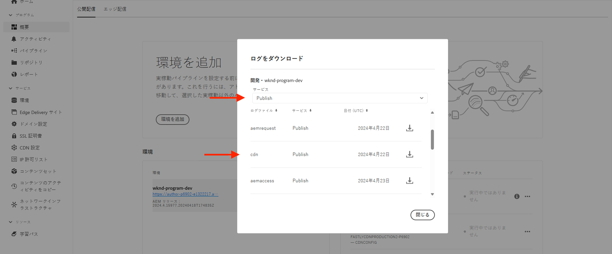

# トラフィックフィルタールールを使用した DoS および DDoS 攻撃のブロック

AEM as a Cloud Service（AEMCS）が管理する CDNで、**レート制限トラフィックフィルター**&#x200B;ルールやその他の戦略を使用して、サービス拒否（DoS）攻撃と分散型サービス拒否（DDoS）攻撃をブロックする方法を説明します。これらの攻撃は、CDN および潜在的に AEM パブリッシュサービス（接触チャネル）でトラフィックの急増を引き起こし、サイトの応答性と可用性に影響を与える可能性があります。

このチュートリアルは、_トラフィックパターンを分析し、レート制限[トラフィックフィルタールール](https://experienceleague.adobe.com/ja/docs/experience-manager-cloud-service/content/security/traffic-filter-rules-including-waf)_&#x200B;を設定して、これらの攻撃を軽減する方法に関するガイドとして機能します。このチュートリアルでは、攻撃が疑われる場合に通知が来るように、[アラートを設定](https://experienceleague.adobe.com/ja/docs/experience-manager-cloud-service/content/security/traffic-filter-rules-including-waf#traffic-filter-rules-alerts)する方法についても説明します。

## 保護について

AEM web サイトのデフォルトの DDoS 保護機能を説明します。

- **キャッシュ：**&#x200B;適切なキャッシュポリシーを使用すると、CDN により、ほとんどのリクエストが接触チャネルに送信されパフォーマンスが低下するのを防止できるので、DDoS 攻撃の影響は限定されます。
- **自動スケーリング：** AEM オーサーサービスとパブリッシュサービスは、トラフィックの急増に対処するために自動スケーリングされますが、トラフィックの突然の大量増加による影響を受ける可能性があります。
- **ブロック：** Adobe CDN は、CDN PoP（ポイントオブプレゼンス）ごとに特定の IP アドレスからアドビが定義したレートを超える場合、接触チャネルへのトラフィックをブロックします。
- **アラート：**&#x200B;トラフィックが特定のレートを超えた場合、アクションセンターは接触チャネルトラフィックスパイクのアラート通知を送信します。このアラートは、特定の CDN PoP へのトラフィックが IP アドレスごとの&#x200B;_アドビ定義_&#x200B;リクエストレートを超えると発生します。詳しくは、[トラフィックフィルタールールのアラート](https://experienceleague.adobe.com/ja/docs/experience-manager-cloud-service/content/security/traffic-filter-rules-including-waf#traffic-filter-rules-alerts)を参照してください。

これらの組み込み保護は、DDoS 攻撃のパフォーマンスへの影響を最小限に抑える、組織の能力のベースラインとして考える必要があります。Web サイトごとにパフォーマンス特性が異なり、Adobeが定義したレート制限に達する前にパフォーマンスが低下する可能性があるので、次の方法でデフォルトの保護機能を拡張することをお勧めします _顧客設定_.

DDoS 攻撃から web サイトを保護するために、顧客が実行できる追加の推奨対策をいくつか見てみましょう。

- **レート制限トラフィックフィルタールール**&#x200B;を宣言して、PoP ごとに単一の IP アドレスからの一定のレートを超えるトラフィックをブロックします。これらは通常、アドビが定義したレート制限よりも低いしきい値です。
- 「アラートアクション」を介したレート制限トラフィックフィルタールールの&#x200B;**アラート**&#x200B;を設定し、ルールがトリガーされるとアクションセンターの通知が送信されるようにします。
- クエリパラメータを無視するように&#x200B;**リクエスト変換**&#x200B;を宣言して、キャッシュカバレッジを増やします。

>[!NOTE]
>
>この[トラフィックフィルタールールアラート](https://experienceleague.adobe.com/ja/docs/experience-manager-cloud-service/content/security/traffic-filter-rules-including-waf#traffic-filter-rules-alerts)機能はまだリリースされていません。早期導入プログラムを通じてアクセス権を取得するには、**<aemcs-waf-adopter@adobe.com>** にメールを送信してください。

### レート制限トラフィックルールのバリエーション {#rate-limit-variations}

レート制限トラフィックルールには、次の 2 つのバリエーションがあります。

1. エッジ：特定の IP に対するすべてのトラフィック（CDN キャッシュから提供できるトラフィックを含む）のレートに基づいて、PoP ごとにリクエストをブロックします。
1. 接触チャネル：特定の IP の接触チャネル宛てのトラフィックのレートに基づいて、PoP ごとにリクエストをブロックします。

## カスタマージャーニー

以下の手順は、顧客が web サイトを保護するために取り組む必要があるプロセスを示しています。

1. レート制限トラフィックフィルタールールの必要性の認識。これは、アドビ標準のトラフィックスパイクを接触チャネルアラートで受信した結果である場合もあれば、DDoS が成功するリスクを減らすための予防措置を講じるためのプロアクティブな判断である場合があります。
1. サイトが既に稼働している場合は、ダッシュボードを使用してトラフィックパターンを分析し、レート制限トラフィックフィルタールールに最適なしきい値を決定します。サイトがまだ実稼働されていない場合は、トラフィックの予測に基づいて値を選択します。
1. 前のステップの値を使用して、レート制限トラフィックフィルタールールを設定します。対応するアラートを必ず有効にし、しきい値に達した場合に通知を受け取るようにします。
1. トラフィックスパイクが発生するたびにトラフィックフィルタールールのアラートを受信し、組織が悪意のあるアクターによってターゲットされている可能性があるかどうかに関する貴重なインサイトを入手します。
1. 必要に応じて、アラートに対応します。トラフィックを分析し、スパイクが攻撃ではなく、正当なリクエストによるものかを判断します。トラフィックが正当な場合はしきい値を増やし、そうでない場合は減らします。

このチュートリアルの残りの部分では、このプロセスについて順を追って説明します。

## ルール設定の必要性の認識 {#recognize-the-need}

前述したように、特定のレートを超える CDN のトラフィックはデフォルトでブロックされますが、サイトによってはそのしきい値を下回るとパフォーマンスが低下する場合があります。そのため、レート制限トラフィックフィルタールールを設定する必要があります。

このルールは、実稼動環境への移行を開始する前に設定するのが理想です。実際、多くの組織は攻撃の可能性を示すトラフィックスパイクの警告を受けた場合にのみ、ルールを事後的に宣言します。

特定の PoP に対して、単一の IP アドレスからのトラフィックがデフォルトのしきい値を超えると、接触チャネルトラフィックスパイクアラートが[アクションセンターの通知](https://experienceleague.adobe.com/ja/docs/experience-manager-cloud-service/content/operations/actions-center)として送信されます。このようなアラートを受信した場合は、レート制限トラフィックフィルタールールを設定することをお勧めします。このデフォルトのアラートは、トラフィックフィルタールールを定義する際に、顧客が明示的に有効にする必要があるアラートとは異なります。このルールについては、後のセクションで説明します。


## トラフィックパターンの分析 {#analyze-traffic}

サイトが既に実稼働している場合は、CDN ログとAdobe提供のダッシュボードを使用してトラフィックパターンを分析できます。

- **CDN トラフィックダッシュボード**:CDN とオリジンリクエスト率、4xx と 5xx のエラー率、キャッシュされていないリクエストを介してトラフィックに関するインサイトを提供します。 また、は、クライアント IP アドレスあたりの 1 秒あたりの最大 CND およびオリジンリクエスト数と、CDN 設定を最適化するためのより多くのインサイトを提供します。

- **CDN キャッシュヒット率**：キャッシュヒット率の合計とリクエスト数の合計（ヒット、合格、ミスのステータス別）に関するインサイトを提供します。 また、上位のヒット、合格およびミス URL も提供します。

を使用したダッシュボードツールの設定 _次のいずれかのオプション_:

### ELK：ダッシュボードツールの設定

アドビが提供する **Elasticsearch、Logstash、Kibana（ELK）**&#x200B;のダッシュボードツールを使用して、CDN ログを分析できます。このツールには、トラフィックパターンを視覚化するダッシュボードが含まれており、レート制限トラフィックフィルタールールの最適なしきい値を簡単に決定できます。

- のクローン [AEMCS-CDN-Log-Analysis-Tooling](https://github.com/adobe/AEMCS-CDN-Log-Analysis-Tooling) GitHub リポジトリ。
- [ELK Docker コンテナの設定方法](https://github.com/adobe/AEMCS-CDN-Log-Analysis-Tooling/blob/main/ELK/README.md#how-to-set-up-the-elk-docker-containerhow-to-setup-the-elk-docker-container)の手順に従ってツールを設定します。
- 設定の一環として、`traffic-filter-rules-analysis-dashboard.ndjson` ファイルをインポートしてデータを視覚化します。_CDN トラフィック_ ダッシュボードには、CDN エッジとオリジンでの IP／POP ごとの最大リクエスト数を表示するビジュアライゼーションが含まれています。
- [Cloud Manager](https://my.cloudmanager.adobe.com/) の&#x200B;_環境_&#x200B;カードから、AEMCS パブリッシュサービスの CDN ログをダウンロードします。

  

  >[!TIP]
  >
  > 新しいリクエストが CDN ログに表示されるまでに最大 5 分かかる場合があります。

### Splunk：ダッシュボードツールの設定

次の顧客： [Splunk ログ転送が有効](https://experienceleague.adobe.com/ja/docs/experience-manager-cloud-service/content/implementing/developing/logging#splunk-logs) では、トラフィックパターンを分析する新しいダッシュボードを作成できます。

Splunk でダッシュボードを作成するには、次に従います [AEMCS CDN ログ分析用の Splunk ダッシュボード](https://github.com/adobe/AEMCS-CDN-Log-Analysis-Tooling/blob/main/Splunk/README.md#splunk-dashboards-for-aemcs-cdn-log-analysis) 手順。

### データの確認

ELK ダッシュボードと Splunk ダッシュボードでは、次のビジュアライゼーションを使用できます。

- **クライアント IP および POP ごとのエッジ RPS**：このビジュアライゼーションには、**CDN エッジでの** IP／POP あたりの最大リクエスト数が表示されます。ビジュアライゼーションのピークは、リクエストの最大数を示します。

  **ELK ダッシュボード**：
  

  **Splunk ダッシュボード**：\
  

- **クライアント IP および POP ごとのオリジン RPS**：このビジュアライゼーションには、**オリジンでの** IP／POP あたりの最大リクエスト数が表示されます。ビジュアライゼーションのピークは、リクエストの最大数を示します。

  **ELK ダッシュボード**：
  

  **Splunk ダッシュボード**：
  

## しきい値の選択

レート制限トラフィックフィルタールールのしきい値は、上記の分析に基づいて、正当なトラフィックがブロックされないように設定する必要があります。しきい値の選択方法のガイダンスについては、次の表を参照してください。

| バリエーション | 値 |
| :--------- | :------- |
| 接触チャネル | **通常**&#x200B;のトラフィック条件（つまり、DDoS 時のレートではない）における IP/POP あたりの最大接触チャネルリクエストの最大値を取得し、倍数で増やします。 |
| Edge | **通常**&#x200B;のトラフィック条件（つまり、DDoS 時のレートではない）における IP/POP あたりの最大 Edge リクエストの最大値を取得し、倍数で増やします。 |

使用する倍数は、オーガニックトラフィック、キャンペーン、その他のイベントによるトラフィックの通常のスパイクの予想値によって異なります。5～10 の倍数が適切な場合があります。

サイトがまだ公開されていない場合は、分析するデータがないので、レート制限トラフィックフィルタールールに設定する適切な値を経験に基づいて推測する必要があります。次に例を示します。

| バリエーション | 値 |
|------------------------------ |:-----------:|
| Edge | 500 |
| 接触チャネル | 100 |

## ルールの設定 {#configure-rules}

上記の説明に基づいた値を使用して、AEM プロジェクトの `/config/cdn.yaml` ファイルで&#x200B;**レート制限トラフィックフィルター**&#x200B;ルールを設定します。必要に応じて、web セキュリティチームに問い合わせて、レート制限値が適切で、正当なトラフィックをブロックしないことを確認します。

詳しくは、[AEM プロジェクトでのルールの作成](https://experienceleague.adobe.com/ja/docs/experience-manager-learn/cloud-service/security/traffic-filter-and-waf-rules/how-to-setup#create-rules-in-your-aem-project)を参照してください。

```yaml
kind: CDN
version: '1'
metadata:
  envTypes:
    - dev
    - stage
    - prod
data:
  trafficFilters:
    rules:
    ...
    #  Prevent attack at edge by blocking client for 5 minutes if they make more than 500 requests per second on average
      - name: prevent-dos-attacks-edge
        when:
          reqProperty: tier
          in: ["author","publish"]
        rateLimit:
          limit: 500 # replace with the appropriate value
          window: 10 # compute the average over 10s
          penalty: 300 # block IP for 5 minutes
          count: all # count all requests
          groupBy:
            - reqProperty: clientIp
        action: 
          type: log
          experimental_alert: true
    #  Prevent attack at origin by blocking client for 5 minutes if they make more than 100 requests per second on average            
      - name: prevent-dos-attacks-origin
        when:
          reqProperty: tier
          in: ["author","publish"]
        rateLimit:
          limit: 100 # replace with the appropriate value
          window: 10 # compute the average over 10s
          penalty: 300 # block IP for 5 minutes
          count: fetches # count only fetches
          groupBy:
            - reqProperty: clientIp
        action: 
          type: log
          experimental_alert: true   
          
```

接触チャネルルールと Edge ルールの両方が宣言され、アラートプロパティが `true` に設定されているので、しきい値に達した場合は常にアラートを受信でき、攻撃を示している可能性があります。

>[!NOTE]
>
>experimental_alert の前にある _実験的な_ prefix_ は、アラート機能がリリースされると削除されます。早期導入プログラムに参加するには、**<aemcs-waf-adopter@adobe.com>** にメールを送信します。

数時間または数日間トラフィックを監視して、正当なトラフィックがこれらのレートを超えないように、アクションタイプを最初にログに記録するように設定することをお勧めします。数日後、ブロックモードに変更します。

AEMCS 環境に変更をデプロイするには、次の手順に従います。

- 上記の変更をコミットして、Cloud Manager Git リポジトリにプッシュします。
- Cloud Manager の設定パイプラインを使用して、変更を AEMCS 環境にデプロイします。詳しくは、[Cloud Manager を使用したルールのデプロイ](https://experienceleague.adobe.com/ja/docs/experience-manager-learn/cloud-service/security/traffic-filter-and-waf-rules/how-to-setup#deploy-rules-through-cloud-manager)を参照してください。
- **レート制限トラフィックフィルタールール**&#x200B;が期待どおりに機能していることを確認するには、[攻撃シミュレーション](#attack-simulation)の節の説明に従って攻撃をシミュレートできます。リクエストの数を、ルールで設定されたレート制限値より高い値に制限します。

### リクエスト変換ルールの設定 {#configure-request-transform-rules}

レート制限トラフィックフィルタールールに加えて、[リクエスト変換](https://experienceleague.adobe.com/ja/docs/experience-manager-cloud-service/content/implementing/content-delivery/cdn-configuring-traffic#request-transformations)を使用してアプリケーションに不要なクエリパラメーターの設定を解除し、キャッシュバスティング手法によるキャッシュをバイパスする方法を最小限に抑えることをお勧めします。例えば、`search` と `campaignId` のクエリパラメーターのみを許可する場合は、次のルールを宣言できます。

```yaml
kind: "CDN"
version: "1"
metadata:
  envTypes: 
    - dev
    - stage
    - prod  
data:  
  experimental_requestTransformations:
    rules:            
      - name: unset-all-query-params-except-those-needed
        when:
          reqProperty: tier
          in: ["publish"]
        actions:
          - type: unset
            queryParamMatch: ^(?!search$|campaignId$).*$
```

## トラフィックフィルタールールアラートの受信 {#receiving-alerts}

上記のように、トラフィックフィルタールールに *experimental_alert: true* が含まれている場合、ルールが一致するとアラートを受信します。

## アラートに対するアクション {#acting-on-alerts}

場合によっては、アラートが情報となり、攻撃の頻度を把握できます。上記のダッシュボードを使用して CDN データを分析し、トラフィックスパイクが攻撃によるものであることを検証することをお勧めします。トラフィックスパイクが単なる正当なトラフィック量の増加ではないことがあります。後者の場合は、しきい値を増やすことを検討してください。

## 攻撃シミュレーション{#attack-simulation}

この節では、DoS 攻撃をシミュレートする方法について説明します。この方法を使用すると、このチュートリアルで使用したダッシュボードのデータを生成し、設定したルールが攻撃を正常にブロックすることを検証できます。

>[!CAUTION]
>
> これらの手順は、実稼動環境では実行しないでください。次の手順はシミュレーションの目的でのみ使用します。
> 
>トラフィックのスパイクを示すアラートを受信した場合は、[トラフィックパターンの分析](#analyzing-traffic-patterns)の節に進みます。

攻撃をシミュレートするには、[Apache ベンチマーク](https://httpd.apache.org/docs/2.4/programs/ab.html)、[Apache JMeter](https://jmeter.apache.org/)、[Vegeta](https://github.com/tsenart/vegeta) などのツールを使用できます。

### Edge リクエスト

次の [Vegeta](https://github.com/tsenart/vegeta) コマンドを使用すると、web サイトに対して多くのリクエストを行うことができます。

```shell
$ echo "GET https://<YOUR-WEBSITE-DOMAIN>" | vegeta attack -rate=120 -duration=5s | vegeta report
```

上記のコマンドは、5 秒間で 120 件のリクエストを実行し、レポートを出力します。Web サイトにレート制限がないとすると、トラフィックのスパイクが発生する可能性があります。

### 接触チャネルリクエスト

CDN キャッシュをバイパスして、接触チャネル（AEM パブリッシュサービス）にリクエストを行うには、URL に一意のクエリパラメーターを追加できます。詳しくは、[JMeter スクリプトを使用した DoS 攻撃のシミュレーション](https://experienceleague.adobe.com/ja/docs/experience-manager-learn/foundation/security/modsecurity-crs-dos-attack-protection#simulate-dos-attack-using-jmeter-script)のサンプル Apache JMeter スクリプトを参照してください。

