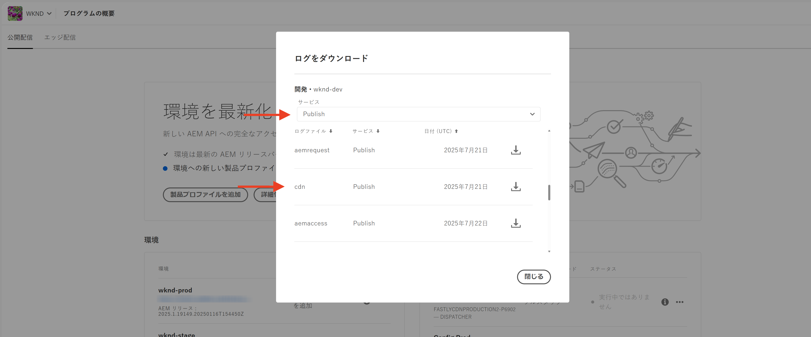

# 機密性の高いリクエストの監視

AEM as a Cloud Service のトラフィックフィルタールールを使用して機密性の高いリクエストをログに記録し、監視する方法について説明します。

ログにより、エンドユーザーやサービスに影響を与えることなくトラフィックパターンを確認でき、ブロックルールを実装する前の重要な最初の手順となります。

このチュートリアルでは、AEM パブリッシュサービスに対する **WKND ログインおよびログアウトパスのリクエストをログに記録**&#x200B;する方法について説明します。

## リクエストをログに記録する理由とタイミング

特定のリクエストをログに記録することは、ユーザー（および潜在的に悪意のあるアクター）が AEM アプリケーションをどのように操作しているかを理解するための、リスクが低く、価値の高いプラクティスです。特に、ブロックルールを適用する前に役立ち、正当なトラフィックを中断することなく、セキュリティ態勢を調整できるという確信が得られます。

ログの一般的なシナリオは次のとおりです。

- ルールを `block` モードに昇格させる前に、ルールの影響と範囲を検証します。
- ログイン／ログアウトパスと認証エンドポイントを監視して、異常なパターンやブルートフォース攻撃の試みがないか確認します。
- 潜在的な不正使用や DoS アクティビティを検出するために、API エンドポイントへの高頻度アクセスを追跡します。
- より厳格な制御を適用する前に、ボットの動作のベースラインを確立します。
- セキュリティインシデントが発生した場合は、攻撃の性質と影響を受けるリソースを理解するためにフォレンジックデータを指定します。

## 前提条件

続行する前に、[トラフィックフィルタールールと WAF ルールの設定方法](../setup.md)チュートリアルの説明に従って必要な設定が完了していることを確認します。また、[AEM WKND Sites プロジェクト](https://github.com/adobe/aem-guides-wknd)のクローンを作成し、AEM 環境にデプロイしておきます。

## 例：WKND のログインリクエストとログアウトリクエストのログ記録

この例では、AEM パブリッシュサービスの WKND ログインパスとログアウトパスへのリクエストをログに記録するトラフィックフィルタールールを作成します。認証試行を監視し、潜在的なセキュリティの問題を特定するのに役立ちます。

- 次のルールを WKND プロジェクトの `/config/cdn.yaml` ファイルに追加します。

```yaml
kind: "CDN"
version: "1"
metadata:
  envTypes: ["dev", "stage", "prod"]
data:
  trafficFilters:
    rules:
    # On AEM Publish service log WKND Login and Logout requests
    - name: publish-auth-requests
      when:
        allOf:
          - reqProperty: tier
            matches: publish
          - reqProperty: path
            in:
              - /system/sling/login/j_security_check
              - /system/sling/logout
      action: log   
```

- 変更をコミットして Cloud Manager Git リポジトリにプッシュします。

- [以前に作成した](../setup.md#deploy-rules-using-adobe-cloud-manager) Cloud Manager 設定パイプラインを使用して、変更を AEM 環境にデプロイします。

- プログラムの WKND サイト（例：`https://publish-pXXXX-eYYYY.adobeaemcloud.com/us/en.html`）にログインおよびログアウトして、ルールをテストします。ユーザー名とパスワードとして `asmith/asmith` を使用できます。

  

## 分析

Cloud Manager から AEMCS CDN ログをダウンロードし、[AEMCS CDN ログ分析ツール](../setup.md#setup-the-elastic-dashboard-tool)を使用して、`publish-auth-requests` ルールの結果を分析してみましょう。

- [Cloud Manager](https://my.cloudmanager.adobe.com/) の&#x200B;**環境**&#x200B;カードから、AEMCS **パブリッシュ**&#x200B;サービスの CDN ログをダウンロードします。

  

  >[!TIP]
  >
  > 新しいリクエストが CDN ログに表示されるまでに最大 5 分かかる場合があります。

- ダウンロードしたログファイル（例：以下のスクリーンショットの `publish_cdn_2023-10-24.log`）を Elastic ダッシュボードツールプロジェクトの `logs/dev` フォルダーにコピーします。

  

- Elastic ダッシュボードツールページを更新します。
   - 上部の「**グローバルフィルター**」セクションで、`aem_env_name.keyword` フィルターを編集し、`dev` 環境値を選択します。

     

   - 時間間隔を変更するには、右上隅にあるカレンダーアイコンをクリックし、目的の時間間隔を選択します。

     

- 更新されたダッシュボードの&#x200B;**分析済みリクエスト**、**フラグ付きリクエスト**、**フラグ付きリクエストの詳細**&#x200B;パネルを確認します。一致する CDN ログエントリの場合、各エントリのクライアント IP（cli_ip）、ホスト、URL、アクション（waf_action）、ルール名（waf_match）の値が表示されます。

  
