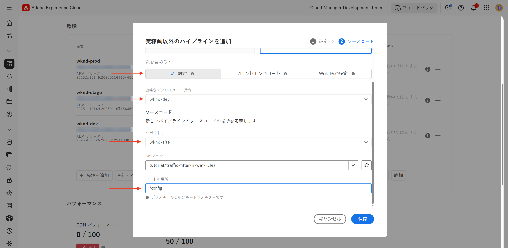

# WAF ルールを含むトラフィックフィルタールールの設定方法

Web アプリケーションファイアウォール（WAF）ルールを含むトラフィックフィルタールールの&#x200B;**設定方法**&#x200B;について説明します。このチュートリアルでは、後続のチュートリアルの基盤を設定します。ここでは、ルールを設定してデプロイし、その後、結果のテストと分析を行います。

設定プロセスを示すために、チュートリアルでは [AEM WKND Sites プロジェクト](https://github.com/adobe/aem-guides-wknd)を使用します。

>[!VIDEO](https://video.tv.adobe.com/v/3469395/?quality=12&learn=on)

## 設定の概要

後続のチュートリアルの基盤には、次の手順が含まれます。

- `config` フォルダーの AEM プロジェクト内での&#x200B;_ルールの作成_
- Adobe Cloud Manager 設定パイプラインを使用した&#x200B;_ルールのデプロイ_。
- Curl、Vegeta、Nikto などのツールを使用した&#x200B;_ルールのテスト_
- AEMCS CDN ログ分析ツールを使用した&#x200B;_結果の分析_

## AEM プロジェクトでのルールの作成

AEM プロジェクト内で&#x200B;**標準**&#x200B;および **WAF** トラフィックフィルタールールを定義するには、次の手順に従います。

1. AEM プロジェクトの最上位に、`config` という名前のフォルダーを作成します。

2. `config` フォルダー内に、`cdn.yaml` という名前のファイルを作成します。

3. `cdn.yaml` で次のメタデータ構造を使用します。

```yaml
kind: "CDN"
version: "1"
metadata:
  envTypes: ["dev", "stage", "prod"]
data:
  trafficFilters:
    rules:
```


[次のチュートリアル](#next-steps)では、実装の強固な基盤として、アドビの&#x200B;**推奨される標準トラフィックフィルタールールと WAF ルール**&#x200B;を上記のファイルに追加する方法について説明します。

## Adobe Cloud Manager を使用したルールのデプロイ

ルールのデプロイの準備として、次の手順に従います。

1. [my.cloudmanager.adobe.com](https://my.cloudmanager.adobe.com/) にログインし、プログラムを選択します。

2. **プログラムの概要**&#x200B;ページから&#x200B;**パイプライン**&#x200B;カードに移動し、「**+ 追加**」をクリックして新しいパイプラインを作成します。

   

3. パイプラインウィザードの場合：

   - **タイプ**：デプロイメントパイプライン
   - **パイプライン名**：Dev-Config

   

4. ソースコード設定：

   - **デプロイするコード**：ターゲットデプロイメント
   - **次を含む**：設定
   - **デプロイメント環境**：例：`wknd-program-dev`
   - **リポジトリ**：Git リポジトリ（例：`wknd-site`）
   - **Git 分岐**：作業用分岐
   - **コードの場所**：`/config`

   

5. パイプライン設定を確認し、「**保存**」をクリックします。

[次のチュートリアル](#next-steps)では、パイプラインを AEM 環境にデプロイする方法について説明します。

## ツールを使用したルールのテスト

標準トラフィックフィルタールールと WAF ルールの効果をテストするには、様々なツールを使用してリクエストをシミュレートし、ルールの応答方法を分析します。

次のツールがローカルマシンにインストールされていることを確認するか、手順に従ってインストールします。

- [Curl](https://curl.se/)：リクエスト／応答フローをテストします。
- [Vegeta](https://github.com/tsenart/vegeta)：高いリクエスト負荷をシミュレートします（DoS テスト）。
- [Nikto](https://github.com/sullo/nikto/wiki)：脆弱性をスキャンします。

次のコマンドを使用して、インストールを確認できます。

```shell
# Curl version check
$ curl --version

# Vegeta version check
$ vegeta -version

# Nikto version check
$ cd <PATH-OF-CLONED-REPO>/program
$ ./nikto.pl -Version
```

[次のチュートリアル](#next-steps)では、これらのツールを使用して、高いリクエスト負荷と悪意のあるリクエストをシミュレートし、トラフィックフィルターと WAF ルールの効果をテストする方法について説明します。

## 結果の分析

結果の分析を準備するには、次の手順に従います。

1. **AEMCS CDN ログ分析ツール**&#x200B;をインストールし、事前定義済みダッシュボードを使用してパターンを視覚化および分析します。

2. Cloud Manager UI からログをダウンロードして、**CDN ログの取り込み**&#x200B;を実行します。 または、Splunk や Elasticsearch などのサポートされているホストされたログの宛先にログを直接転送することもできます。

### AEMCS CDN ログ分析ツール

トラフィックフィルターと WAF ルールの結果を分析するには、**AEMCS CDN ログ分析ツール**&#x200B;を使用します。このツールでは、AEMCS CDN から収集されたログを活用して、CDN トラフィックと WAF アクティビティを視覚化するための事前定義済みダッシュボードを提供します。

AEMCS CDN ログ分析ツールでは、**ELK**（Elasticsearch、Logstash、Kibana）と **Splunk** の 2 つの確認性の高いプラットフォームをサポートします。

ログ転送機能を使用して、ホストされた ELK または Splunk のログサービスにログをストリームできます。ここでは、ダッシュボードをインストールして、標準トラフィックフィルタールールと WAF トラフィックフィルタールールを視覚化および分析できます。ただし、このチュートリアルでは、コンピュータにインストールされたローカルの ELK インスタンスにダッシュボードを設定します。

1. [AEMCS-CDN-Log-Analysis-Tooling](https://github.com/adobe/AEMCS-CDN-Log-Analysis-Tooling) リポジトリのクローンを作成します。

2. [ELK Docker コンテナ設定ガイド](https://github.com/adobe/AEMCS-CDN-Log-Analysis-Tooling/blob/main/ELK/README.md)に従って、ELK スタックをローカルにインストールおよび設定します。

3. ELK ダッシュボードを使用すると、IP リクエスト、ブロックされたトラフィック、URI パターン、セキュリティアラートなどの指標を調べることができます。

   

>[!NOTE]
> 
> ログがまだ AEMCS CDN から取り込まれていない場合、ダッシュボードは空で表示されます。

### CDN ログの取り込み

CDN ログを ELK スタックに取り込むには、次の手順に従います。

- [Cloud Manager](https://my.cloudmanager.adobe.com/) の&#x200B;**環境**&#x200B;カードから、AEMCS **パブリッシュ**&#x200B;サービスの CDN ログをダウンロードします。

  

  >[!TIP]
  >
  > 新しいリクエストが CDN ログに表示されるまでに最大 5 分かかる場合があります。

- ダウンロードしたログファイル（例：以下のスクリーンショットの `publish_cdn_2025-06-06.log`）を Elastic ダッシュボードツールプロジェクトの `logs/dev` フォルダーにコピーします。

  {width="800" zoomable="yes"}

- Elastic ダッシュボードツールページを更新します。
   - 上部の「**グローバルフィルター**」セクションで、`aem_env_name.keyword` フィルターを編集し、`dev` 環境値を選択します。

     

   - 時間間隔を変更するには、右上隅にあるカレンダーアイコンをクリックし、目的の時間間隔を選択します。

- [次のチュートリアル](#next-steps)では、ELK スタックの事前定義済みダッシュボードを使用して、標準トラフィックフィルタールールと WAF トラフィックフィルタールールの結果を分析する方法について説明します。

  

## 概要

AEM as a Cloud Service に WAF ルールを含むトラフィックフィルタールールを実装するための基盤を正常に設定しました。設定ファイルの構造、デプロイメント用のパイプラインを作成し、結果をテストおよび分析するツールを準備しました。

## 次の手順

次のチュートリアルを使用して、アドビの推奨されるルールを実装する方法について説明します。

<!-- CARDS
{target = _self}

* ./use-cases/using-traffic-filter-rules.md
  {title = Protecting AEM websites using standard traffic filter rules}
  {description = Learn how to protect AEM websites from DoS, DDoS and bot abuse using Adobe-recommended standard traffic filter rules in AEM as a Cloud Service.}
  {image = ./assets/use-cases/using-traffic-filter-rules.png}
  {cta = Apply Rules}

* ./use-cases/using-waf-rules.md
  {title = Protecting AEM websites using WAF traffic filter rules}
  {description = Learn how to protect AEM websites from sophisticated threats including DoS, DDoS, and bot abuse using Adobe-recommended Web Application Firewall (WAF) traffic filter rules in AEM as a Cloud Service.}
  {image = ./assets/use-cases/using-waf-rules.png}
  {cta = Activate WAF}
-->
<!-- START CARDS HTML - DO NOT MODIFY BY HAND -->
<div class="columns">
    <div class="column is-half-tablet is-half-desktop is-one-third-widescreen" aria-label="Protecting AEM websites using standard traffic filter rules">
        <div class="card" style="height: 100%; display: flex; flex-direction: column; height: 100%;">
            <div class="card-image">
                <figure class="image x-is-16by9">
                    <a href="./use-cases/using-traffic-filter-rules.md" title="標準トラフィックフィルタールールを使用した AEM web サイトの保護" target="_self" rel="referrer">
                        
                    </a>
                </figure>
            </div>
            <div class="card-content is-padded-small" style="display: flex; flex-direction: column; flex-grow: 1; justify-content: space-between;">
                <div class="top-card-content">
                    <p class="headline is-size-6 has-text-weight-bold">
                        <a href="./use-cases/using-traffic-filter-rules.md" target="_self" rel="referrer" title="標準トラフィックフィルタールールを使用した AEM web サイトの保護">標準トラフィックフィルタールールを使用したAEM web サイトの保護</a>
                    </p>
                    <p class="is-size-6">AEM as a Cloud Service でアドビの推奨される標準トラフィックフィルタールールを使用して、AEM web サイトを DoS 攻撃、DDoS 攻撃、ボットの不正使用から保護する方法について説明します。</p>
                </div>
                <a href="./use-cases/using-traffic-filter-rules.md" target="_self" rel="referrer" class="spectrum-Button spectrum-Button--outline spectrum-Button--primary spectrum-Button--sizeM" style="align-self: flex-start; margin-top: 1rem;">
                    <span class="spectrum-Button-label has-no-wrap has-text-weight-bold">ルールを適用</span>
                </a>
            </div>
        </div>
    </div>
    <div class="column is-half-tablet is-half-desktop is-one-third-widescreen" aria-label="Protecting AEM websites using WAF traffic filter rules">
        <div class="card" style="height: 100%; display: flex; flex-direction: column; height: 100%;">
            <div class="card-image">
                <figure class="image x-is-16by9">
                    <a href="./use-cases/using-waf-rules.md" title="WAF トラフィックフィルタールールを使用した AEM web サイトの保護" target="_self" rel="referrer">
                        
                    </a>
                </figure>
            </div>
            <div class="card-content is-padded-small" style="display: flex; flex-direction: column; flex-grow: 1; justify-content: space-between;">
                <div class="top-card-content">
                    <p class="headline is-size-6 has-text-weight-bold">
                        <a href="./use-cases/using-waf-rules.md" target="_self" rel="referrer" title="WAF トラフィックフィルタールールを使用した AEM web サイトの保護">WAF トラフィックフィルタールールを使用した AEM web サイトの保護</a>
                    </p>
                    <p class="is-size-6">AEM as a Cloud Service でアドビの推奨される web アプリケーションファイアウォール（WAF）トラフィックフィルタールールを使用して、DoS 攻撃、DDoS 攻撃、ボットの不正使用などの高度な脅威から AEM web サイトを保護する方法について説明します。</p>
                </div>
                <a href="./use-cases/using-waf-rules.md" target="_self" rel="referrer" class="spectrum-Button spectrum-Button--outline spectrum-Button--primary spectrum-Button--sizeM" style="align-self: flex-start; margin-top: 1rem;">
                    <span class="spectrum-Button-label has-no-wrap has-text-weight-bold">WAF をアクティブ化</span>
                </a>
            </div>
        </div>
    </div>
</div>
<!-- END CARDS HTML - DO NOT MODIFY BY HAND -->

## 高度なユースケース

アドビの推奨される標準トラフィックフィルタールールと WAF ルールに加えて、高度なシナリオを実装して特定のビジネス要件を満たすことができます。これらのシナリオには、次が含まれます。

<!-- CARDS
{target = _self}

* ./how-to/request-logging.md

* ./how-to/request-blocking.md

* ./how-to/request-transformation.md
-->
<!-- START CARDS HTML - DO NOT MODIFY BY HAND -->
<div class="columns">
    <div class="column is-half-tablet is-half-desktop is-one-third-widescreen" aria-label="Monitoring sensitive requests">
        <div class="card" style="height: 100%; display: flex; flex-direction: column; height: 100%;">
            <div class="card-image">
                <figure class="image x-is-16by9">
                    <a href="./how-to/request-logging.md" title="機密性の高いリクエストの監視" target="_self" rel="referrer">
                        
                    </a>
                </figure>
            </div>
            <div class="card-content is-padded-small" style="display: flex; flex-direction: column; flex-grow: 1; justify-content: space-between;">
                <div class="top-card-content">
                    <p class="headline is-size-6 has-text-weight-bold">
                        <a href="./how-to/request-logging.md" target="_self" rel="referrer" title="機密性の高いリクエストの監視">機密性の高いリクエストの監視</a>
                    </p>
                    <p class="is-size-6">AEM as a Cloud Service のトラフィックフィルタールールを使用して機密性の高いリクエストをログに記録し、監視する方法について説明します。</p>
                </div>
                <a href="./how-to/request-logging.md" target="_self" rel="referrer" class="spectrum-Button spectrum-Button--outline spectrum-Button--primary spectrum-Button--sizeM" style="align-self: flex-start; margin-top: 1rem;">
                    <span class="spectrum-Button-label has-no-wrap has-text-weight-bold">詳細情報</span>
                </a>
            </div>
        </div>
    </div>
    <div class="column is-half-tablet is-half-desktop is-one-third-widescreen" aria-label="Restricting access">
        <div class="card" style="height: 100%; display: flex; flex-direction: column; height: 100%;">
            <div class="card-image">
                <figure class="image x-is-16by9">
                    <a href="./how-to/request-blocking.md" title="アクセスの制限" target="_self" rel="referrer">
                        
                    </a>
                </figure>
            </div>
            <div class="card-content is-padded-small" style="display: flex; flex-direction: column; flex-grow: 1; justify-content: space-between;">
                <div class="top-card-content">
                    <p class="headline is-size-6 has-text-weight-bold">
                        <a href="./how-to/request-blocking.md" target="_self" rel="referrer" title="アクセスの制限">アクセスの制限</a>
                    </p>
                    <p class="is-size-6">AEM as a Cloud Service のトラフィックフィルタールールを使用して特定のリクエストをブロックし、アクセスを制限する方法について説明します。</p>
                </div>
                <a href="./how-to/request-blocking.md" target="_self" rel="referrer" class="spectrum-Button spectrum-Button--outline spectrum-Button--primary spectrum-Button--sizeM" style="align-self: flex-start; margin-top: 1rem;">
                    <span class="spectrum-Button-label has-no-wrap has-text-weight-bold">詳細情報</span>
                </a>
            </div>
        </div>
    </div>
    <div class="column is-half-tablet is-half-desktop is-one-third-widescreen" aria-label="Normalizing requests">
        <div class="card" style="height: 100%; display: flex; flex-direction: column; height: 100%;">
            <div class="card-image">
                <figure class="image x-is-16by9">
                    <a href="./how-to/request-transformation.md" title="リクエストの標準化" target="_self" rel="referrer">
                        
                    </a>
                </figure>
            </div>
            <div class="card-content is-padded-small" style="display: flex; flex-direction: column; flex-grow: 1; justify-content: space-between;">
                <div class="top-card-content">
                    <p class="headline is-size-6 has-text-weight-bold">
                        <a href="./how-to/request-transformation.md" target="_self" rel="referrer" title="リクエストの標準化">リクエストの標準化</a>
                    </p>
                    <p class="is-size-6">AEM as a Cloud Service のトラフィックフィルタールールを使用してリクエストを変換し、標準化する方法について説明します。</p>
                </div>
                <a href="./how-to/request-transformation.md" target="_self" rel="referrer" class="spectrum-Button spectrum-Button--outline spectrum-Button--primary spectrum-Button--sizeM" style="align-self: flex-start; margin-top: 1rem;">
                    <span class="spectrum-Button-label has-no-wrap has-text-weight-bold">詳細情報</span>
                </a>
            </div>
        </div>
    </div>
</div>
<!-- END CARDS HTML - DO NOT MODIFY BY HAND -->

## その他のリソース

- [WAF ルールを含むトラフィックフィルタールール](https://experienceleague.adobe.com/ja/docs/experience-manager-cloud-service/content/security/traffic-filter-rules-including-waf)
